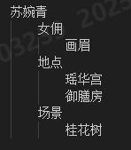
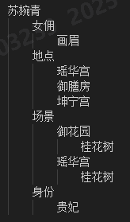
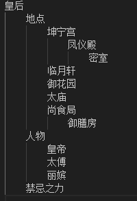
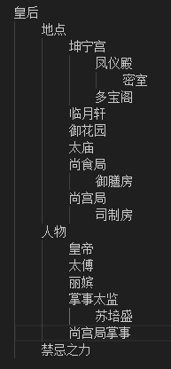

苏婉青
    女佣
        画眉
    地点
        瑶华宫
        御膳房
        坤宁宫
    场景
        御花园
            桂花树
        瑶华宫
            桂花树    
    身份
        贵妃        

# Updatelog
## Rev.0 
    
    
苏婉青
    女佣
        画眉
    地点
        瑶华宫
        御膳房
    场景
        桂花树

## Rev.1 
   

苏婉青
    女佣
        画眉
    地点
        瑶华宫
        御膳房
        坤宁宫
    场景
        御花园
            桂花树
        瑶华宫
            桂花树    
    身份
        贵妃    

## Rev.2 
   
  

福安
    马厩总管 
        张公公
        
    禁军士兵*2
        小宫女
        老太监   
        园丁 
    马
        照夜雪
    地点
        御马监
        御花园
        坤宁宫
    场景
        瑶华宫-C
            女皇(真正的是贵妃)
        御马监
            张公公
            禁军士兵*2
            小宫女
            老太监     
        御花园
            园丁
            宫女
        瑶华宫
            桂花树 
        坤宁宫
            皇后       
    身份
        贵妃  

## Rev.3 
   

皇后
    地点
        凤仪殿
            密室
        太庙
    人物
        皇帝
        太傅        
    禁忌之力
    
## Rev.4 
   
    

皇后
    地点
        坤宁宫
            凤仪殿
                密室
        临月轩
        御花园
        太庙
        尚食局
            御膳房  
    人物
        皇帝
        太傅
        丽嫔        
    禁忌之力
    

## Rev.5     
   

皇后
    地点
        坤宁宫
            凤仪殿
                密室
            多宝阁                
        临月轩
        御花园
        太庙
        尚食局
            御膳房
        尚宫局
            司制房              
    人物
        皇帝
        太傅
        丽嫔
        掌事太监
            苏培盛 
        尚宫局掌事              
    禁忌之力
    

## Rev.6     
       

皇后
    地点
        坤宁宫
            寝殿
                暖阁
            凤仪殿
                密室
            多宝阁                
        临月轩
        御花园
        太庙
        尚食局
            御膳房
        尚宫局
            司制房              
    人物
        皇帝
        太傅
        丽嫔
        掌事太监
            苏培盛 
        尚宫局掌事 
        侍女
            春禾
            秋月             
    青灰色的“裂痕
    禁忌之力

## Rev.7     
      
    

皇后
    地点
        坤宁宫
            寝殿
                暖阁
            凤仪殿
                密室
            多宝阁                
        临月轩
        御花园
        太庙
        尚食局
            御膳房
        尚宫局
            司制房              
    人物
        皇帝
        太傅
        丽嫔
        掌事太监
            苏培盛 
        尚宫局掌事 
        侍女
            春禾
            秋月             
    青灰色的“裂痕
    禁忌之力

      

## Rev.8
    

苏选侍
    翠儿
    储秀宫
    宫女
    

## Rev9
    

    

苏选侍
    翠儿
    储秀宫
        廊檐
        偏僻庭院
        寝殿
    春桃        