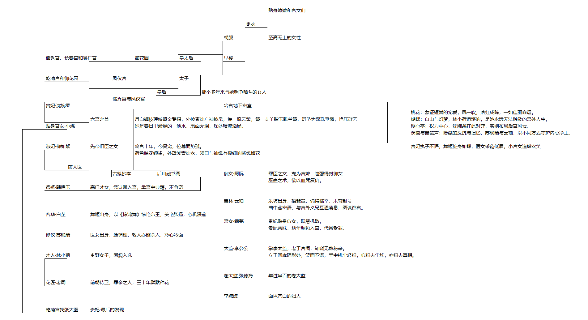

                                                                                                    
                                                贴身嬷嬷和宫女们													
                                                                                                    
                                            更衣														
                                                                                                    
                                        朝服		至高无上的女性													
                                                                                                    
                                                                                                    
        储秀宫、长春宫和景仁宫				御花园		皇太后		早餐															
                                                                                                    
                                                                                                    
        乾清宫和御花园			凤仪宫			太子																	
                                                                                                    
                            皇后		那个多年来与她明争暗斗的女人																
                    储秀宫与凤仪宫																				
        贵妃·沈婉柔								冷宫地下密室															
                                                                        桃花：象征短暂的宠爱，风一吹，落红成阵，一如佳丽命运。							
                六宫之首		月白缠枝莲纹蹙金罗裙，外披素纱广袖披帛，挽一流云髻，簪一支羊脂玉雕兰簪，耳坠为双珠垂露，艳压群芳												蝴蝶：自由与幻梦，林小荷追逐的，是她永远无法触及的宫外人生。							
        贴身宫女·小蝶				她是春日里最静的一池水，表面无澜，深处暗流汹涌。												湖心亭：权力中心，沈婉柔在此对弈，实则布局后宫风云。							
                                                                        药圃与琵琶声：隐藏的反抗与记忆，苏晚晴与云袖，以不同方式守护内心净土。							
                                                                                                    
        淑妃·柳如絮		先帝旧臣之女		冷宫十年，今复宠，位尊而势孤。												贵妃执子不语，舞姬旋身如蝶，医女采药低眉，小宫女追蝶欢笑							
                        荷色暗花缎裙，外罩浅青纱衣，领口与袖缘有极细的断线梅花																			
                                                                                                    
            前太医																						
                    古籍抄本		后山藏书阁			御女·阿阮		罪臣之女，充为宫婢，勉强得封御女													
                                                巫蛊之术，欲以血咒复仇。													
        德嫔·韩明玉		寒门才女，凭诗赋入宫，掌宫中典籍，不争宠																					
                                                                                                    
                                        宝林·云袖		乐坊出身，擅琵琶，偶得临幸，未有封号													
                                                曲中藏密语，与宫外义兄互通消息，图谋逃宫。													
        容华·白芷		舞姬出身，以《惊鸿舞》惊艳帝王，美艳张扬，心机深藏																					
                                        宫女·绿芜		贵妃贴身侍女，聪慧机敏。 													
                                                贵妃亲妹，幼年调包入宫，代其受罪。													
        修仪·苏晚晴		医女出身，通药理，救人亦能杀人，冷心冷面																					
                                                                                                    
                                        太监·李公公		掌事太监，老于宫闱，知晓无数秘辛。  													
        才人·林小荷		乡野女子，因貌入选								立于回廊阴影处，笑而不语，手中拂尘轻扫，似扫去尘埃，亦扫去真相。													
                                                                                                    
                                                                                                    
                                        老太监,张德海		年过半百的老太监													
        花匠·老周		前朝侍卫，罪余之人，三十年默默种花																					
                                                                                                    
                                        李嬷嬷		面色苍白的妇人													
                                                                                                    
        乾清宫找张太医		贵妃·最后的发现																					
                                                                                                    
