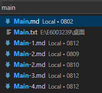
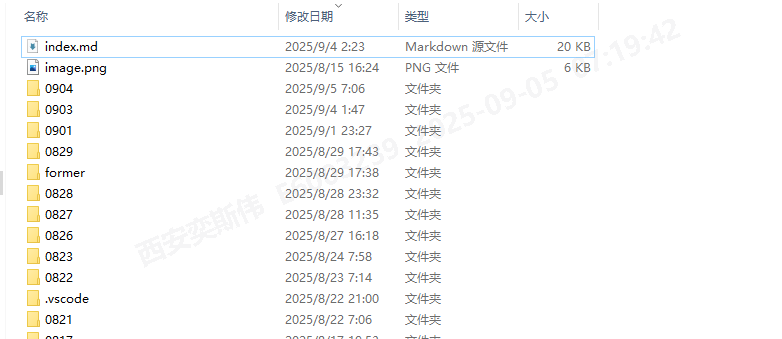

# Local

A-
 

！

# remote

 

----

人物群像

....

2025年8月9日04:45:49

设计一个简约款的常服  

2025年8月9日06:12:14

皇太后巡视后宫 病毒扩散的过程 

落后的医疗条件缺乏足够的卫生知识带病传播病毒 疫情扩散 

其实感觉常服倒是可以设计出很多套 

病毒改变了他的思维 让病毒扩散  

巡视六宫 需要个合理化的解释 

六军不发无奈何,宛转蛾眉马前死。花钿委地无人收,翠翘金雀玉搔头。君王掩面救不得,回看血泪相和流

描述一下她霸气的让宫女准备銮驾的细节 增加一些情节描写 注意她皇太后的身份

她决定换上那套深紫色旗袍长裙，先描述长裙的细节，注意她的年纪 也要符合他顶级皇宫贵族的身份

她决定沐浴更衣更换上这件衣服 注意她日益苍老的身体 以及那件完美而性感的长裙 

年老色衰的身体  爆体而亡 可以继承后面的片段  
皇后不能死 太后可以安排盒饭 
原则 好看的人可以留下 不好看的人都给我盒饭吧  

巡视六宫
色衰和期待好像给重复了 
不过问题不大  LocalStorge而已

等待銮驾的过程 他感受到了小腹和手臂处的瘙痒 

他开始巡视六宫 先去皇后的宫殿 

重新调整 换一套符合皇后的装扮 皇后在宫门前迎接太后的场景

接见结束之后，皇太后和皇后两人来到了皇后的宫殿之内 增加一下细节，描述一下这个过程

好像可以增加一下婆媳矛盾   

皇后和太后那也不是一个大家庭嘛 矛盾肯定也是有的

两人来到内厅 增加一下宫殿的名称 摒退身边闲散人等 增加一些细节过渡一下

在这个安静的内厅 他们两人谈话 讨论起病情 也发现了皇后锦衣之下的同样的病情

怎么感觉跟小孩子玩过家家一样 太多就没意思了啊 

将故事讲述出来就行了 不用太多 

To be Continue...... 

https://chat.qwen.ai/c/05457ba5-d539-4862-9d41-4262fa7ba29f  皇太后深宫日常 

1. 剧情想必可以这么安排 这样就串联起来了 
Rev.0 
七绝山前传→紫蟒修仙→化形觅洞府→开辟小世界→一界之神→万民朝拜→七绝惨案→阴谋 误入西游→终章 注定败北→逆反 九重天宫→败亡 跌落凡间→归凡 王朝女帝→残喘 身躯腐败→身化万物→紫蟒 玉殒香消→...→...→滴血玉簪→修仪 御花园感染→...→修仪 春猎异变→贵妃A感染→带毒归来→黑雾惊变/宴请众人→舞姬异变→贵妃B细查→小桃舞姬→太后异变→致命高烧→巡视六宫→...→深度异变→贵妃小桃→优雅残存→...→
---
... 2025年8月22日23:33:53

# 2025年8月22日23:33:58 
Rev.1 
七绝山前传→紫蟒修仙→化形觅洞府→开辟小世界→一界之神→万民朝拜→七绝惨案→阴谋 误入西游→终章 注定败北→神陨 孙猴败亡→逆反 九重天宫→败亡 跌落凡间→归凡 王朝女帝→残喘 身躯腐败→觅生 逆风拯救→妖躯 身化万物→紫蟒 玉殒香消→枯骸 女妖遗骨→王朝 黑雾残响→ ...→...→滴血玉簪→修仪 御花园感染→...→修仪 春猎异变→贵妃A感染→带毒归来→黑雾惊变/宴请众人→舞姬异变→贵妃B细查→小桃舞姬→太后异变→致命高烧→巡视六宫→...→深度异变→贵妃小桃→优雅残存→...→女帝 腐骨生蛆→后传 任神之城→逆风 囚笼脱逃→吸血 狼人双生→雨燕 尸骨无存

Rev.2

七绝山前传→紫蟒修仙→化形觅洞府→开辟小世界→一界之神→万民朝拜→七绝惨案→阴谋 误入西游→终章 注定败北→神陨 孙猴败亡→逆反 九重天宫→败亡 跌落凡间→归凡 王朝女帝→残喘 身躯腐败→觅生 逆风拯救→妖躯 身化万物→紫蟒 玉殒香消→枯骸 女妖遗骨→王朝 黑雾残响→ ...→...→滴血玉簪→修仪 御花园感染→...→修仪 春猎异变→贵妃A感染→带毒归来→黑雾惊变/宴请众人→舞姬异变→贵妃B细查→小桃舞姬→太后异变→致命高烧→巡视六宫→...→深度异变→贵妃小桃→优雅残存→...→女帝 腐骨生蛆→后传 任神之城→逆风 囚笼脱逃→吸血 狼人双生→未来 致命猎杀→雨燕 尸骨无存 →维妮娜 吞噬星空→李薇 重生归来→ KSP 星辰大海 → 希灵 真神不灭 → 英灵 伪神重生

Rev.3 大纲
1. 七绝山前传→
2. 紫蟒修仙→
3. 化形觅洞府→
4. 开辟小世界→
5. 一界之神→
6. 万民朝拜→
7. 七绝惨案→
8. 阴谋 误入西游→
9. 终章 注定败北→
10. 神陨 孙猴败亡→
11. 逆反 九重天宫→
12. 败亡 跌落凡间→
13. 归凡 王朝女帝→
14. 残喘 身躯腐败→
15. 觅生 逆风拯救→
16. 妖躯 身化万物→
17. 紫蟒 玉殒香消→
18. 枯骸 女妖遗骨→
19. 王朝 黑雾残响→ ...→...→
20. 滴血玉簪→.
21. 修仪 御花园感染→...→
22. 修仪 春猎异变→
23. 贵妃A感染→
24. 带毒归来→
25. 黑雾惊变/宴请众人→
26. 舞姬异变→
27. 贵妃B细查→
28. 小桃舞姬→
29. 太后异变→
30. 致命高烧→
31. 巡视六宫→...→
32. 深度异变→
33. 贵妃小桃→
34. 优雅残存→...→
35. 女帝 腐骨生蛆→
36. 后传 任神之城→
37. 逆风 囚笼脱逃→
38. 吸血 狼人双生→
39. 未来 致命猎杀→
40. 雨燕 尸骨无存 →
41. 维妮娜 吞噬星空→
42. 李薇 重生归来→ 
43. KSP 星辰大海 → 
44. 希灵 真神不灭 → 
45. 英灵 伪神重生

2025年8月10日06:45:53

顺着大纲来编吧 
呵呵呵呵
！
# 2025年8月10日22:21:00 

----
# 废文

黑雾惊变·大纲Initial
01. 废文扩展 

场面描写 

！
與酒
！
皇后·2
！
皇后·1
！
赐酒
！
金凤
！
黑雾·2
！
黑雾·1
！
RawData·Chatbox对话文档 
！
Temp
！  
Closed
！ 
锦袍
# 2025年8月11日22:50:08 

！
废·莲子羹
！
废·莲子羹·1
！
废·銮驾
！
大纲
！
Temp·大纲·小桃 
！
废·风暴
！
锦袍
！
思绪·Closed
！
小桃·Closed
！
七绝山
！
故事线·Closed
！
神陨·0
！
神陨·1
！
神陨·2

！
挪动

！
漩涡

！
神坠

！
朱砂印
！
伤疤·泉眼

还是回归之前的
 Local 古风 remote 七绝山 mobile Transfer
写古风丧尸文

可以继续梳理大纲了  这边都到111了 那边还不知道几何呢~  

# 2025年8月15日10:27:47 

！
瑶光圣域

！
铸皇朝

！
新纪元

！
三千年的发展

！
行盛世

！
瑶光帝君

！
争端起

！
入局

！
注败局

！
注败局·扩展

！
九重天降·Raw Data

！
陨落之神·01废

# scene 
01  云海 九重天 玄冥神女 墨色长裙 周边冰蛇环绕 | 
02 七把冰剑 迎面冲击 巨大化 白衣修仙女神 冰墙阻挡 | 

！
陨落之神·02废

03 修仙神女 头戴玄冰冠冕  眉心一点玄冥印记 九串冰晶璎珞 垂落肩头 腰间盘龙玉带 身旁护体灵蛇 手持神杖  杖身 万年寒玉 顶端 神核 |  
04 金甲女神将 手持神兵 结阵  灭杀叛乱的女神  女神 紫金龙袍 仙界大战 | 
05 金色流光 击杀贯穿女神 白衣神女 手持神杖化作护盾抵挡 东方女神 | 
06 女神坠落 摔下云端 嘴角流出鲜血 不甘望向天空的其余女神将 手中玄冥神杖碎裂 | 

！
陨落之神·01正·遗世独立

07 瑶光女神踏云站立 一身霓裳披身 衣上金线绣有北斗七星  裙摆拖曳 绣祥云图案 头戴凤冠 鬓边垂落两缕冰蚕银丝 眉心一点金纹 耳垂双环 腰束紫玉玲珑带 | 

！
陨落之神·02正·多幻法术

！
陨落之神·03正·仙女临凡

！
陨落之神·04正·最强大招

！
陨落之神·05正·同归于尽

！
陨落之神·06正·细微伤口

！
陨落之神·07正·暗伤评估

！
陨落之神·08正·九霄灭世

！
陨落之神·09正·神陨之期

# 2025年8月15日20:05:40

！
陨落之神·10正·不朽之光

！
陨落之神·11正·天命主宰

！
陨落之神·12正·天罚之力

！
陨落之神·13正·命运之渊

！
陨落之神·14正·帝袍妖躯

！
陨落之神·15正·九重神坠·33·33

！
陨落之神·16正·帝噬重天·32·32

！
陨落之神·16正·巨蟒妖神·32·31

！
陨落之神·16正·天道之伤·32·30

！
陨落之神·16正·致命神劫·32·29

！
陨落之神·17正·仙药秘伤·31·28

！
陨落之神·17正·复归人形·32·27

！
陨落之神·18正·致命前行·30·26

！
陨落之神·19正·青光女仙·25

！
陨落之神·20正·位格·24

！
陨落之神·21正·灵气·23

# 2025年8月16日11:37:30
To be Continue... 

！

！

！

！

！
！

！

# 2025年8月17日11:36:46

！
！
未尽之文
！

！

！

！

！

！

！

！

！

！

！

！

# 2025年8月15日15:33:36
正向发展呢 还是负向发展呢 
其实之前的想法是正向发展 她的一步步成长与最终的败亡形成鲜明的对比 达成一个BE结局

# 2025年8月16日09:03:25

神祭 | 送那位陌生的神明 

# 2025年8月14日08:22:20

其实感觉这个设定也不错 前世今生的设定 前世为七绝山的大蟒妖的尸骸所化  后世为任神之城 一个并不存在的城市 但是就是讲一个当世的故事 当时的丧尸宫斗文 玩的就是一个感觉

# 2025年8月10日21:39:43 

  腐骨生蛆 奢侈而又华丽的礼服之下，她那俊美的绝世容颜让世人所痴迷 但没有人知道她隐秘之处的污秽 每一步的行走都可以感受到肌肤的腐败 不可逆转的流程已经开始  一切已经避无可避 静静的等待最后的审判 默默的承担着最终的一切 毋庸置疑 不可逃避 2025年8月10日21:17:31 |
  为什么写丧尸  因为现在的工作状态就像是个丧尸 浑浑噩噩 行尸走肉 好像是在努力工作的一种假象 人人定了个黑眼圈 上班就在犯困 打瞌睡 拜佛 这不就是丧尸的状态吗 活动的尸体 The Walking Dead或者说换个说法 死人也可以走路 繁华的假象都靠着一堆丧尸在表层维护 上层内核已经彻底腐败 依旧维持那种虚假的繁荣 靠AI维护的互联网的伪繁荣 经济下行之下的伪扩增消费 感觉一切都像是有病了一样 丧尸病毒感染了一切 但又在竭力维护着这一切  2025年8月10日21:21:25 | 
  整个王朝都在覆灭 唯独个人得以幸存 红颜枯骨 在所有人都变成枯骨之后 只剩一人幸存 挣扎在末日之后的伪像 2025年8月10日21:30:36 | 
  太多的细节貌似也不好 快速推进剧情貌似才是最终的方案 2025年8月10日21:31:02 | 

！
腐骨生蛆 
王朝皇后的最期 奢侈而又华丽的礼服之下，她那俊美的绝世容颜让世人所痴迷 但没有人知道她隐秘之处的污秽 已经深入异变为丧尸的她 每一步的行走都可以感受到肌肤的腐败 不可逆转的流程已经开始  一切已经避无可避 静静的等待最后的结局 默默的承担着最终的一切 毋庸置疑 不可逃避 
！
不知不觉之间就拿AI又编了一个文 妙哉~ 

！

！

！

！

！

！

！

！

！

！

# 2025年8月26日11:16:49

# 2025年8月28日11:42:37    

皇后
# 2025年8月27日13:53:12 

# 2025年8月27日22:19:50

皇后之变-1
1. 皇后的故事还需要继续 带病之身 续接 紫宸夜宴 这个是个很好的主意
2. 但是到底是三日后还是当日夜宴呢 这是个问题 
3. 皇后善妒 所以她化作了怪物 前文已经有了皇后的异变  
   大调不太可能 但微调可以做到

皇后之变-2

皇后之变-3

皇后之变-4

# 2025年8月27日23:20:54

苏选侍

异变细节

异变细节-b

异变细节-c

# 2025年8月29日15:36:16 

1. 桂花是一种意象 两个人都喜欢同样的东西 或许那是共同的联系吧

1. 七绝山前传→2. 紫蟒修仙→3. 化形觅洞府→4. 开辟小世界→5. 一界之神→6. 万民朝拜→7. 七绝惨案→8. 阴谋 误入西游→9. 终章 注定败北→10. 神陨 孙猴败亡→11. 逆反 九重天宫→12. 败亡 跌落凡间→13. 归凡 王朝女帝→14. 残喘 身躯腐败→15. 觅生 逆风拯救→16. 妖躯 身化万物→17. 紫蟒 玉殒香消→18. 枯骸 女妖遗骨→19. 王朝 黑雾残响→ ...→...→20. 滴血玉簪→21. 修仪 御花园感染→...→22. 修仪 春猎异变→23. 贵妃A感染→24. 带毒归来→25. 黑雾惊变/宴请众人→26. 舞姬异变→27. 贵妃B细查→28. 小桃舞姬→29. 太后异变→30. 致命高烧→31. 巡视六宫→...→32. 深度异变→33. 贵妃小桃→34. 优雅残存→...→35. 女帝 腐骨生蛆→36. 后传 任神之城→37. 逆风 囚笼脱逃→38. 吸血 狼人双生→39. 未来 致命猎杀→40. 雨燕 尸骨无存 →41. 维妮娜 吞噬星空→42. 李薇 重生归来→ 43. KSP 星辰大海 → 44. 希灵 真神不灭 → 45. 英灵 伪神重生
# 2025年9月17日07:38:16

感觉应该修一修了  

01 黑雾残响.
02. 

3. 锦衣/皮衣之下的身躯已经严重异变，腐烂从内到外不可逆转。
  这个感觉已经写了双份了 
尽管路人看起来还是那么的美丽动人的女子，但她的内心早已腐烂。
  锦衣之下的身躯被病毒侵袭已久。
    不断蜿蜒爬行的病毒扩散的痕迹，在那完美的肌肤之上
      对外的肌肤依旧完美 但锦衣之下的肌肤已经深度异变
  腐烂 
    完美的皮肤之下的肉体已经彻底腐烂 
      她需要一个契机 来释放那些彻底腐烂的粘液
        隐秘的空间 尽情的释放那些私密处的污秽

！      
！       

！        

！ 

不同于对外的优雅大方，绝美高贵，在那独处而又私密的隐秘的独处空间之内，她扒开自己的伪装，处理着自己的残躯，尽可能的延缓那些异变的进程，苟活于世，但又不仅仅是苟活。
她有着自己的目的和考量，或为自己守护的一方众生，又或者是其他的该守护或者坚持的东西。

# 10 

    下层人物已经是严重的状态  
    异变的舞女 被宫殿侍卫带走 
    已经到了非常严重的那一步 在太医院将很快不治身亡 

    贵妃的贴身侍女小桃负责调查异变的舞姬，前去天牢提人的时候发现舞姬已经脸色苍白冷汗淋漓发寒的症状初显 无法坚持进一步问询 然后心软的她带人前去太医院治病 过程中无意感染了病毒  
     进一步导致了病毒的扩散 

.