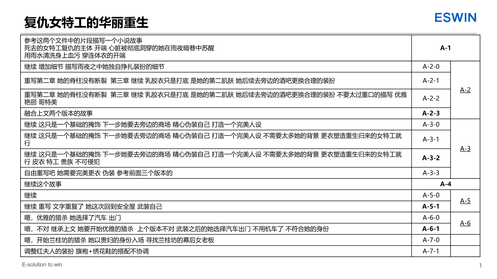
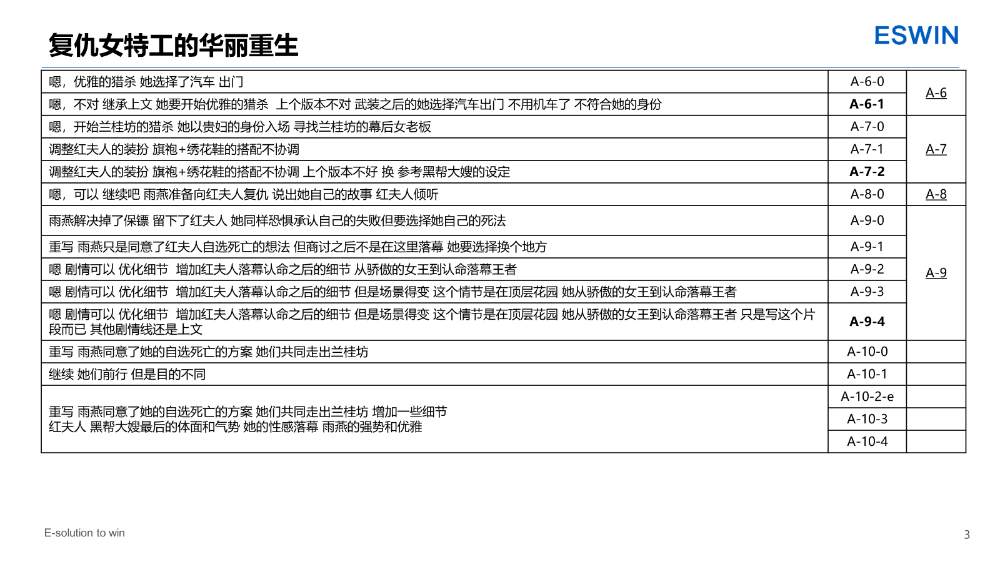

# 素材 

你们是说我吗？
你都在想些啥
死亡的前一刻猛的一口吸入的那一口气不能散 散了就凉了啊
花部长的重伤之躯 小腹被无情的杀手无情的划开 几乎要裂成了两半 纵向剖腹的伤口 昨晚研究了之后才发现作者也是看过杀戮之宴的，果然是同好啊 
一坨大便粘在她那完美无瑕的赤身裸体之上 完美的身躯不在完美
一个美丽性感而又霸气十足的女子军官，性欲十足，非常有诱惑力。
高颜值的描写 刚刚提到巨文静 结果就有了这个想法，一切都是有逻辑的 暗杀巨文静
长靴 防水台 原来还有这么多有意思的设定啊  看来专业的就是要把事情做细致  长靴的防水台（也称为“防水台底”或“防水台跟”）是指鞋底前脚掌部分加厚的设计，通常由橡胶、塑料或其他防水材料制成。它的主要功能是：

1. **防水防滑**：加厚的鞋底可以隔绝地面水分，防止雨水或积水渗入鞋内，同时增强抓地力。  
2. **增高效果**：防水台能隐形增加身高，且比细高跟更稳定，减轻前脚掌压力。  
3. **平衡舒适度**：搭配高跟鞋时，防水台能缓解脚部疲劳，让行走更轻松。  

**常见类型**：  
- **隐藏式防水台**：外观与普通鞋底无异，但内部加厚（如某些过膝长靴）。  
- **外露式防水台**：明显可见的加厚设计，风格更粗犷（如雨天靴或厚底靴）。  

**适用场景**：雨天、冬季雪地，或需要长时间站立/行走的场合。  

简单来说，防水台是兼顾实用与美观的设计，尤其适合需要防水或增高的长靴款式。
如果要说有多么好看吧，那么想必就是张馨予一样的颜值了吧，女神级别的身材 演员一般的气质 绝美的身材 无可挑剔的神颜
肚子破了就那胶衣包裹住啊多么重的伤都可以用胶衣包裹住 身材好的话都不是问题 还有束腰 才发现还有这个玩法 666
束口胶衣之下多么重的伤都可以被完美掩饰，甚至是腐烂的尸体  血和尿 大便 粪 精液或者女性的爱液 等等...
美女完美的肉体是美女的第一层美丽的皮肤，而胶衣被誉为女性的第二皮肤，用于掩饰身体上的缺陷，比如各种丑陋的伤疤，肆意流淌的体液 遮掩身体上的痛苦等等 在那之上还有其他的掩饰 重重掩饰下性感的美女 

