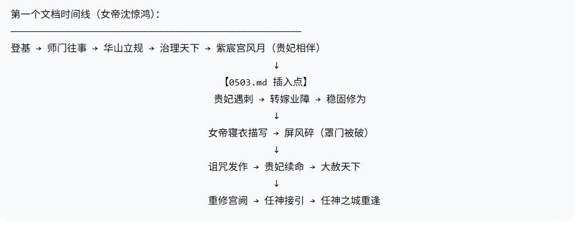

# 01  对话
## 01 提示词 

帮忙优化一下这个文档 梳理一下小说故事线

## 02 响应

当然可以。以下是对你提供的这部小说创作对话记录的整体优化与故事线梳理，分为两个部分：

---

## 一、整体优化建议（文档结构与可读性）

### 1. **统一章节命名方式**
- 当前“01 提示词 / 响应”这种格式清晰，建议保留。
- 可将“响应”部分的小标题（如“一眼惊鸿”“金銮殿一剑定乾坤”）统一为**加粗或斜体**，便于区分。

### 2. **删除重复内容**
- 文档中多次出现重复片段（如“屏风碎”改写多次、“华山绝顶”出现两次），建议保留最终版本，其余删除或标注为“弃稿”。

### 3. **增加剧情分段标题**
在长对话中插入简要剧情标题，例如：
- `【女帝初立】`
- `【师门血案】`
- `【罩门被破·诅咒应验】`
- `【贵妃续命·妖仙真相】`
- `【大赦天下·重修宫阙】`

### 4. **统一人物称呼**
- 女帝：沈惊鸿 / 陛下 / 女帝（统一为“沈惊鸿”为主称）
- 贵妃：苏晚璃（统一姓名）
- 女魔头/宿敌：建议统一命名，如“夜罗刹”或“清霜”

---

## 二、故事主线梳理（按时间顺序）

### 【第一阶段：女帝初立·天下第一】

- **设定**：紫宸王朝女帝沈惊鸿，既是帝王，也是天下第一高手。
- **登基**：一剑劈碎权臣篡位野心，华山绝顶连败七大派掌门。
- **治国方式**：朝堂严惩贪腐，江湖以武立规，夜巡四方，镇妖除魔。

### 【第二阶段：往事·师门覆灭】

- **出身**：青云剑派最小弟子，师父凌玄真人如父。
- **背叛**：大师兄秦苍勾结外敌，血洗师门，夺剑谱、献边关图。
- **坠崖逃生**：被崖壁松枝挂住，藏身洞窟，活下来并发誓复仇。

### 【第三阶段：恩怨纠葛·宿敌与诅咒】

- **秦苍**：成为权臣，后被沈惊鸿收服，转为暗卫谋臣。
- **先帝诅咒**：登基第七天梦遇先帝，诅咒她“罩门被破，旧伤齐发，药石无医”。
- **女魔头夜罗刹**：被沈惊鸿镇压于天牢，封印以女帝生机为锁，只有女帝陨落才能解封。

### 【第四阶段：致命危机·罩门被破】

- **金丝穿罩门**：暗杀者以细金丝刺入她颈后罩门，内力尽泄。
- **诅咒应验**：旧伤齐发，生机流逝，命入倒计时。
- **贵妃苏晚璃出场**：深宫贵妃，温柔体贴，察觉女帝异样，开始贴身照顾。

### 【第五阶段：贵妃续命·妖仙真相】

- **续命方式**：苏晚璃以秘药灯油、自身内力为女帝续命。
- **真相一**：苏晚璃修仙，吸纳天地散逸生机修行，不伤人命。
- **真相二**：苏晚璃本体为**千年碧玉蜈蚣精**，化形入世，只求红尘庇护，不为恩仇。

### 【第六阶段：大赦天下·重修宫阙】

- **心境转变**：女帝放下恩怨，决定大赦天下。
- **亲赦宿敌**：亲自下天牢，为女魔头解开枷锁，搀扶出狱。
- **重修宫阙**：以帝王权柄统筹全局，修复战火破损的皇城、园林、藏书楼。
- **与贵妃相守**：二人坦诚相待，女帝接纳妖仙身份，贵妃继续为她续命。

### 【第七阶段：结局意向（未完结）】

- 沈惊鸿命数仍短，但不再孤身一人。
- 贵妃以妖身相守，旧敌知己驻足相伴。
- 她以有限光阴，修补山河，留存世间美好。

---

## 三、人物关系简表（建议补充）

| 角色 | 身份 | 与沈惊鸿关系 |
|------|------|----------------|
| 沈惊鸿 | 女帝、天下第一 | 主角 |
| 苏晚璃 | 贵妃、碧玉蜈蚣精 | 伴侣、续命者 |
| 秦苍 | 前权臣、暗卫谋臣 | 师兄→仇人→臣子 |
| 夜罗刹/清霜 | 女魔头/宿敌 | 被镇压→被赦免 |
| 先帝 | 前朝帝王 | 诅咒施术者 |
| 凌玄真人 | 青云剑派掌门 | 师父（已故） |

---

## 四、可补充的建议

### ✅ 建议增加：
- **章节导语**：每章开头用一句话概括核心冲突。
- **时间线标注**：如“登基第七年”“罩门被破第三日”等。
- **视觉符号**：如“⚔️”“🩸”“🌙”区分战斗、温情、回忆等场景。

### ❌ 建议删除/合并：
- 多次重写的“屏风碎”“银瓶乍破”等段落，只保留最终版。
- 重复的“华山绝顶”描写，合并为一处。

---

如果你希望，我可以帮你将这个文档**重新整理成一个结构清晰、可读性强的完整小说大纲或正文章节版**。是否需要我这样做？

# 02  对话

## 02 剧情融合 

任神 / 女帝 / 贵妃 （私货）

## 02 响应

嗯 先给这个故事一个结尾吧 不要BE结局 女帝已经活了 但是需要引入一个神灵 任神接引 完美退场 小故事快速退场就行 重写 不要贵妃 她还有故事 只有女帝 神明不要太多描述 设定全能 为女帝驱散诅咒 解除性命之忧 带她归去任神之城  神明不是女帝

### 03-3 女帝沈惊鸿 · 终章 · 任神接引

夜色沉沉，望月阁的烛火已将燃尽。

沈惊鸿独坐窗前，鎏金贵妃华袍褪去，换回一身素白寝衣。颈间那枚朱砂红点仍在隐隐发烫，诅咒如附骨之疽，在骨血里缓缓蔓延。贵妃苏晚璃今夜未至——她早已在数日前离去，说是要回山野渡一场属于她自己的劫。沈惊鸿没有挽留，只赠了她一枝御苑新开的碧色牡丹。

她知道，有些人注定要分别，有些路注定要独行。

只是这条独行的路，似乎也走不远了。

内力已稀薄如雾，每一次呼吸都带着旧伤的钝痛。她望着窗外渐次修复的宫阙，唇角浮起一丝浅淡的笑——该修的，都已修好；该留的，都已留下。这王朝，这山河，这人间的繁华与温柔，她已尽数归还。

“够了。”她轻声说给自己听。

就在此时——

殿内烛火忽然静止，不再摇曳，连沉香袅袅的青烟都凝在半空，如一幅被定格的画。

一道光，从穹顶无声垂落。

不刺眼，不灼目，只是一片柔和的、金白色的辉光，如月华，如晨雾，又如深秋的第一缕霜。光芒之中，隐约显出一道身影——无冠冕，无法袍，无羽翼，也无任何凡世神像该有的威仪。那只是一个轮廓清隽、看不出年岁与性别的人影，周身笼罩在一层极淡的光晕里，仿佛随时会散，又仿佛亘古长存。

沈惊鸿微微抬眸，没有惊惧，没有慌乱。她见惯生死，早已无惧。

“你是何人？”

那身影没有回答，只轻轻抬手。

一指点在她眉心。

刹那间，沈惊鸿只觉得体内所有蛰伏的诅咒、缠绕的阴寒、罩门处日夜溃散的内力，如同冰雪遇朝阳，无声无息地消融。不是被驱散，不是被镇压，而是被一种高于凡尘的力量轻轻拂去，仿佛它们从未存在过。

那是一种她从未体验过的感觉——通透、轻盈、无病无痛。

从十六岁师门覆灭起，她的身体便从未如此轻松过。

“你的命，不该绝于此。”那身影开口了，声音平静如水，没有居高临下的怜悯，也没有神明的慈悲，只是淡淡地陈述，“你守过一方山河，护过万民烟火，修过破碎宫阙，留过人间美好。尘缘已尽，善果自成。”

“我来接你。”

沈惊鸿怔了一瞬，随即轻轻笑了。

她没有追问对方是谁，来自何方，为何而来。她只问了一句：“去何处？”

“任神之城。”

那身影伸出手，掌心光晕柔和。

沈惊鸿望着那只手，又回望了一眼窗外沉睡的皇城。朱墙碧瓦，灯火点点，她一手重建的盛世，正安睡在月色之中。

再无牵挂。

她缓缓起身，素白衣袂垂落如霜雪。没有回望，没有迟疑，指尖轻轻搭上那道光影的掌心。

光芒骤然盛放，又骤然收敛。

殿内烛火重新摇曳，沉香再度袅袅升起。只是窗前那张软榻之上，已无人影。

只剩一枝碧色牡丹，静静搁在案头，花瓣上凝着一滴露，映着月色，像一滴未落的泪。

---

后来，宫人只在软榻上发现了一封简短的手书：

> “朕去矣。山河无恙，勿念。”

无人知晓她去了哪里。

只知道那一夜过后，女帝沈惊鸿再未出现。王朝由内阁暂摄，四海安定如初。御花园的花年年盛开，望月阁的灯夜夜长明。

而千年之后，任神之城的某处白玉阶前，总会有一位素衣女子负手而立，望着云海尽头那一片如碎金般的人间灯火。

她偶尔会想起那座皇城，想起那枝碧色牡丹，想起某个深夜里，一道光影接引她走出命数的囚笼。

再无诅咒，再无旧伤，再无倒计时。

她终于，以另一种方式，永存于世间。

——【终】——

重写 不要贵妃 她还有故事 只有女帝 神明不要太多描述 设定全能 为女帝驱散诅咒 解除性命之忧 带她归去任神之城

我们要求重写结尾：不要贵妃，只有女帝。神明（任神）设定全能，为女帝驱散诅咒，解除性命之忧，带她归去任神之城。小故事快速退场。需要简短。

原故事中女帝沈惊鸿有罩门被破、先帝诅咒、生机流逝。现在任神出现，直接解决这些问题并带走她。没有贵妃参与。

写一个精简的尾声。

### 03-2 尾声 · 任神接引

皇城修缮完毕那夜，沈惊鸿独自立在望月阁顶。

月光洒满她一身鎏金长袍，颈间朱砂红点仍在，诅咒的寒意日日啃噬骨血。她知道自己撑不了多久了。可她已无遗憾——宫阙复原，山河安定，天下苍生有了太平。

忽然，天穹裂开一道金光。

没有异象铺陈，没有风雷翻涌，只有一道温和却不容抗拒的光柱垂落，将她整个人笼罩其中。一位身披素光、眉眼淡漠的神明踏光而出，周身气息浩瀚如宇宙，却静默无声。

“朕乃任神。”那声音直入神魂，“你凡尘功行圆满，诅咒当消，命数当续。”

不等沈惊鸿开口，任神抬手一指。一道金色神光没入她眉心，颈间朱砂红点瞬间消散，盘踞多年的先帝诅咒如冰雪遇阳，顷刻瓦解。体内枯竭的经脉重新涌动，生机如春潮回涌——她从未感觉如此轻盈、如此完整。

“你的性命，朕已保下。”任神淡淡道，“随朕归去任神之城，位列神阶，掌一方安宁。”

沈惊鸿垂眸，看了一眼脚下万家灯火，然后抬步，踏上光阶。

她没有回头。

金光收拢，天穹闭合。望月阁顶空无一人，只余夜风拂过檐铃，清响悠长。

那位女帝，从此人间再无踪迹。而任神之城，多了一位俯瞰万世的神祇。

嗯 先给这个故事一个结尾吧 不要BE结局 女帝已经活了 但是需要引入一个神灵 任神接引 完美退场 小故事快速退场就行

我们要求为故事写一个结尾，不要BE，女帝已经活了，引入一个神灵（任神）接引，完美退场，小故事快速退场。需要结合之前的故事线：女帝沈惊鸿罩门被破、诅咒缠身、生机流逝，但有贵妃苏晚璃（千年碧玉蜈蚣精）续命。现在需要她最终获得解脱，不是死亡，而是被神灵接引，完美退场。可以理解为：她修复完宫阙，完成了人间使命，然后任神出现，接引她离开凡间（或许成仙或去往更高境界），贵妃可能也一起？但要求“女帝已经活了”，所以不是BE，是HE。

写一个简短的结尾片段，融入之前的文风。

### 03-1 尾声 · 任神接引

暮春的最后一场雨落尽时，皇城修缮终告竣工。

承天门琉璃瓦映着初晴的日光，白玉栏杆上缠枝鸾纹栩栩如生，御花园内万花齐放，望月阁的铜铃在风里发出清越的鸣响。沈惊鸿立在城楼最高处，一身鎏金贵妃华袍被风吹得猎猎作响，苏晚璃静静站在她身侧，碧色灵光在指尖流转，默默稳住她日渐稀薄的生机。

她已活得比任何人预料的都要久。

罩门的朱砂红点仍在，诅咒的寒意日夜不休，可她的脚步从未停歇。这些年，她亲手督造了这座王朝最盛大的重生——宫阙复原，文脉重续，百姓安居，四海升平。她把所有破碎的美好，一片片拼回了原样。

“朕能做的，都做完了。”

她轻声道，语声里没有遗憾，只有沉甸甸的圆满。

苏晚璃轻轻握住她的手，掌心温热，千年妖仙的灵气缓缓渡来。她知晓沈惊鸿的命数已至尽头，却不再惶恐，因为她知道，眼前这个人从不畏惧终局。

就在此时——

天光骤然一暗，又猛地亮起，金光从云层深处倾泻而下，整座皇城被笼罩在一片温暖而庄严的光辉之中。

城楼之上，虚空缓缓裂开一道缝隙，金色光雨纷纷扬扬洒落，一位身着素白长袍、眉目慈悲的神灵踏光而来。他的身影不辨男女，周身流转着亘古的星辰之力，每一步都踏在虚空之上，却有莲花般的金光在脚下绽开。

“沈惊鸿。”

那声音温润如玉，穿透云霄，直入心魄。

“朕乃任神，掌世间功行圆满、宿缘了却之人。你以残躯守山河，以仁心赦天下，以毕生之力修补万民疮痍。凡尘使命已尽，功德圆满，当由本神接引，脱离凡骨，归于太虚。”

沈惊鸿抬眸望向那道神圣的身影，神色平静如水。她微微侧首，看了一眼身旁的苏晚璃，又看了一眼城墙下那些曾经并肩的故人——女魔头遥遥拱手，秦苍垂首默立，文武百官跪伏如潮。

她没有什么放不下的了。

“朕的贵妃，也可一同去么？”她问，声清如泉。

任神微微一笑，目光落在苏晚璃身上：“千年妖仙，守护帝君，不伤苍生，功德自成。她与你命魂相缠，本神一并接引。”

苏晚璃怔了一瞬，随即轻轻笑出来，眼眶微红，却无泪。她握紧沈惊鸿的手，碧色灵光与金色光雨交织在一起，温柔缱绻。

沈惊鸿最后看了一眼这座她守护一生的王朝，繁花似锦，宫阙巍峨，人间烟火绵延不绝。

她回过头，与苏晚璃并肩，踏上了那道金色光阶。

一步，两步，三步——

鎏金华袍化作漫天金粉，素色宫衣随风散为流光，两人的身影渐渐融入那片温暖的光辉之中。没有痛苦，没有衰败，只有释然与安宁。

城楼上，那道金色光门缓缓合拢。

天光重归清明，暖风拂过御花园，落英缤纷如雨。

而那位女帝的身影，再未归来。

只余一座盛世皇城，在春日里静静矗立，碑石上刻着她留下的最后一句话：

> **“朕不负江山，江山不负朕。”**

——全文完——

可以 上面的故事没写贵妃的结局 贵妃的故事

### 03-4 贵妃苏晚璃 · 终章 · 千年一诺

同一夜，月华如水。

苏晚璃独自立于山野之间，早已远离皇城千里。她褪去了深宫华服，只着一身碧色素衣，长发散落，周身萦绕着淡淡的莹绿灵光。

那是她本来的模样——千年碧玉蜈蚣精，化形妖仙，无恩无仇，只求一方红尘栖身。

她在等一场劫。

妖仙修行，千年一劫。渡过则修为精进，渡不过则神魂俱散。她之所以离开沈惊鸿，并非无情，而是不愿让女帝看见自己渡劫时的狼狈，更不愿以将散之身，拖累那本就命数有限的人。

“我若渡得过，便回去寻你。”她曾这样轻声许诺。

可此刻，山风骤起，雷云汇聚，九道天雷已在云层中蓄势。

苏晚璃闭目，心神沉静。

第一道雷落下——

她硬生生接下，唇角溢出一丝碧色的血。

第二道、第三道……

到第七道时，她已单膝跪地，灵光黯淡，妖元几近崩散。

“恐怕……回不去了。”她苦笑着想。

就在第八道天雷即将劈落的瞬间——

天穹裂开一道金光。

不是雷，不是电，而是一道温和到极致的光幕，如一只无形的手，轻轻挡在她身前。那第八道、第九道天雷，竟被那光幕无声消解，连余波都不曾触及她分毫。

苏晚璃愕然抬头。

光幕之中，隐约显出一道轮廓——看不清面目，只有一双沉静如水的眼眸，正淡淡望着她。

“你本非此界之妖，千年修行，不伤众生，不造杀孽。”那声音平静无波，无悲无喜，“尘缘虽未尽，善缘已先成。”

“有人替你求了一道恩赦。”

苏晚璃心头一震：“谁？”

那身影没有回答，只缓缓伸出手。

掌心里，静静躺着一枝碧色牡丹——正是沈惊鸿赠她的那一枝。

花瓣上，一滴露珠晶莹如泪。

苏晚璃怔怔望着那枝牡丹，眼眶骤然泛红。她明白了。

那人虽已离去，虽已步入任神之城，却在最后时刻，替她挡下了天劫，为她求来了一个圆满。

“她等你。”那身影淡淡说道。

苏晚璃缓缓起身，抬手接住那枝碧色牡丹。指尖触到花瓣的瞬间，她周身破碎的灵光骤然重新凝聚，比从前更盛、更纯、更通透。

千年妖身，在这一刻真正蜕变为仙。

她没有回头望一眼凡尘，只是将那枝牡丹轻轻贴在心口，一步踏入那道光幕。

光芒散去。

山野重归寂静，天雷尽散，月色如洗。

只有原地落着一片碧色的花瓣，在夜风中打了个旋，便消散无踪。

---

## 尾声 · 任神之城

白玉阶前，云海翻涌。

沈惊鸿负手而立，素衣如雪。她望着天边那道由远及近的光影，唇角微微扬起。

光影散去，苏晚璃一身碧色长裙，手持那枝永不凋零的牡丹，缓缓落在她面前。

“你替我挡了劫。”苏晚璃轻声说。

沈惊鸿淡淡一笑：“你替我续了命。”

“扯平了。”

两人相视，再无言语。

云海翻涌，日光洒满白玉阶。

千年妖仙，一朝女帝，从此共栖任神之城。

再无诅咒，再无天劫，再无生死相隔。

只有这满城光华，与彼此眼中，永不凋零的倒影。

——【终】——

# 03 对话 

碧玉蜈蚣女妖仙剧情融入

## 03 响应

我们有两个文档：第一个文档是女帝沈惊鸿的故事，结尾有任神接引，贵妃苏晚璃（碧玉蜈蚣精）后续也去了任神之城。第二个文档是贵妃沈氏（沈清沅）的故事，她也是碧玉蜈蚣精，遇刺、探查、转嫁业障等。注意：第一个文档中贵妃名“苏晚璃”，第二个文档中贵妃名“沈清沅”。可能是同一角色的不同命名？或者不同故事线？用户问“剧情线应该在那之前还是之后，两个剧情融合”。需要分析：

第一个文档（女帝故事）：女帝沈惊鸿，贵妃苏晚璃，最后女帝被任神接引，贵妃渡劫后也去了任神之城，结局HE。时间线：女帝登基，诅咒，罩门被破，贵妃续命，发现贵妃是碧玉蜈蚣精，最后女帝被任神接引，贵妃渡劫成功，一同在任神之城。

第二个文档（贵妃故事）：主角贵妃沈氏（沈清沅），也是碧玉蜈蚣精，深得女帝宠爱，遇刺，发现宿命金针导致修为流逝，她转嫁业障给刺客，然后继续在宫中，暗中要清算清微宗。这里女帝似乎没有明确名字，但应该是同一个女帝？第二个文档中女帝称呼为“陛下”，没有明确名字。但贵妃叫沈清沅，与第一个文档的苏晚璃不同。可能是同一个人的不同名字？或者两个独立的故事？

用户想要融合两个剧情。需要判断顺序。第二个文档中贵妃的修为被宿命金针所伤，但后来她转嫁了业障，止住了修为流逝。第一个文档中贵妃（苏晚璃）没有这种经历，而是以碧玉蜈蚣精身份为女帝续命。所以可能是：第二个文档的故事发生在第一个文档之前？即贵妃先遇到刺杀，转嫁业障，然后后来女帝中了诅咒，贵妃用自己修为续命？但第二个文档结尾贵妃已经稳固修为，没有陨落之忧。第一个文档中贵妃修为似乎很强，能续命。

或者可以把两个故事合并为同一条时间线：贵妃沈清沅（即苏晚璃）在宫中遇刺，查明清微宗阴谋，转嫁业障，然后女帝后来中诅咒，贵妃用自己修为续命，最后女帝被任神接引，贵妃渡劫后也去了。第二个文档中没有任神和女帝结局。所以第二个文档应该是女帝故事的前传？但第二个文档中女帝已经是女帝了，而且贵妃深得帝宠，与第一个文档时间线重叠。

更合理的融合：两个文档其实是同一个世界观下的不同篇章。第一个文档聚焦女帝的诅咒和结局，第二个文档聚焦贵妃的个人遭遇和复仇。可以按时间顺序：贵妃遇刺、探查清微宗、转嫁业障（这是女帝中诅咒之前还是之后？）第一个文档中女帝罩门被破是在登基后某日，先帝诅咒应验。贵妃遇刺可能发生在更早。但女帝罩门被破时，贵妃用秘药续命，那时贵妃修为正常。如果贵妃此前已中宿命金针，修为流逝，那她如何能续命？所以第二个文档中贵妃转嫁了业障，止住了流逝，所以修为恢复。可以安排为：贵妃遇刺并转嫁业障发生在女帝罩门被破之前，这样贵妃修为得以保全，后来才能为女帝续命。

因此，剧情线顺序：贵妃遇刺（第二个文档） -> 女帝中诅咒、罩门被破 -> 贵妃为女帝续命 -> 女帝被任神接引，贵妃渡劫 -> 一同去任神之城。

这样融合是合理的。用户需要给出一个融合后的时间线梳理，并说明如何衔接。

### 03-1 Result

根据你提供的两个文档内容，我仔细梳理了剧情线和人物设定，得出以下结论：

---

## 一、两个文档的核心差异

| 维度 | 文档一（女帝故事） | 文档二（贵妃故事） |
|------|------------------|------------------|
| 主角 | 女帝沈惊鸿 | 贵妃沈氏（沈清沅/苏晚璃？） |
| 贵妃姓名 | 苏晚璃 | 沈清沅（文中称沈氏、沈贵妃） |
| 贵妃身份 | 千年碧玉蜈蚣精，温婉续命 | 千年碧玉蜈蚣精，遇刺后转嫁业障 |
| 核心冲突 | 女帝罩门被破、诅咒应验、贵妃续命 | 贵妃被宿命金针所伤，修为流逝，转嫁业障给刺客 |
| 结局 | 任神接引女帝，贵妃渡劫后同往任神之城 | 未完结，贵妃仍在宫中，暗中布局清算清微宗 |
| 时间线特征 | 女帝诅咒应验 → 贵妃续命 → 任神接引 | 贵妃遇刺 → 探查真相 → 转嫁业障 → 继续宫中生活 |

---

## 二、两个故事的关系判断

**二者应为同一世界观下的不同时间线，且贵妃故事发生在女帝故事之前。**

理由如下：

1. **贵妃修为状态**  
   - 文档二：贵妃中了宿命金针，修为持续流逝，后来通过转嫁业障止住了衰败。  
   - 文档一：贵妃有完整修为为女帝续命（秘药灯油、渡灵气）。  
   → 说明文档二的“转嫁业障”成功后，贵妃修为恢复，才能在文档一中为女帝续命。

2. **女帝状态**  
   - 文档二：女帝未提及罩门被破、诅咒等，只是正常宠爱贵妃。  
   - 文档一：女帝先中诅咒、罩门被破，贵妃才需要续命。  
   → 文档二应发生在文档一之前，是贵妃个人的独立劫数。

3. **贵妃姓名差异**  
   - 文档一：苏晚璃  
   - 文档二：沈清沅（沈氏）  
   → 可能是同一角色的不同命名（“沈”为姓氏，“苏”为名？或者笔误），融合时可统一为“沈清沅，字晚璃”或直接采用“苏晚璃”。

---

## 三、融合后的完整时间线（推荐）

| 阶段 | 剧情概要 | 对应文档 |
|------|----------|----------|
| **第一阶段：贵妃遇刺** | 贵妃苏晚璃（沈清沅）在御花园被刺客以宿命金针所伤，修为开始流逝。她独自探查，从刺客口中得知清微宗阴谋。在静云轩，她以妖仙手段将业障转嫁刺客，自身修为稳固。 | 文档二 |
| **第二阶段：深宫静守** | 贵妃继续在宫中陪伴女帝，外表温柔华美，暗中布局准备清算清微宗。女帝不知其妖身与劫数。 | 文档二后续 |
| **第三阶段：女帝诅咒应验** | 女帝沈惊鸿罩门被破，先帝诅咒发作，旧伤齐发，生机流逝。贵妃以秘药灯油和自身修为为其续命，二人感情更深。 | 文档一（前中期） |
| **第四阶段：贵妃坦白妖身** | 贵妃向女帝坦诚自己是千年碧玉蜈蚣精，修行方式无害，女帝接纳。 | 文档一（中期） |
| **第五阶段：女帝大赦天下，重修宫阙** | 女帝放下恩怨，大赦天下，亲自修复战火破损的宫阙。贵妃相伴。 | 文档一（后期） |
| **第六阶段：任神接引** | 女帝宿命将尽，任神降临，驱散诅咒，接引她前往任神之城。贵妃渡天劫，被女帝留下的恩赦所救，也前往任神之城。 | 文档一（终章） |
| **第七阶段：任神之城重逢** | 二人在任神之城重逢，再无生死之隔。 | 文档一（尾声） |

---

## 四、融合建议

### ✅ 统一人物命名
- 贵妃统一为：**苏晚璃**（或“沈清沅，赐名晚璃”）
- 女帝统一为：**沈惊鸿**

### ✅ 整合文档二的“清微宗”暗线
- 清微宗是贵妃在文档二中发现的幕后黑手，可在文档一的女帝诅咒应验后，贵妃一边续命一边暗中派人剿灭清微宗，作为她“独自承担”的体现。

### ✅ 删除重复/矛盾内容
- 文档二中没有“任神”设定，融合后保留任神结局。
- 文档二中没有女帝罩门被破，融合后作为后续剧情。

---

## 五、最终结论

**贵妃的故事（文档二）发生在女帝的故事（文档一）之前**，是女帝主线的前传/并行支线。  
融合后，贵妃的遇刺、转嫁业障、暗中布局，为她后来为女帝续命、最终同往任神之城埋下了伏笔。

如果你需要，我可以帮你**把两个文档合并成一个完整的时间线叙事文档**，保持文风统一，删除重复，补全衔接。

### 03-2 紫宸秘事 · 华年往事

Timekey:紫宸宫风月”之后，“寝殿惊变·屏风碎”之前

#### 过渡章节 · 华年往事

【位置：第一个文档“紫宸宫风月”之后，“寝殿惊变·屏风碎”之前】

---

凝芳殿的烛火燃至夜深，暖意融融，熏香细细盘旋，将整座殿宇笼在温柔安宁之中。

苏晚璃斜倚软榻，一身月白银丝寝衣垂落如云，衣领袖口赤金暗绣的缠枝莲在烛火下流转着细碎华光。青丝松散垂在肩侧，玉簪半卸，鬓边一粒珍珠花钿映得她眉眼愈发温润。她手中捧着一卷旧年的诗册，目光却未落在书页上，而是微微出神，望向窗外沉沉的月色。

今夜女帝宿在紫宸殿批阅奏折，不曾来凝芳殿。她难得独处，却也难得清闲。

只是这份清闲之下，藏着一桩无人知晓的旧事。

她缓缓放下书卷，指尖轻轻抚过自己肩头。那一处肌肤莹白如玉，触感温润，看不出任何异样。可只有她自己记得，多年之前，这里曾被一枚宿命金针刺穿，险些令她千年修为尽数流散。

那是她入宫不久后的事。

那时她还不叫苏晚璃。

她本名沈清沅，生于昆仑山下一处幽深玉洞，乃是千年碧玉蜈蚣吸天地灵气、沐日月精华修成的妖仙。山野孤寂，她厌倦了万古清冷，便化形入世，想寻一处红尘安身之所。

机缘巧合之下，她踏入紫宸皇都，因一身风华气度被选入宫闱，成了彼时尚未登基、仍是太女的沈惊鸿身边的侍读。二人一见如故，性情相投，渐渐生出超越君臣的情意。

沈惊鸿登基为女帝之后，执意要给她一个名分。

“你既入朕的宫闱，便是朕的人。”女帝握着她的手，眼底是少有的温柔，“朕赐你一个新名——苏晚璃。晚者，暮色温柔；璃者，玉光流转。愿你此生，如暮色美玉，安然伴朕左右。”

她欣然领受，从此沈清沅成了过去，苏晚璃成了她在红尘中的新身份。

贵妃的岁月，本是温柔静好的。

直到那一年春日，她在御花园赏花时，被一名乔装潜入的刺客以宿命金针所伤。那金针非凡间俗物，乃是隐世宗门清微宗秘制的克妖之器，专破精怪灵脉，耗其本源，令其修为缓缓流散，最终无声陨落。

她修为深厚，本不惧寻常暗器，可那金针上附着命理枷锁，因果缠身，以她的千年妖力竟也无法自行愈合。伤口不见血，不溃烂，只是内里灵元一日日悄然流逝，如沙漏倾泻，拦不住，补不回。

那一刻她心底便已清明——对方知晓她的真身，知晓她的弱点，是冲着她这条命来的。

她没有告知女帝。

那时沈惊鸿刚登基不久，朝局未稳，藩镇蠢动，江湖暗流汹涌，女帝日日操劳，连安睡都是奢侈。她不愿以自身劫数惊扰帝王心神，更不愿让朝堂因她掀起腥风血雨。

于是她独自承受着灵元流逝的隐痛，独自追查幕后黑手。

她亲自去了关押刺客的天牢。不是以贵妃之尊兴师问罪，而是孤身一人，华服端庄，立在幽暗囚室之中，以千年妖仙的沉静威压，一字一句，从那名被利用的少女口中问出了真相——

清微宗，贪她碧玉灵骨，欲以宿命金针耗其修为，待她陨落之后，取骨炼丹，以突破修行桎梏。

那少女不过是一枚被捏造仇恨的棋子，父亲死于清微宗之手，却被宗门嫁祸于她。

苏晚璃听完，没有暴怒，没有杀意。

她只是静静立了片刻，眼底碧色微光一闪而逝，随即恢复了惯常的温柔淡然。她将那名少女带出阴冷牢狱，移至御园静云轩，以茶相待，以礼相问。

而后，在无人窥见的月夜，她施展了妖仙独有的因果转移之术。

她没有杀那少女，没有施以酷刑，甚至没有斥责半句。她只是将宿命金针带来的业障——那灵元流逝的隐痛、那修为消散的绝望、那走向陨落的漫长折磨——尽数从自己玉骨之中剥离，无声无息，渡给了那名刺客。

因果有归，业障有还。愚昧者，自承其果。

从那以后，她的修为不再流逝，灵元重新稳固，碧玉蜈蚣精的本源恢复了往日的沉厚。而那枚宿命金针留下的印记，只余肩头一道浅淡的红痕，不痛不痒，像一朵将谢未谢的花，静静提醒着她，世间尚有阴私算计，尚未清算。

她没有急着向清微宗复仇。

她隐于深宫，以贵妃的身份继续安然度日，陪伴女帝，赏花品茶，临窗读书，把所有的杀伐心思都藏在那副温柔皮囊之下。她暗中以灵识推演，以奇门手段溯源，将清微宗的人脉、势力、朝堂暗线一一摸清，只待时机成熟，便亲手碾碎这个妄图害她性命的宗门。

那些事，她从不对女帝提起。

沈惊鸿只知道自己的贵妃温婉贤淑，聪慧过人，遇刺之后愈发沉静淡然，却不知这份淡然之下，藏着多少独自扛下的风雨。

“阿沅。”

身后忽然传来熟悉的声音，低柔沉稳，带着帝王独有的温度。

苏晚璃微微回神，侧首望去，只见女帝不知何时已步入殿中，玄色常服未换，显然刚从紫宸殿归来。烛火映着她清冷的眉眼，此刻却柔和了几分。

“陛下怎来了？”苏晚璃起身，动作优雅从容，唇角漾开一抹浅笑，“不是说要批折子到深夜么？”

沈惊鸿走到她身侧，伸手轻轻揽住她的肩，目光落在她脸上，细细端详了片刻，忽然低声问：“在想什么？朕在殿外站了一会儿，见你出神，连朕走近都未察觉。”

苏晚璃垂眸，长睫轻覆，掩去眼底一闪而过的心事。再抬眸时，依旧是那副温柔恬淡的模样：“在想一些旧事。入宫前的，入宫后的。想陛下当年赐名时说的话。”

沈惊鸿眸光微动，指尖轻轻拂过她鬓边碎发，语气宠溺：“朕说，愿你如暮色美玉，安然伴朕左右。”

“臣妾记得。”苏晚璃浅笑，抬手覆上她的手背，指尖温润如玉，“这些年，臣妾一直记得。”

她没有再说下去。

那些宿命金针的痛，那些灵元流逝的绝望，那些独自承受、独自追查、独自转嫁业障的日夜——她统统咽回了心底。

她只想让眼前这个帝王记住的，永远是那个温婉华美、不染尘埃的苏晚璃。

至于沈清沅的过往，至于碧玉蜈蚣的妖身，至于清微宗的恩怨——那是她一个人的事，不需要让这万里江山的主人，为她再添一分忧思。

夜色深沉，帝妃二人并肩立在窗前，月光洒满衣袂。

远处宫墙之外，隐世深山之中，清微宗的灯火依旧亮着。那些修士尚不知晓，他们觊觎的那枚碧玉灵骨，非但没有凋零陨落，反而正在深宫之中，以贵妃之姿，静静等待着反噬的时机。

苏晚璃微微侧首，望向窗外的月色，眼底温柔如旧，唇角笑意恬淡。

她依旧是那个宠冠六宫、绝代风华的苏贵妃。

只是这温柔之下，藏着一头千年玉妖，静待收网。

---

【过渡章节完，可衔接“寝殿惊变·屏风碎”】

# 04 对话 

解析0503.md的时间线

## 04 响应

我们分析0503.md文档（贵妃故事）的时间线。文档内容从“1. 对话”开始，提示词是“续写这个故事 主角贵妃...”，然后响应。后续有多个对话轮次（1-19）。需要理清故事内的时间顺序。

根据内容：

贵妃遇刺：在御花园被金针击中（#1）。当时有女帝赶来。

回宫、更衣、发现伤口不愈（#2-#5）。贵妃发现宿命金针导致修为流逝，但未告知女帝。

评估伤势，决定独自彻查（#6）。

掩盖暗伤，细查（#7-#8）。

调整设定：失血改为修为散去，无血污（#9-#10）。

亲自去查刺客（#11-#12）。从刺客口中得知清微宗阴谋（#13-#16）。

转嫁业障给刺客（#17）。

回到宫中与女帝相处（#18-#19），继续宫中生活，暗中布局。

整体时间线是连续的：遇刺 -> 回宫 -> 探查 -> 转嫁 -> 回归日常。故事发生在同一时间跨度内（数日到数周）。没有出现女帝诅咒、罩门被破等事件。女帝只是正常宠爱贵妃，没有提及自身伤病。

因此，0503.md的时间线应该是在第一个文档（女帝故事）的“紫宸宫风月”之后、“寝殿惊变·屏风碎”之前？但是第一个文档中贵妃名叫苏晚璃，而第二个文档中贵妃名叫沈清沅（后赐名苏晚璃）。过渡章节已经解决了命名问题。

所以0503.md的故事发生在女帝故事中女帝罩门被破之前。具体来说，在“紫宸宫风月”之后（此时女帝与贵妃感情深厚），在“寝殿惊变·屏风碎”（女帝罩门被破）之前。因为0503.md中女帝健康无恙，而屏风碎章节中女帝罩门被破，开始诅咒应验。

因此时间线：贵妃遇刺（0503.md） -> 女帝罩门被破（屏风碎） -> 女帝诅咒发作、贵妃续命 -> 等。

需要输出解析。

## 0503.md 时间线解析

根据文档内容，贵妃故事（0503.md）的时间线可梳理如下：

---

### 一、整体时间跨度

故事发生在**连续的数日至数周内**，无明显跳跃。核心事件如下：

| 章节 | 事件 | 时间点 |
|------|------|--------|
| #1 | 贵妃在御花园遇刺，金针伤肩 | 第1日白天 |
| #2 | 女帝赶来，贵妃回宫，更衣上药 | 第1日下午 |
| #3 | 独处时发现伤口不愈（宿命之伤） | 第1日夜晚 |
| #4 | 评估伤势，决定独自彻查 | 第2日 |
| #5 | 掩盖暗伤，维持贵妃仪态 | 第2-3日 |
| #6 | 调整设定：修为流散，无血污 | （同前） |
| #7-#9 | 亲自去幽掖庭查刺客 | 第3日夜晚 |
| #10-#12 | 将刺客移至静云轩，审问得知清微宗 | 第3-4日 |
| #13 | 展露妖仙身份，压迫刺客 | 第4日 |
| #14 | 转嫁业障给刺客 | 第4日夜晚 |
| #15-#16 | 回宫与女帝相守，表面温柔如常 | 第5日起 |

---

### 二、与第一个文档（女帝故事）的时间关系

#### 1. 核心差异对照

| 维度 | 0503.md（贵妃故事） | 第一个文档（女帝故事） |
|------|---------------------|------------------------|
| 女帝状态 | 健康，无罩门被破，无诅咒发作 | 先有诅咒，后被金丝破罩门，濒死 |
| 贵妃状态 | 遇刺后修为曾流逝，但已转嫁业障，修为稳固 | 修为完整，能为女帝续命 |
| 核心冲突 | 清微宗阴谋，贵妃独自清算 | 女帝诅咒，贵妃续命 |
| 结局 | 未完结，贵妃仍在宫中布局 | 任神接引，二人同往任神之城 |

#### 2. 时间先后判断

**0503.md 发生在第一个文档的“紫宸宫风月”之后、“寝殿惊变·屏风碎”之前。**

理由：

- **女帝健康**：0503.md中女帝无任何伤病，只是正常宠爱贵妃。而第一个文档中，“寝殿惊变·屏风碎”章节开始，女帝罩门被金丝穿透，诅咒应验，走向濒死。
- **贵妃修为状态**：0503.md中贵妃已通过转嫁业障稳固修为，不再流逝。这为她后续在女帝濒死时能够以完整修为续命提供了前提。
- **感情基础**：0503.md中帝妃已情深意重，符合第一个文档“紫宸宫风月”中二人相守的描写。

#### 3. 具体位置

在第一个文档中，**“紫宸宫风月”**（第25节）描述了女帝后宫、贵妃等人物关系。之后是**“女帝身着银色丝绸寝衣”**（第26节）等场景，然后是**“屏风碎”**（第27节起）——女帝罩门被破，诅咒应验。

因此，0503.md应插入在“紫宸宫风月”之后、“屏风碎”之前。即：

> 紫宸宫风月（第25节） → **0503.md（贵妃遇刺、转嫁业障）** → 女帝寝衣描写（第26节） → 屏风碎（第27节） → 后续诅咒发作

---

### 三、命名问题的衔接

根据你提供的**过渡章节**，已解决贵妃命名差异：

- 贵妃本名**沈清沅**（碧玉蜈蚣精），入宫后女帝赐名**苏晚璃**。
- 0503.md中前期称“沈氏”“沈贵妃”，后期称“苏晚璃”或仍用“沈氏”，可统一为：在遇刺事件发生时，她已获赐名苏晚璃，但回忆中可用本名。

因此，0503.md可以理解为苏晚璃入宫后、女帝诅咒应验前的一段独立劫数。

---

### 四、简化版时间线图

### 五、结论

**0503.md的时间线位于第一个文档的“紫宸宫风月”与“屏风碎”之间**，是贵妃苏晚璃个人的独立劫数，也是她修为稳固、为后续续命女帝埋下伏笔的关键事件。女帝在此期间健康无恙，尚不知贵妃妖身与宿命金针之事。

# 05 对话
回到0413-C.md 里面的夜罗刹的剧情分支 解析下

## 05-1 响应

我们需解析0413-C.md中夜罗刹的剧情分支。该文档是女帝沈惊鸿的故事，夜罗刹出现多次。提取相关段落：

第22节：天牢劫狱·镇魔。夜罗刹冲破封印，沈惊鸿镇压她，重新封印。

第23节：插入小说钩子：夜罗刹封印以女帝生机为锁，只有女帝落败身死时才能解封。女帝主动设下此封印。

第24节：重写，体现仁慈仁政：女帝给夜罗刹允诺，待自己生死陨落之后大赦她。

第28节：重复第23节类似的钩子（文档中重复）。

后续：夜罗刹没有再次出现。文档结尾女帝被任神接引，贵妃也去任神之城，但夜罗刹结局未提。

总结夜罗刹剧情分支：

夜罗刹是十年前被沈惊鸿镇压的女魔头，封印在天牢九层。

封印是以女帝生机气运为锁，只有女帝陨落时才会解开。

女帝主动设此封印，并允诺待自己死后大赦她。

后续剧情中，女帝罩门被破、诅咒应验，濒临死亡，但最终被任神接引，没有真正陨落？任神驱散诅咒，带她离开，实际上女帝未死，只是离开凡间。那么封印是否解开？夜罗刹是否被大赦？文档未交代。

这是一个未闭合的剧情分支。需要解析其逻辑和可能的问题。

另外，第23-24节中，夜罗刹还提到“你以为这封印真的是囚我？唯有你落败身死、神魂陨落的那一刻，我身上的枷锁才会彻底解开”。女帝知道这一点，但仍设下封印。

解析要点：

女帝最终没有死（被任神接引，算是一种“离开”而非死亡）。那么封印是否算触发？可能需要明确。

夜罗刹的结局：要么封印未解，她继续被囚；要么女帝临走前主动解封放她；要么任神一并处理。

文档中未给出，属于未完成支线。

因此，回答应梳理夜罗刹的剧情线，指出其逻辑和未闭合之处，并提出可能的解决方案。

---

## 0413-C.md 中“夜罗刹”剧情分支解析

### 一、夜罗刹出现章节

| 章节 | 内容概要 |
|------|----------|
| **第22节** | 天牢劫狱·镇魔。夜罗刹冲破封印，沈惊鸿镇压她，重新封印。 |
| **第23节** | 插入钩子：夜罗刹透露封印以女帝生机为锁，唯女帝陨落方可解封。女帝知晓并默认。 |
| **第24节** | 重写体现仁慈仁政：女帝允诺待自己生死陨落之后大赦夜罗刹。 |
| **第28节** | 重复第23节内容（文档冗余）。 |

此后夜罗刹再无出场，直至文档结束（任神接引、贵妃渡劫、任神之城重逢）。

---

### 二、核心设定

1. **封印机制**：夜罗刹被囚于天牢九层，身上的封印与女帝沈惊鸿的生机气运绑定。**只有女帝落败身死、神魂陨落之时，封印才会自动解开**，夜罗刹功力尽复，重临世间。

2. **女帝的态度**：沈惊鸿亲手设下此封印，明知这是“用自己的命替天下人扛着她”。她给夜罗刹一个允诺——待自己陨落之日，大赦于她，放她重归天地。这体现了女帝的仁慈与担当。

3. **夜罗刹的背景**：十年前以邪功祸乱江湖的女魔头，被沈惊鸿亲手镇压。

---

### 三、剧情逻辑问题

**问题核心**：女帝最终的结局是被任神接引，驱散诅咒，带往任神之城。她**并没有真正死亡**，而是以另一种形式“离开”凡间。

那么：
- 夜罗刹的封印是否触发解封？
- 如果女帝未死，封印依然存在，夜罗刹将继续被囚，女帝的“大赦允诺”无法兑现。
- 如果任神的接引被视为“凡间身死”，则封印会解开，夜罗刹出世，但文档未交代她后续。

**这是一个明显的剧情断点（plot hole）**。

---

### 四、可能的解决方案（供后续续写参考）

#### 方案一：女帝临行前主动解封

在任神接引的当晚，女帝先前往天牢，亲手解开夜罗刹的封印，兑现大赦之诺。可以写一段简短的告别场景：

> 沈惊鸿最后去了天牢。隔着玄铁牢门，她望着里面那个曾搅动江湖的女魔头，淡淡说：“朕要走了。从今往后，你自由了。”封印应声而碎，夜罗刹错愕地看着她消失于光芒之中。

#### 方案二：封印随女帝“凡躯终结”而自动解开

任神接引时，女帝的凡间肉身消散（或被认为死亡），封印触发。夜罗刹破牢而出，但此时女帝已离去，她面对的是一个没有沈惊鸿的世界。可写她茫然立于废墟，最终选择隐退或自行离去。

#### 方案三：任神一并带走

任神在接引女帝时，顺手将夜罗刹的封印化解，并将其一同引渡（或打入轮回、或收归神域），作为女帝善果的一部分。这需要补充一段任神与夜罗刹的互动。

#### 方案四：夜罗刹成为后续独立支线

如果故事还要继续，夜罗刹可作为一个伏笔——女帝离开后，封印未解，但女帝的“生机”是否以另一种形式存在（如任神之城的元神）？可设定封印随女帝的凡间身份消失而弱化，夜罗刹慢慢挣脱，成为新故事的引子。

---

### 五、推荐处理方式

考虑到文档已以“任神之城重逢”作为结局，**建议采用方案一或方案二**，在终章之前插入一小段夜罗刹的收尾，使所有支线闭合。

例如在 **第76节“山河归序，风月同栖”之后、终章之前**，加入：

> **天牢最后的夜**  
> 沈惊鸿独自踏进天牢九层。夜罗刹抬头，看见的不是帝王龙袍，而是一身素衣、眉目平和的女帝。  
> “十年前朕囚你，今日朕放你。”  
> 封印碎裂，锁链坠地。夜罗刹怔怔望着她消失在月光里，耳畔只留一句：“因果已了，好自为之。”

这样既保持了女帝的仁慈人设，又闭合了夜罗刹分支。

---

### 六、总结

| 项目 | 内容 |
|------|------|
| 夜罗刹定位 | 女帝的宿敌之一，封印与女帝性命绑定 |
| 剧情断点 | 女帝未死（被任神接引），封印是否解开未交代 |
| 解决思路 | 在终章前加入解封片段，可选主动解封或自动触发 |
| 叙事意义 | 体现女帝“大赦天下、放下恩怨”的终极慈悲 |

如果需要，我可以帮你**撰写这段夜罗刹的收尾片段**（约500字），直接插入文档适当位置。

## 05-2 夜罗刹剧情分支解析（含第60章大赦天下）

### 一、夜罗刹相关章节梳理

| 章节 | 内容 | 备注 |
|------|------|------|
| **第22节** | 天牢劫狱·镇魔。夜罗刹冲破封印，沈惊鸿镇压她，重新封印。 | 初次登场 |
| **第23节** | 插入钩子：夜罗刹透露封印以女帝生机为锁，唯女帝陨落方可解封。女帝知晓并默认。 | 设定封印机制 |
| **第24节** | 重写体现仁慈仁政：女帝允诺待自己生死陨落之后大赦夜罗刹。 | 允诺“死后大赦” |
| **第28节** | 重复第23节内容 | 文档冗余 |
| **第60节** | “不用，这一次他决定大赦天下。” | 转折点：女帝决定大赦 |
| **第61节** | 女帝决定拜见牢头女魔头（此处“牢头”似指看守？但实际是去拜谒女罪犯） | 表述略乱 |
| **第62节** | 明确：拜谒天牢深处的那位女罪犯魔头，为了大赦她 | 目标明确 |
| **第63节** | 加细节：沈惊鸿和那位女魔头的悲惨故事 | 扩展背景 |
| **第64节** | 沈惊鸿亲手落下她的枷锁，为她执旧衣，搀扶着她，给她讲新的故事 | **实际上已释放** |
| **第65节** | 谈笑之间，沈惊鸿气息渐弱，罩门伤势依旧 | 释放后女帝状态 |

---

### 二、核心设定演变

| 阶段 | 设定 | 章节 |
|------|------|------|
| 初始设定 | 封印与女帝生机绑定，唯有女帝陨落方可解封 | 第22-24节 |
| 修正设定 | 女帝允诺“死后大赦” | 第24节 |
| 实际剧情 | 女帝在命不久矣时**提前主动大赦**，亲手释放夜罗刹 | 第60-64节 |

**矛盾点**：第24节明确说“待朕生死陨落之日，大赦于你”，而第64节却是女帝还活着就亲手打开了枷锁。这属于剧情走向的自然调整——女帝心态从“被动等死解封”变为“主动放下恩怨”。

---

### 三、第60-64节已写的内容（释放夜罗刹）

- 女帝决定大赦天下，亲自前往天牢。
- 她与夜罗刹有旧日恩怨背景（第63节“悲惨故事”暗示两人曾是知己或故人）。
- 她亲手落下枷锁，为夜罗刹执旧衣，搀扶她走出天牢。
- 女帝给夜罗刹讲新的故事（关于王朝、关于放下）。

**这已经完成了夜罗刹分支的闭合**——夜罗刹被释放，恩怨化解。

---

### 四、问题：为何用户说“当时女帝以为命不久矣，大赦天下，填了夜罗刹前面的坑”？

用户指出：第60章“大赦天下”有想法但没写出来。实际上第60-64节确实写了，但可能写得不充分或不够清晰。需要**强化“女帝以为命不久矣”这一动机**，让大赦夜罗刹与之前的“死后解封”设定形成逻辑闭环：

> 女帝罩门被破、诅咒发作，自感时日无多。她想起曾对夜罗刹许下的“死后大赦”之诺。但她不愿让夜罗刹的解脱建立在“自己死亡”之上，于是决定**提前主动释放**——这既是慈悲，也是对自己命数的坦然接受。

这样，夜罗刹的释放就成为了女帝“大赦天下”精神的一部分，也填上了之前“封印以生机为锁”的坑（主动解封，无需死亡）。

---

### 五、建议的融合优化方案

在现有第64节之后、第65节之前，插入一小段女帝的内心独白或对话，明确这一动机。例如：

> 枷锁落地，夜罗刹怔怔望着她：“你曾说过，只有你死，我才能自由。为何现在……”
> 
> 沈惊鸿淡淡一笑，苍白的脸上透着释然：“朕的命，早已不由己。但你的自由，不必等到朕死的那一天。”
> 
> 她望着天牢外透进的月光，语声轻缓：“朕这一生，欠过很多人。还不起的，便趁还活着的时候，先还了。”

这样既保留了第24节的设定（曾许诺死后大赦），又解释了为何提前释放（女帝心态变化，不愿让解脱与死亡绑定），让剧情更顺畅。

---

### 六、夜罗刹剧情分支总结

| 项目 | 内容 |
|------|------|
| 角色定位 | 女帝的宿敌之一，曾是故人/知己，后因故反目成仇 |
| 初始设定 | 封印与女帝生机绑定，唯女帝陨落方解封 |
| 剧情演变 | 女帝命不久矣，决定主动大赦，亲手释放夜罗刹 |
| 结局 | 夜罗刹被释放，恩怨化解，女帝为其执旧衣、讲故事 |
| 后续 | 第65节之后夜罗刹未再出场，但已自由，可视为支线完结 |

---

### 七、是否需要补充？

如果你希望**将夜罗刹的后续收尾更完整地融入终章**（例如在任神接引之前，女帝与夜罗刹最后一次对话），我可以为你写一段约500字的补充章节，让这个分支更圆满。

## 05-3 第六十节 · 天牢释仇，大赦天下

> 本章约2100字，承接女帝罩门被破、诅咒应验之后，生命步入倒计时之际，补全“大赦天下”中释放夜罗刹的完整情节，解决“陨落解封”设定的逻辑矛盾。

---

残阳如血，沉甸甸压在天牢的玄铁门楣上。

沈惊鸿没有带任何随从。她身披玄色龙纹常服，腰间悬着那柄镇岳剑，长发仅用一根素玉簪束起，面容在暮色里显得格外苍白。罩门被破之后，内力每运转一个周天便会流逝一缕，先帝的诅咒在骨血深处隐隐作痛，旧伤如蛰伏的毒蛇，随时会翻涌噬心。

她知道自己的时日不多了。

正因如此，她必须在落幕之前，做完所有该做的事。

大赦天下的旨意已经拟好，明日便会昭告四海。可有一人，她不愿假手于人，不愿只凭一纸诏书轻飘飘地赦免。

她要亲自去。

天牢最深处，阴寒刺骨，潮湿的石壁上覆着暗绿的苔痕，空气中弥漫着铁锈与腐朽的气息。狱卒远远跪了一地，不敢抬头，更不敢出声。女帝独自行过长长甬道，玄色衣袂扫过冰冷的青石地面，步履沉稳，没有半分迟疑。

最里间的牢房，玄铁栅栏粗如儿臂，锁链层层缠绕。牢中坐着一个身披灰白囚衣的女子，长发散乱，面容枯瘦，唯有那双眼睛依旧锐利如刀，带着十年囚禁未曾磨灭的桀骜与不甘。

夜罗刹。

十年前以邪功祸乱江湖、屠戮无数、令天下闻风丧胆的女魔头。也是沈惊鸿亲手镇压、亲手封印、亲手关进这不见天日之地的旧日故人。

听见脚步声，夜罗刹缓缓抬起头。她看见牢门外那道玄色身影，瞳孔微微一缩，随即扯开嘴角，露出一个沙哑而嘲讽的笑。

“陛下大驾光临，是要亲自行刑？还是终于想通了，要放我出去？”

沈惊鸿没有回应她的讥讽，只静静立在牢门前，目光落在那张被岁月和囚禁磨得苍老却依旧倔强的脸上。半晌，她抬手，示意身后战战兢兢的狱卒打开牢门。

玄铁锁链哗啦作响，沉重的牢门缓缓推开。

夜罗刹猛地站起身，周身黑气翻涌，那是被封印压制十年、依旧残存的邪功余韵。她死死盯着沈惊鸿，眼底满是戒备与不解。

“你不怕我暴起伤人？”她冷笑道，“我虽被你封了大半修为，可拼着这条命不要，未必不能拉你同归于尽。”

沈惊鸿依旧不动。她甚至将腰间的镇岳剑解下，随手搁在牢门外的石台上。

“朕今日来，不是与你动手的。”

她的声音很轻，带着一种夜罗刹从未听过的疲惫与平静。那不是高高在上的帝王威压，也不是当年华山绝顶、金銮殿上一剑定乾坤的凌厉。那是一种走过了千山万水、看透了生死荣辱之后，才会有的沉静。

夜罗刹怔住了。

沈惊鸿缓步走入牢中，玄色衣袍在昏暗的光线里几乎与阴影融为一体。她在夜罗刹面前三步之遥停下，目光平静地与她对视。

“你可还记得，朕欠你一条命？”

夜罗刹浑身一僵。

那是不为人知的旧事。十年前，沈惊鸿还未登基，还在为青云剑派的灭门之仇奔走。那时她曾被仇家围困于绝谷，是夜罗刹——彼时还不是女魔头，只是一个隐世修行的孤僻女子——出手救了她一命。

后来她们曾有过一段短暂的同行。夜罗刹性情冷僻，不善言辞，却对沈惊鸿有过几分真心。只是后来，夜罗刹被邪功反噬，心智渐乱，开始滥杀无辜，沈惊鸿不得不亲手镇压她。

封印之时，夜罗刹曾在癫狂中嘶吼：“沈惊鸿！你欠我的，这辈子都还不起！”

沈惊鸿没有反驳。她将夜罗刹囚于天牢最深处，以自己的生机为锁，设下了那道“唯我陨落，方能解封”的禁制。那既是囚禁，也是一种变相的守护——只要她活着，夜罗刹就不会被其他势力趁机灭口；只要她活着，这枷锁便无人能破。

如今，她快要死了。

“朕的罩门被破，先帝诅咒应验，旧伤齐发，药石无医。”沈惊鸿语气平淡，仿佛在说一件与己无关的事，“朕的命，撑不了多久了。”

夜罗刹瞳孔骤缩。

“当年朕对你许过诺——”沈惊鸿抬手，指尖轻轻点在牢壁上那道镌刻着封印纹路的暗痕之上，“待朕陨落之日，封印自解，朕会大赦于你。”

话音落下，她掌心内力微吐。

不是死亡触发的自动解封，而是她以仅存的内力，主动催碎了那道封印。

封印纹路应声龟裂，黑气从裂纹中迸射而出，玄铁牢壁上的禁制符文寸寸崩碎，化作粉末簌簌落下。夜罗刹只觉浑身一轻，那压了她十年的修为枷锁，在这一刻轰然溃散。

她难以置信地低头看着自己的双手，体内被封印的邪功如决堤之水，汹涌回流。可她没有欣喜若狂，没有仰天长笑，只是怔怔地望着沈惊鸿。

“你……你疯了？你主动解封，就不怕我出去之后血洗皇城、屠尽你珍视的一切？”

沈惊鸿淡淡看着她，苍白的脸上浮起一丝极浅的笑意。

“你不会。”

“你凭什么断定我不会？”

“因为十年前的那个夜晚，你在绝谷中救我时，你的眼睛里没有杀意，只有不忍。”沈惊鸿的声音很轻很轻，像是怕惊碎什么，“你不是天生的魔头。邪功噬心，非你本愿。朕囚你十年，不是要你永世受苦，而是想等一个机会，等你醒过来。”

夜罗刹浑身颤抖，眼眶泛红，却死死咬着牙，不让泪落下来。

沈惊鸿从袖中取出一件叠得整整齐齐的旧衣。那是粗布素色，针脚细密，衣料早已洗得发白，却干净柔软。夜罗刹一眼便认出——那是当年她们同行时，她常穿的那件衣衫。

“朕一直留着。”沈惊鸿将旧衣递过去，“朕不知道你如今是否还穿得惯锦衣华服，但朕想，你出牢笼的第一件事，应当是换下这一身囚衣。”

夜罗刹的手在发抖。她接过那件旧衣，指尖触到粗糙的布料，忽然弯下腰，将脸埋进衣褶里，肩膀剧烈地耸动。没有声音，没有哽咽，可那无声的颤抖，比任何哭喊都更令人心碎。

沈惊鸿没有催促，只是静静立在一旁，等她平复。

过了许久，夜罗刹缓缓直起身，眼眶通红，神色却比方才柔和了许多。她哑声问：“你放了我，就不怕我以后……”

“以后的事，是以后。”沈惊鸿打断她，“朕能做的，只有这些了。朕命不久矣，无法替你挡下所有仇家，也无法替你在世人面前辩白。朕能给你的，只有自由。”

她顿了顿，又补了一句：“还有一句话。”

“当年绝谷之中，你救朕一命。今日天牢之内，朕还你自由。恩怨两清，从此不相欠。”

夜罗刹死死攥着那件旧衣，嘴唇翕动了许久，终究没有说出一句完整的话。

沈惊鸿转身，向牢门外走去。走到门口时，她微微侧首，暮色从甬道尽头透进来，映得她苍白的面容仿佛镀了一层暖金。

“外面的世界，变了。”她说，“皇城在重修，宫阙在复原，百姓安稳，四海承平。你若愿意，可以去看看。若不愿……天高海阔，任你自在。”

夜罗刹望着那道玄色身影渐渐消失在甬道尽头，终于跌坐在地，紧紧抱着那件旧衣，泪流满面。

她听见甬道尽头传来狱卒们慌乱跪拜的声音，听见女帝淡然而沉稳的脚步声渐行渐远。然后，一切归于寂静。

寂静中，她低头看着那件洗得发白的旧衣，忽然想起很多年前，那个雨后初晴的黄昏，她与一个年轻女子并肩坐在山崖边，看云海翻涌，说江湖快意。

那时的沈惊鸿还不是女帝，她也还不是女魔头。

只是两个不知天高地厚的少年人。

夜罗刹缓缓站起身，将旧衣披在肩头。她迈出牢门的那一刻，脚步顿了顿，最后回头望了一眼那空荡荡的囚笼。

十年的黑暗，十年的囚禁，十年的恨与不甘。

在这一刻，尽数化作了风。

她深吸一口气，迎着甬道尽头透进来的暮光，一步一步，走了出去。

---

**与此同时，紫宸殿外。**

沈惊鸿独自立在丹墀之上，望着渐沉的夕阳。她的脸色比进天牢时更加苍白，罩门处隐隐作痛，内力又流逝了不少。可她眉眼舒展，唇角噙着一抹极淡的笑意。

身后传来轻盈的脚步声，一件月白披风轻轻落在她肩头。

“陛下，风大。”贵妃苏晚璃的声音温柔如水，“该回殿歇息了。”

沈惊鸿没有回头，只是轻轻握住她搭在自己肩头的手。

“朕今日，还了一桩旧债。”

“嗯。”

“心里轻快了许多。”

苏晚璃没有说话，只静静地陪她站着，一同望向远方。暮色四合，华灯初上，皇城的轮廓在最后一抹余晖中温柔而庄严。

沈惊鸿缓缓闭上眼。

她的命，还在倒计时。

但至少，在最后的时光里，她把该放下的，都放下了。

---

【本章完，可衔接后续贵妃与女帝相处的温情段落，以及女帝重修宫阙、最终任神接引的结局】