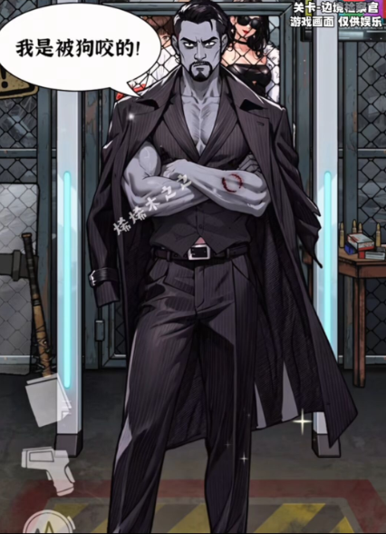

init

# 1

这位黑帮大哥名叫维克多· “铁颚”·莫兰（Victor “Iron Jaw” Moran），是东海岸地下世界令人闻风丧胆的传奇人物。

他并非天生黑帮，年轻时曾是拳击界的希望之星，直到一场被操纵的比赛毁了他的职业生涯和弟弟的生命。
复仇的怒火将他吞噬，他用拳头和智慧在地下世界杀出一条血路，最终建立起以他为核心的“黑礁”组织。
维克多以极度冷静和钢铁般的意志著称，他信奉“债务必须偿还”，无论是恩情还是仇恨。
他身着定制的深灰色条纹西装，内穿黑色高领衫，外面是一件及膝的黑色风衣，仿佛是他的战袍。
他的左臂上有一道明显的咬痕，那是他与一只变异犬搏斗时留下的，这也成为了他身上唯一的“弱点”。
尽管如此，他依然屹立不倒，眼神中燃烧着不屈的火焰，仿佛在向整个世界宣告：即使地狱敞开，他也将以王者的姿态君临。

那场几乎要了他命的犬袭，那道在医院无菌室里，于他左臂上泛起青灰死气的咬痕，非但没有击垮他，反而成了他身上最狰狞的勋章。

他不再追求完美的格斗技巧，而是用最原始、最野蛮的方式战斗。每一次挥拳，都带着要将那晚的屈辱与疼痛十倍奉还的决心。
他的风衣在狂风中猎猎作响，像一面黑色的战旗。条纹西装的肩线在肌肉的贲张下，仿佛要被撕裂开来。
那道咬痕在 adrenaline 的刺激下阵阵抽痛，却像一个疯狂的节拍器，驱动着他体内的野兽。

这不仅仅是一场胜利，更是一次加冕。他用自己的伤痕和意志，向整个地下世界宣告：维克多·莫兰，依旧是这片黑暗王国里，唯一的王。

他冲在最前面，仿佛不知疼痛为何物。子弹呼啸而过，擦着他的衣角，他却连眼睛都不眨一下。一个敌人从侧面扑来，手中的匕首闪着寒光。维克多不闪不避，任由那匕首划过他的左臂，那里的血肉早已麻木。在对方因刺中而错愕的瞬间，维克多的右拳如同出膛的炮弹，狠狠砸在对方的太阳穴上，骨骼碎裂的声音清脆而恐怖。

他的眼神，比码头的寒夜更冷。那不是属于人的目光，而是一头被逼入绝境，反扑噬人的野兽。他不再是那个在拳击场上遵守规则的运动员，也不是那个在谈判桌前运筹帷幄的黑帮首领。此刻的他，是纯粹的、只为杀戮而生的战争机器。

战斗结束得比任何人预想的都要快。

敌人如同潮水般溃退，留下一地的狼藉和呻吟。硝烟与血腥味混合在一起，构成了一幅末日景象。

左臂上的咬痕在汗水和血水的浸润下，呈现出一种诡异而狰狞的美感。

他没有高举双臂欢呼，也没有对败者投去轻蔑的一瞥。他只是静静地站在那里，喘息着，目光越过混乱的战场，望向城市深处那片璀璨的灯火。

他知道，自己赢了。

这不仅仅是一场胜利，更是一次加冕。他用自己的伤痕和意志，向整个地下世界宣告：维克多·莫兰，依旧是这片黑暗王国里，唯一的王。

夜风拂过他坚毅的脸庞，吹干了汗水，也吹散了最后一丝属于“人类”的软弱。他的嘴角，勾起一抹冰冷而残酷的弧度。

# 2

好的。以下是根据你提供的文件内容，聚焦于“医院无菌室遭遇丧尸侵袭”这一关键事件的扩写，结合维克多·莫兰的人物设定，补充了前后细节与战斗过程：

无菌室里的獠牙

那场改变一切的袭击，并非发生在硝烟弥漫的街头，而是在城市最洁净、最脆弱的心脏——圣玛利亚纪念医院的最高级别隔离病房。

三天前，维克多在码头一场突袭中被一只来历不明的野犬扑倒。那畜生的眼睛浑浊发白，动作却快如鬼魅，一口咬穿了他左臂的肌肉。伤口深可见骨，且伴随着一种诡异的灼烧感。医生们束手无策，只能将他送入负压隔离病房，以防未知病原体扩散。

病房里只有仪器单调的滴答声和他粗重的呼吸。维克多躺在病床上，身体因高烧而虚弱，但眼神依旧锐利如鹰。他透过防爆玻璃窗，能看到外面全副武装的医护人员紧张地忙碌着。他不知道的是，就在他昏迷期间，那只野犬的尸体在停尸房发生了异变，撕碎了守卫，感染了整层楼的病人和工作人员。

午夜时分，警报毫无预兆地尖啸起来。

厚重的合金隔离门被一股蛮力撞击得凹陷下去，发出令人牙酸的金属呻吟。下一秒，门锁崩飞，一群扭曲的身影涌入。他们穿着病号服或医护袍，皮肤呈现出死尸般的青灰色，眼睛空洞无神，嘴角淌着混着血丝的涎水。他们是活死人，是行走的瘟疫。

维克多的心沉到了谷底。他右臂被固定，身上插满了输液管，左臂的伤口正火辣辣地疼。他几乎是赤手空拳，被困在一个连苍蝇都飞不出去的玻璃牢笼里。

第一个丧尸扑了上来，是之前给他换药的护士。她张开的嘴里发出非人的嘶吼，指甲像刀片一样抓向他的脸。求生的本能压倒了一切。维克多猛地扯掉身上的监护电极，用尽全身力气从床上滚落，躲开了致命一击。冰冷的地板让他瞬间清醒。

他没有武器，只有这间病房里的一切。他抄起床头的金属托盘，狠狠砸向第二个冲进来的丧尸——一个体型壮硕的保安。托盘变形，但成功让对方踉跄了一下。维克多趁机扑向墙角的氧气瓶，拔掉阀门，将喷涌的高压气体对准门口涌来的尸群。

纯氧环境遇火即爆，但他此刻没有火源。不过，高压气流本身就像一把无形的巨锤，将最前面的几个丧尸吹得东倒西歪，为他争取了宝贵的几秒钟。

真正的杀招来自他自己。

他知道自己的左臂正在溃烂，那伤口就是毒源。他眼中闪过一丝决绝的狠厉。当又一个丧尸扑来时，他不再闪避，反而主动迎了上去，用自己的左臂作为诱饵。丧尸果然一口咬住他本就受伤的手臂，疯狂撕扯。

剧痛几乎让他昏厥，但他强忍着，在对方埋首撕咬的瞬间，右手如铁钳般扼住了丧尸的后颈。他用尽毕生的拳击技巧和黑帮生涯磨砺出的凶悍，将全身的力量灌注于右臂，猛地一拧！

“咔嚓！”

颈椎断裂的声音清脆而致命。丧尸软软地倒下。

但这还没完。维克多喘着粗气，看着自己左臂上两个新鲜的、深可见骨的咬痕，又看了看地上抽搐的尸体。一个疯狂的念头在他脑中成形。他拖过尸体，用其染满污血的牙齿，狠狠地、反复地在自己左臂的旧伤口上刮擦、撕咬，将新旧两种“毒素”彻底混合。

这不是自残，而是一场豪赌。他要让自己的身体成为病毒的战场，要么被吞噬，要么……驯服它。

门外的尸群被血腥味刺激得更加狂躁，疯狂地撞击着已经摇摇欲坠的玻璃墙。维克多背靠着冰冷的墙壁，大口喘息，汗水混着血水从下巴滴落。他感到一股前所未有的、狂暴的力量正在血管里奔涌，左臂的疼痛逐渐被一种麻木的灼热所取代。

他知道，自己或许再也回不到从前。但只要还能站着，他就绝不会倒下。

当最后一块防爆玻璃轰然碎裂时，站在废墟中央的维克多·莫兰，眼神比任何丧尸都要恐怖。他不再是那个等待救援的病人，而是从地狱归来的君王。他捡起地上一根断裂的金属支架，像握着权杖一样，迎向了潮水般的死亡。

这场在无菌室里的战斗，没有观众，没有欢呼。只有鲜血、钢铁和意志的碰撞。而最终活下来的，是一个带着伤痕与诅咒的传奇。那道融合了变异犬与丧尸双重咬痕的左臂，从此成了他身上最狰狞的勋章，也是他力量的源泉。