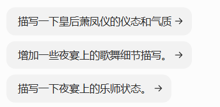

# 01

## 01 提示词

扩写下面的场景 贵妃司空红药   

中秋夜。

月亮还没升起来，天边只剩一抹暗红的残霞。

司空红药坐在妆台前，铜镜里映出她的脸。

很白的一张脸，白得像是未着墨的纸。

她拿起胭脂盒，打开，沾了一点，在手背上试了试色。

太淡了。

她又沾了一点，还是淡。

第三下，胭脂的颜色终于深了——像血。

她笑了，很轻的一声。

然后，她开始上妆。

胭脂从脸颊晕开，像是血染的桃花。她的手指很稳，一笔一笔，勾勒出完美的弧度。画眉的时候，手更稳了，黛笔在她手里，像是刀。

眉峰挑高，眉尾拉长。

铜镜里的那张脸，从妩媚变得凌厉——那是帝王的颜。

## 01 响应

中秋夜的瑶华殿，浸在一层将暗未暗的天光里。
月亮还没升上檐角，西天只余一抹暗红残霞，像被揉碎的朱砂，沉沉坠在琉璃瓦尽头。殿内早早就燃了蜜蜡烛，烛火被窗缝漏进来的桂风吹得微微晃，把螺钿妆台上的金钿玉梳、银盒瓷瓶，都映出一层流动的光。沉水香从博山炉里袅袅漫出来，混着窗外飘进来的桂子甜香，缠在殿角的素纱幔上。殿里静得落针可闻，侍立在侧的宫女垂着眼，连呼吸都放得极轻——她们都知道，贵妃娘娘上妆时，最厌人声。

司空红药就坐在妆台前，鸦青色的长发松松挽了半幅，余下的披在素色绫罗衫上，像一匹凉滑的墨缎。她望着面前的青铜镜，镜面磨得光可鉴人，清清楚楚映出她的脸。

那是一张极白的脸。不是病弱的苍白，是常年不见烈日、又刻意敷了铅华的冷白，白得像一张从未落过墨的宣纸，干净得近乎空旷，连半点血色都寻不见。眉是淡的，唇是浅的，整个人像一汪浸在寒潭里的月，美得静，也美得冷。入宫三载，人人都说贵妃娘娘貌若天仙，性子也温软如春水，只有这铜镜知道，素面之下的这张脸，本就带着几分天生的冷冽。

她伸出手，指尖掠过妆台上一排描金胭脂盒，最终停在最左边那只嵌了玛瑙的银盒上。盒盖掀开的瞬间，淡淡的蔷薇香漫了出来——这是江南进贡的蔷薇膏，宫妃们都爱它色泽娇柔，上脸显温婉。她用小指的指腹沾了一点，轻轻抹在左手手背上。
胭红浅淡，像春日枝头上刚绽的桃花瓣，是京中贵女最时兴的娇怯颜色。
太淡了。
她垂着眼，睫毛在眼下投出一小片浅影，没什么表情，只又沾了第二下。指腹上的胭脂厚了些，抹开时颜色深了一分，却依旧是温温柔柔的红，像宫人唇边怯生生的笑意，撑不起她这张脸，也撑不起她今晚要走的路。
还是淡。

第三下，她的指腹重重按进胭脂膏里，再抬起来时，指腹上凝了厚厚一层红。她慢慢抹在手背上，那颜色便彻底沉了下去，艳得发冽，像深秋凝在霜刃上的血，带着一点冷腥的艳。
司空红药忽然笑了一声。
很轻，几乎散在沉香烟气里，殿里的烛火却像是跟着颤了一颤。侍立的宫女心头一紧，头垂得更低了。她们听不明白这声笑里的意味，是满意，是自嘲，还是藏着别的什么。只有司空红药自己知道，这才是她要的颜色——不是讨帝王欢心的娇红，是能镇得住人心、染得透权柄的血色。

她抬了抬眼，看向镜里那张素白的脸，指尖沾着胭脂，按在了右脸颊上。
她的手指很稳，稳得不像寻常深宫女子。指腹带着胭脂，从颧骨最高处轻轻往腮边晕开，动作不快，却一笔都没有偏差。那红便顺着她的指腹漫开，像雪地里洇开的血痕，又像被血浸透的桃花瓣，一点点染透了那张白纸似的脸。不是寻常宫妃那种晕到耳根的娇柔，是恰到好处的艳，艳得锋利，艳得有锋芒，像开在断崖边的红药，美，却带着毒。
侍立的宫女悄悄抬眼瞥了一下，又慌忙低下头——娘娘今日的妆，和往日都不一样。往日里是温婉的、讨喜的，是陛下爱看的贵妃模样；今日这红，太烈了，烈得像要烧起来。

胭脂落定，她取过一旁的黛笔。
那支笔杆是乌木做的，磨得发亮，笔锋是极细的玄石墨。她捏着黛笔的姿势很特别，食指抵在笔杆侧面，像握着一柄出鞘的短刀。
画眉的时候，她的手更稳了。
黛笔轻轻落在眉骨上，先勾出挑高的眉峰，利落得像刀劈出来的一般，再顺着眉骨往眼尾拉长，斜斜地飞入鬓角。一笔成型，没有半分犹豫，也没有半分修改。
原先浅淡柔和的眉形，瞬间就变了模样。
眉峰一起，眼型便跟着吊了起来，原本含着水意的眼尾陡然锋利，像淬了寒的剑锋。铜镜里的那张脸，还带着胭脂的艳，却再没有半分妩媚娇柔——那是一种带着杀伐气的凌厉，是坐拥万里河山、翻覆云雨的帝王颜。

殿外忽然亮了些。
月亮终于升起来了，银白的月光穿过雕花窗棂，落在铜镜上，晃得人眼微微一眯。远处宫宴的丝竹声顺着风飘过来，隐隐约约，是太平盛世的曲调。今夜是中秋家宴，帝后同席，百官命妇入宫朝贺，是后宫最体面的日子。
司空红药望着镜里的自己，指尖轻轻蹭过眉尾。
她是司空家的嫡女，是后宫最尊贵的贵妃，可她要的从来不是帝王的恩宠，不是六宫的艳羡。她的骨血里流着司空家的血，那是世代将相、手握兵权的家族，她的父兄还在北疆守着国门，她不能只做笼里的金丝雀。

她放下黛笔，指尖的胭脂还没擦去，像沾了未干的血。
“备辇。”她开口，声音平静，却带着不容置疑的威仪，“去赴中秋家宴。”
宫女连忙上前，取过那支赤金点翠的凤纹步摇，要替她簪上。她却抬手拦住了，只取了一支素银簪子，随手挽住长发。
够了。
这张脸，已经足够了。
今夜的中秋宴，她要的不是帝王的垂怜。她要这后宫的天，翻一翻面；要这金銮殿上的人，看清谁才是真正能站在他身边、与他共掌天下的人。

# 02
## 02 提示词 
继续这个故事 下一幕 更衣 华丽的描写 后面的故事记得带一个小标题   

她起身，走到衣架前。

那上面挂着一件红衣。

不是寻常的宫装红，而是血染的红。她花了一年时间，让绣坊用最好的丝绸，染了十七遍，才染出来的颜色。

红的像是刚流出来的血。

她脱下身上的宫装，赤着身子站在月光里。月光从窗棂漏进来，照在她的背上，她的脊骨一节一节，像是藏在皮肉下的剑。

她穿上那件红衣。

丝绸贴着皮肤，冰凉凉的。她系上腰带，系得很紧，紧得像是把自己捆起来。

## 02 响应

### 十七重红

妆台上的黛笔还横在青瓷碟边，指腹残留的胭脂红未干。司空红药扶着妆台边缘站起身，素色绫罗的衫角扫过金砖地面，带起一阵细碎的沉水香气息。殿中烛火被她衣袂带起的风晃了晃，将影子长长投在云母屏风上，像一株即将盛放、却带着尖刺的花。

她步向殿中那架黄花梨木衣架。
衣架顶端悬着一件红衣，在半明半暗的殿宇里，像一团凝固的火，又像一滩尚未冷却的血。
这不是宫中常见的朱红、绯红、石榴红，是独一份浸到丝骨里的血色。是她耗了整整一年，命江南最好的染坊反复漂染十七次才得的颜色——头十遍用深山茜草汁浸底，晒足三个伏天；中间五遍兑了上等苏木与紫铆膏，染了又褪，褪了再染，褪去浮色，留取沉底的艳；最后两遍，她甚至让人添了微量朱砂与鹿血，阴干之后，红得沉郁又鲜活，像刚从心口涌出来的热血，带着一点触目惊心的亮。衣料是贡品里挑出的素面软烟罗，本轻得像雾，却因十七遍浸染，垂坠得如同水银，一垂到底，连褶皱深处都浸满了红，不见半分底色。

殿外的月光恰好漫过雕花窗棂，斜斜铺在那件红衣上。丝缎表面泛着一层冷润的光，红得更深了几分，仿佛下一秒就要顺着衣摆滴落在金砖上。

她抬手解了外衫的系带。
素色绫罗顺着肩头滑落，委顿在地，像褪下了一层温软的壳。内里的素纱中衣也随之落下，一件一件，轻得像落雪。她就那样赤着身子站在月光里，背对着满殿烛火，面向窗外那轮将圆未圆的月。
银白的月光浇在她瓷白的背脊上，照得皮肤近乎透明。可那纤细肩背之下，脊骨一节一节清晰地凸起，从后颈一路蜿蜒至腰窝，像一柄藏在皮肉之下的长剑，剑脊分明，冷硬锋利。那不是深宫女子惯有的柔弱无骨，是司空将门嫡女刻在骨血里的挺拔——是小时候跟着父兄在演武场长大、拉得开两石硬弓的韧劲，是入宫三载步步为营、熬碎了多少长夜才磨出来的硬气。月光沿着脊骨往下滑，落在她收得极紧的腰腹上，每一寸线条都利落得像刀刻出来的。
她站得很直，像一杆插在血与月光里的枪。没有半分羞怯，也没有半分自怜，仿佛这具身体从来不是用来承宠的玩物，而是她握在手里最趁手的一件兵器。

伸手取下衣架上的红衣。
丝缎落入掌心的瞬间，一片冰凉顺着指尖漫上来，像握住了一捧刚从寒潭里捞出来的血。她展开衣袍，抖开的瞬间，满殿的烛光仿佛都被这红色吸了进去，空气里漫开一点若有似无的、朱砂与茜草混杂的冷香。
她抬臂，红衣从头顶落下来，顺滑的丝绸贴着皮肤滑过肩颈、背脊、腰肢，像一层冰冷的血，严丝合缝地裹住了她所有的轮廓。衣料极软，却带着沉甸甸的分量，贴在身上时，连呼吸都跟着沉了几分。

她抬手系腰间的同色缎带。
指尖扣住鎏金带扣，一寸一寸往紧里收。缎带勒进腰腹，勾勒出纤细却有力的腰线，紧到呼吸都微微发滞，紧到像用一道红绳，把骨子里所有的柔软、迟疑、温情，全都牢牢捆在了皮肉之下。
她系得很慢，很稳，像将军在战前给利刃缠上刀穗。
系到最紧处，她顿了顿，指尖按着腰侧的缎带，微微低头。隔着一层血色丝绸，她能摸到自己脊骨的形状，摸到胸腔里平稳跳动的心脏。这一身红衣，是华服，更是铠甲；这一身束缚，是桎梏，更是底气。就像十七遍浸染才得的颜色，她也是一层一层剥掉了世家嫡女的娇矜，剥掉了后宫贵妃的温婉，才熬出了这身能扛住风雨、握得住权柄的骨头。

衣摆垂在地上，曳出三尺余长的红，像一道缓缓流淌的血河。袖口与衣摆处，用更深的红绒线暗绣了几枝红药花，只有凑得极近，才能在光影里辨出花瓣的轮廓——那是她的名字，也是她的命。生于阀阅，长于深宫，艳如红药，毒如刀兵。

侍立的宫女屏息上前，要替她整理衣摆的褶皱，刚伸出手，就被她一个眼神止住了。
司空红药自己抬手，顺着衣襟缓缓抚过，从领口一路理到袖口，动作慢而郑重，像将帅在战前擦拭自己的佩剑。
远处的丝竹声越来越清晰了，太和殿的方向，灯火已经亮透了半边天。中秋家宴，帝王端坐，百官在侧，皇后着明红翟衣，母仪天下。
而她，司空红药，穿着这十七遍染成的血色红衣，要从这瑶华殿走出去，走到那满堂珠光宝气里，走到那权力的最中心去。

她抬眼，看向落地铜镜里的人。
血衣裹身，帝颜上妆，眉眼锋利，一身肃杀。
她抬手，将鬓边一丝碎发抿到耳后，唇角勾起一点极淡的笑意。
“走吧。”她轻声说，声音里裹着丝绸的冷，和血色的锐，“别让陛下，和皇后娘娘，等久了。”

# 03
## 03 提示词 

继续这个故事 下一幕  华丽的描写 后面的故事记得带一个小标题 使用对话回答 

她走到门口，回头看了一眼这个住了七年的房间。

梳妆台，衣架，床，窗——今夜之后，她就不会再回来了。

她推开门，走了出去。

月亮正好升起来，白惨惨的光往下泼。她的红衣在月光下，像是燃烧的火。

## 03 响应

### 月下红衣辞瑶华

朱漆殿门的铜环凉得浸骨，司空红药指尖搭在上面，终是顿住脚步，回头望了一眼。

七年瑶华殿，从十五岁豆蔻入宫，到如今二十二岁盛宠在身，一砖一瓦、一器一物都熟得刻进了骨血里。螺钿妆台上的玛瑙胭脂盒还敞着，那抹血色残红落在白瓷底上，像一滴凝住的泪；博山炉里的沉水香燃到了尾段，青烟细如游丝，绕着半垂的素纱帐子缠了又缠。窗边那盆她亲手栽的红药，入秋便含了苞，迟迟不肯开，像攥着一肚子未说出口的话。雕花拔步床悬着水色绫帐，银质帐钩在残烛里晃出细碎的光，晃过七载孤枕长夜，晃过无数次对镜描眉的晨昏，晃过她从世家嫡女到深宫贵妃的一路浮沉。

这是困了她七年的金丝笼，也是她藏锋砺骨七年的练兵场。今夜之后，无论成败，她都不会再踏回这里。赢了，她便搬去该去的地方；输了，这殿中一切，自会有人来清点收走。
没什么可留恋的。要往前走的人，从不回头捡身后的旧壳。

她指尖微微用力，朱门“吱呀”一声向内敞开，满世界的月光便劈头盖脸泼了下来。

今夜的月太亮，亮得发白发惨，像铺了满地未化的寒霜，又像撒了一层冷透的碎银。她一身十七遍染就的血色红衣，立在月光里，竟像是寒夜里凭空烧起的一团野火——红得发亮，红得扎眼，红得要把这满宫清冷月色都烧出个窟窿来。衣摆垂在汉白玉台阶上，浓红与素白撞得惊心动魄，连阶前开得正盛的金桂，都在这逼人艳色里淡了几分甜香。

候在阶下的青禾连忙提着羊角灯笼迎上来。她是司空府的家生丫鬟，跟着司空红药十年，入宫七载，是她身边最信得过的人。抬头撞见自家娘娘的脸，青禾指尖猛地一颤，灯笼里的烛火晃了三晃，在地上投出摇曳不安的影子。

“娘娘。”她压着声音屈膝行礼，话音里藏着压不住的慌，“凤辇已在宫道口候着了。方才皇后宫里的周掌事来过两趟，催您入席，说陛下与皇后娘娘即刻便驾临太和殿，百官命妇都已到齐了。”

司空红药踩着汉白玉台阶缓步而下，红衣曳过石阶，像一道缓缓流淌的血河。她走得不快，每一步却都稳得像钉在石面上，连半分踉跄都无。

“急什么。”她开口，声音轻得像落在衣摆的月光，内里却裹着沉如寒铁的笃定，“本宫去得迟些，他们才好把这张脸，记得更牢些。”

青禾跟在她身侧，提着灯笼的指节攥得发白，忍了一路的话终究还是漏了出来，压得极低：“娘娘，北疆的密信今早才到，父兄那边还未传来准信。今夜若贸然动手，万一有半分差池……咱们还有转圜的余地吗？”

“没有万一，也没有转圜。”司空红药脚步未停，目光直直望向宫道尽头那片亮如白昼的灯火，眉峰在月光下锋利如刀，“司空家的人，从不给自己留后路。我在这深宫里扮了七年温婉柔顺的贵妃，父兄在北疆黄沙里守了七年国门，七年磨一剑，就等今夜这一出。”

她顿住脚步，指尖轻轻拂过袖口暗绣的红药花瓣，语气淡得像在说一件家常小事：“今夜之后，要么凤印入我掌中，司空家满门荣光；要么我三尺白绫了此残生，你带着殿里的人，拿上我备好的银两出宫去，往后不必再提司空氏。”

青禾眼圈一红，咬着唇差点落下泪来，“噗通”一声便要跪下：“奴婢誓死追随娘娘！生是司空府的人，死是娘娘的鬼！”

司空红药伸手扶住了她，没让她跪下去。月光落在她凌厉的眉眼上，竟柔和了一瞬。她从不说软话，也不爱听效忠的誓词，可十年相伴的情分，她记在心里。

“起来吧。”她收回手，重新抬步向前，“哭什么，还没到输的时候。走吧，别让满朝文武，都等着看本宫的好戏。”

宫道漫长，两侧朱墙高耸如沉默的巨兽，将一轮皓月夹在中间。她一身红衣走在正中，像一柄烧红的利刃，劈开这深宫的沉寂与晦暗。月亮越升越高，将她的影子拉得又细又长，影子的尽头，是太和殿的琉璃重檐，是万人之上的权位，也是一场以性命作注的赌局。

# 04

## 04 提示词

继续这个故事 下一幕 酒 华丽的描写加上一些她的心理描写 后面的故事记得带一个小标题   

御膳房。

司空红药走进来的时候，御厨正在收拾。

"贵妃娘娘？"

御厨跪下，额头磕在地上。

"起来。"

司空红药说。

御厨站起来，低着头，不敢看她。

"我要一杯酒。"

御厨愣了一下，但还是点头。他转身去取酒坛，倒了一杯，递给司空红药。

"娘娘，酒。"

司空红药接过酒杯，没有喝。她只是看着那杯酒，酒液清亮，映着烛光，像是金色的眼泪。

## 04 响应

### 金盏凝光，杯酒砺心

御膳房的棉帘被夜风掀起一角，漏进满襟霜白月光。里头还散着中秋宴席备菜余下的暖雾，桂香、酱香与陈酒气缠在一处，裹着牛油烛的暖意，撞得人一怔。司空红药掀帘而入时，掌事御厨正俯身收拾案上的鎏金食盒，银筷玉碟相碰出细碎轻响，听见脚步声抬头，撞见那一身刺目血红，登时腿软，“噗通”跪倒在地，额头重重磕在青石板上，连声音都发颤。

“贵妃娘娘？”

案边两个打下手的小太监也跟着跪伏下去，满室活气瞬间凝住，只剩烛火噼啪跳动的轻响。

“起来。”
司空红药的声音很淡，像落在酒面上的月光，听不出半分情绪。她立在堂中，血色衣袍垂落至地，与青灰石板撞出惊心动魄的艳，连案上燃得正旺的烛火，仿佛都被这红衣压去了几分光。

御厨颤巍巍起身，垂首弓腰，视线只敢落在她的衣摆褶皱上，半分不敢往上抬。往日里贵妃驾临，总伴着宫女侍从前呼后拥，说话温声细语，连菜味偏了都肯和颜悦色提点一句。可今日的人不一样，远远站着便像一柄出鞘的寒刃，连空气里都飘着冷锐的压迫感。

“我要一杯酒。”

御厨愣了一瞬，不敢多问缘由，连忙躬身应“是”，转身便往深处的酒架去。他不敢拿宴席上惯饮的甜软桂花酿，挑了最里层一坛封藏五年的桑落陈酒。泥封拍开时，清冽的酒香瞬间漫开，压过了满室食香。取一只素面羊脂玉杯，倾斜酒坛，清亮的酒液顺着杯壁缓缓注满，酒面浮起细碎银花，转瞬又散了，只剩一汪透亮的金，在烛火下晃出柔而冷的光。

“娘娘，酒。”御厨双手捧杯，躬身递到她面前。

司空红药伸出手，指尖触到玉杯的瞬间，一丝凉意顺着指腹漫上来，与衣料下的体温撞在一处。她接过酒杯，没有饮，就着烛火微微抬腕，垂眸凝向杯中的酒液。
酒液澄澈如冰，映着头顶跳动的烛火，也映出她半张容颜——眉峰斜挑如刃，胭脂艳烈如血，红衣的影子沉在酒底，像一团烧在寒冰里的火。晃动的酒波将金色光影揉碎又聚起，像谁盛了半杯金色的泪，沉甸甸地凝在玉盏之中，稍一碰触，便要溢出来。

她就那样望着杯酒，良久未动。
殿外的风声穿过窗缝，呜呜地擦过瓦当，像极了七年前入宫那日，宣阳门外刮的长风。那时候她也是一身红，却是十里红妆的嫁衣朱红，盖头垂落遮了满街繁华，唯有父亲在轿边低声落下的那句“红药，记住，你是司空家的女儿”，顺着风钻进耳骨，扎了整整七年。
这七年深宫，她喝过无数杯酒。
封妃那日的御赐琼浆，温甜绵软，她饮得端庄得体，谢恩的语调分毫不差；帝后同席的宫宴清酿，她举杯时眉眼温顺，垂眸时却早已数清杯底的暗纹；无数个独守瑶华殿的深夜，她也会让青禾温一壶桂花酿，就着月光慢饮，一口一口压下心底的焦躁与难平。
可没有一杯酒，像今夜这样沉。
这杯酒里，盛着她七年的隐忍蛰伏，盛着北疆父兄的铁马蹄声，盛着司空家满门的荣光与赌注，也盛着她即将踏出去的、再也回不了头的路。她清楚御膳房外的宫道通向何方，清楚太和殿的龙椅上坐着谁，清楚今夜一步踏错，便是万劫不复。可她从没有退路——从她命人染这十七遍血色红衣、对着铜镜画出帝王眉的那一刻起，就没有了。

酒液在杯中轻轻晃了晃，金色的光影在她眼底流转明灭。她忽然想起十五岁那年，在演武场边偷喝父亲藏的边塞烧刀子，烈酒辣得她眼眶发红，却梗着脖子硬说“一点都不烈”。那时候的她鲜衣怒马，能拉两石硬弓，能骑烈马踏秋，从没想过自己会在朱墙深宫里，用七年磨去一身棱角，再用一杯酒的功夫，把所有锋芒尽数亮出来。

指尖微微收紧，玉杯的凉意浸得更深。
她终于抬腕，将酒杯凑到唇边，仰头饮了大半。
清冽的酒液划过喉咙，带着桑落酒特有的烈，一路烧到胃腑，又顺着血脉漫遍四肢百骸，把心底最后一丝犹豫、最后一点软意，都烧得干干净净。酒意上涌，眼底却愈发明亮，眉梢的凌厉也更重了几分。

余下半杯，她手腕微侧，缓缓泼在了身侧的青石板上。
酒液渗入石缝，像一滴金色的泪，悄无声息落进尘埃里。
这半杯，敬七年深宫的温婉假面，敬那些小心翼翼的长夜，敬那些藏在柔顺皮囊下的刀光剑影。从此往后，那个柔顺知礼的司空贵妃，死了。活下来的，是司空将门的嫡女，是要握凤印、掌六宫，足以与帝王并肩而立的人。

“收了吧。”
她将空杯轻轻放回案上，声音依旧平静，却带着酒意浸过的沉冷。
没再看御厨一眼，她转身掀帘而出。棉帘落下的瞬间，满室暖香与烟火气都被隔在身后，迎面而来的，是满地霜白月光，和远处太和殿隐隐传来的礼乐钟声。
红衣在月色里再次燃起，比来时更烈，更决绝。
杯酒已尽，旧骨已辞。
接下来，该她登场了。

未用内容

# 05

## 05 提示词

继续这个故事 下一幕 前置准备 展示她的霸气 不容置疑 强势 

"你可以走了。"

她说。

御厨愣了一下。

"娘娘，这酒——"

"给皇上喝的。"

她说。

"我说，你可以走了。"

她的声音很轻，但有一种不容置疑的威严。

御厨跪下磕了个头，退了出去。

## 05 响应

### 盏底谋局，威仪千钧

羊脂玉杯轻轻落回案面，发出一声沉闷的轻响，像寒潭里坠进一粒碎冰。
“你可以走了。”

司空红药收回手，赤红的袖摆扫过案边錾银酒勺，带起一缕清冽的桑落酒香。她垂眸望着杯底残酒，烛火揉碎在澄澈的酒液里，漾开细碎的金芒，连她眼底的神色都浸得冷了几分。

御厨本已探手要去收整酒盏，闻言猛地僵在原地，悬在半空的手收也不是，放也不是。后颈的汗毛一根根竖了起来，冷汗顺着鬓角滑进衣领里。宫宴御酒向来有定规，从启封、注盏到押送，每一步都有尚食局专人盯守，半分差池便是掉脑袋的罪过。贵妃深夜独自入御膳房，要了一杯陈酒，饮过半盏又说留下，他实在摸不透其中深浅，只得硬着头皮躬身，声音发着颤：
“娘娘，这酒……按规矩该归入御宴酒列，由尚食局盖印押送，奴才……奴才不敢私留。”

“给皇上喝的。”

司空红药抬了抬眼。
只一眼，御厨便觉一股寒意顺着后脊爬上天灵盖，像有一柄淬了霜的短刀，静静贴在了他的喉间。她的语气平得像无风的湖面，没有加重半分语调，甚至连眉梢都未动一下，可“皇上”二字落地时，却如千斤铜鼎轰然砸下，压得他喘不过气。他瞬间便懂了——这不是寻常备酒，是贵妃要亲手递到帝王跟前的酒。可私调御酒是灭门的重罪，他一个卑贱御厨，哪里敢沾这趟浑水。

他腿肚子打着颤，还想再争辩一句“娘娘，御酒需经太监管事验看，否则奴才担待不起……”，话音刚冒了个头，便撞进了司空红药的目光里。
烛火忽地跳了一下，将她眉峰的影子投在眼下，锋利如刀。方才饮酒时那点漫上来的薄暖荡然无存，眼底只剩一片深不见底的寒。她没有拔高声音，甚至语调都与方才别无二致，只轻轻重复了一遍，每个字都清晰地砸在御厨耳边：
“我说，你可以走了。”

声音很轻，轻得像落在酒面的一片桂花瓣。
可御厨却“噗通”一声双膝砸在青石板上，额头重重磕下去，连磕三下，震得额角发麻。他不敢再问半个字，不敢再多说一句话，连案上那只玉杯都不敢再瞥一眼。他忽然幡然醒悟——站在眼前的从来不是那个温言软语、连膳食咸淡都肯和他商量的贵妃娘娘。这一身浸了十七遍的血色红衣，这一双寒潭似的眼，是能随手定他生死、也敢搅动整个后宫风云的人。他再多辩一句，明日御膳房的枯井里，便会多一具无人认领的尸首。

“奴才……奴才告退。”
他伏在地上往后退，脊背弓成一团，直到退到棉帘边，才敢颤巍巍撑着地面起身，掀帘逃也似的没入夜色里。棉帘被夜风掀得晃了几晃，漏进满地霜白月光，又重重垂落，将满室的沉寂与冷意，死死封在了屋中。

御膳房里只剩她一人了。
牛油烛烧得噼啪作响，陈酒香混着残羹的暖香漫在空气里，却暖不透她周身的寒意。司空红药立在案前，红衣如凝固的血，身姿挺拔得像一杆插在寒夜里的枪。

她伸出指尖，轻轻摩挲着玉杯的杯口——杯沿还留着她唇瓣的温度，也沾着她方才垂首饮酒时，悄无声息弹进去的药粉。
不是穿肠的剧毒。她还没蠢到在百官齐聚的中秋家宴上行刺帝王。那只是一点能让神思昏沉、心绪躁乱的散剂，分量拿捏得刚好，足够让龙椅上的那个人判断力失准几分，足够让今夜的太和殿，乱出她想要的缺口。

“出来。”
她忽然开口，声音不高，却精准地穿透空气，落在屋梁的阴影里。
一道黑影从梁上跃下，单膝跪地，头埋得极低，周身气息敛得像一块石头。那是司空家养了十五年的死士，三年前混进御膳房做杂役，隐在烟火气里，从未被任何人察觉。

“娘娘。”

“半个时辰后，把这杯酒混在御宴进酒里，送到陛下席上。”她收回手，语气平淡得像吩咐一句添茶倒水的小事，“记住，要在皇后献寿酒之后，百官集体祝酒之前。手脚干净点，别留痕迹。”

“是。”死士应声，没有半分迟疑，也没有半句追问。

“还有。”她顿了顿，目光扫过棉帘的方向，眼底掠过一丝冷冽的光，“方才那个御厨，派人盯紧。今夜之内，让他把嘴闭牢。若是走漏半个字……”
她没把话说完，只抬起右手，食指与中指并拢，在空中轻轻一划，像一柄无形的刀，利落斩断了后半句。
死士垂首：“属下明白。”

司空红药没再多言。她从不反复叮嘱，也从不问“能否办到”。她选的人，要么把事办成，要么把命留下，从来没有第三条路。这深宫七年，她从一个无宠的世家嫡女走到权倾后宫的贵妃之位，靠的从来不是帝王的垂怜恩宠，是步步为营的算计，是说一不二的狠厉，是容不得半分置喙的绝对掌控。

她最后瞥了一眼案上的玉杯。
金色酒液在烛火下泛着柔润的光，看起来与所有御酿一样醇美无害，就像她这七年里的模样，温婉柔顺，与世无争。
可只有她自己知道，柔波之下，藏着怎样的惊涛骇浪；笑意背后，布着怎样的刀光剑影。

“走。”
她撂下一个字，转身掀帘而出。
赤红的衣摆扫过门槛，像一道血色闪电，劈开御膳房的暖雾，撞进满院寒冽的月光里。
远处太和殿的礼乐声愈发清晰，那场她筹谋了七年的局，终于要正式开席了。
# 06 
## 06 提示词

继续这个故事 下一幕 毒 她选择的方式是投毒 毒酒 优雅而又狠厉的贵妃形象 

御膳房里只剩下司空红药一个人。

她从袖中取出一只瓷瓶，拇指大小，泛着冷光。她拔开瓶塞，一股淡淡的香气飘出来，像是桂花。

她把瓷瓶倒过来。

一滴透明的液体落进酒杯，瞬间化开，消失在酒液里。

什么痕迹都没有留下。

无色无味，入口即化，一个时辰后发作。

没有解药。

## 06 响应

### 桂香入盏，杀局无声

御膳房的棉帘早已落定，将外头的霜白月光与风声悉数隔绝。牛油烛烧得正旺，烛泪顺着铜烛台缓缓淌下，凝成一滩透明的痕。满室浮动着陈酒与桂糕的暖香，静得能听见烛火噼啪炸裂的轻响，连方才御厨仓皇退去的余悸，都已在这浓稠的沉寂里散得干干净净。

司空红药立在案前，十七遍染就的血色红衣垂落如展开的锦屏，连投在青砖上的影子都透着沉凝的力道。她垂眸望着那杯剩了大半的桑落酒，酒液在烛下漾着碎金似的光，澄澈温润，与所有御宴佳酿别无二致。片刻后，她缓缓抬起左手，广袖顺着皓腕滑落，露出一截瓷白的小臂。指尖探入袖中，再出来时，指腹已捏了一只拇指大小的羊脂玉瓷瓶。

瓶身莹润泛着冷光，外壁描着极细的金桂暗纹，瞧着不像是装着夺命毒物的器皿，倒像是闺阁女子随身的香膏。她指尖捏着紫檀木塞，轻轻一转，木塞“啵”的一声轻响拔了出来。
一股极淡的桂花香飘了出来，清浅、甜润，与窗外院中的桂树香气如出一辙。混在满室食香与酒气里，别说凑近分辨，便是刻意去寻，也只会当是夜风送进来的花香。这是她花了三年时间，让司空家暗中培养的药师反复调制的奇毒，取八月头茬金桂的花露为引，融十余种寒草之毒凝练而成，从形制到气味，都妥帖地藏进了中秋的景致里。

她手腕微侧，瓷瓶瓶口对准玉杯，动作慢得像先前在手背试胭脂颜色，优雅，从容，连指尖都没有半分颤抖。
一滴透明的液珠从瓶口坠下，细得像晨露坠在花瓣上，悄无声息落进酒液里。只一瞬，便彻底化开了，像一滴水融进深海，连半分涟漪都未曾泛起。清亮的酒液依旧澄澈，映着跳动的烛火，映着她艳烈的红衣影子，连色泽都未曾改变半分。
什么痕迹都没有留下。

司空红药将瓷瓶收回袖中，动作行云流水，仿佛方才只是往酒里添了一勺蜜浆。她垂眸望着那杯酒，唇角甚至勾起一点极淡的笑意，眼尾却冷得像檐角的霜。
这毒最是温和，也最是狠绝。入口无觉，入喉无涩，与寻常酒水毫无分别。一个时辰后，才会顺着血脉缓缓侵入脏腑，先是心口微闷，再是肢体渐僵，最后心脉寸断而亡。届时便是太医院院判亲至，也查不出半分中毒痕迹，只会当是帝王操劳过度，突发心疾崩逝。
没有解药。从炼制成功的那天起，她就没让药师配过解药。

她指尖轻轻敲了敲杯壁，发出清脆的一声响，在寂静的屋子里格外清晰。
选这样的毒，自然有她的盘算。
当场暴毙太过扎眼，满朝文武齐聚宴席，必然彻查到底，御膳房、尚食局、她这个中途来过的贵妃，全都脱不了干系。她要的从来不是鱼死网破，是稳稳当当接过权柄，替司空家，也替自己，挣出一片天。一个时辰，恰好是中秋家宴散席、帝王摆驾回乾清宫歇息的时辰。届时宫门下钥，外臣不得入宫，消息压得住，后宫与前朝的乱局，恰好由她以贵妃之尊出面收拾。

七年深宫相伴，她太了解龙椅上那个男人了。他多疑，薄情，一边倚重司空家的北疆兵权，一边又处处提防，明升暗降削她兄长的兵权，暗中扣下边境的粮草补给；一边给她贵妃的尊荣，一边又扶持外戚分她的权势。他以为她是笼中听话的金丝雀，是他平衡前朝的一枚棋子，却不知道，棋子早已有了执棋的心思。

烛火晃了晃，橘色的光落在她眼底，烧出一点艳烈的锋芒。
她不是没念过半分情分。初入宫时，他曾亲手为她描过远山眉，曾在御花园的桂树下陪她守过一整夜的月，曾笑着说“红药是朕的解语花”。可那些温情在权势面前，薄得像一张纸。转头他就能为了安抚外戚降她的位份，就能为了敲打司空家，将她身边的宫女杖责发配。
情分？这紫禁城里最不值钱的，就是帝王的情分。

她收回手，从袖中取出素白锦帕，细细擦过指尖与瓶口，仿佛沾了什么不洁的东西。擦完了，随手将锦帕丢进一旁燃着的炭盆里。锦帕遇火，“腾”地燃起一团橘色的焰，转瞬便化为灰烬，连一点碎屑都不剩。
就像她今晚要做的事，干净，利落，不留痕迹。

案上的玉杯静静立着，酒香里混着极淡的桂香，温柔得诱人。
司空红药最后看了那杯酒一眼，转身便走。红衣曳过青石板地面，像一道无声流淌的血河，棉帘被风掀起一角，又重重落下。
御膳房里重归寂静，只有烛火还在烧，那杯藏着夺命杀机的酒，在暖光里泛着温柔的金色，等着被送到它该去的地方。
而她，要去赴那场最后的宴。
等一个时辰后，这紫禁城的天，就该换个颜色了。

# 07 
## 07 提示词

继续这个故事 下一幕 按照我给的剧情写 不要往后扩展太多的剧情 增加场面细节描写就行 大女主无敌文

前半 

她看着那杯酒，看了很久。

她知道自己要做什么，她知道做了之后会发生什么。这是一条没有回头的路。

但她还是走了。

下半部分 

中秋夜宴开席 她 赴宴 

宫道 皇城 

## 07 响应
### 杯酒定局，踏月赴宴

御膳房里烛火悠悠，蜡泪沿着錾铜烛台蜿蜒淌下，在底座积成一汪透亮的蜡池。牛油灯的暖光裹着陈酒与桂香，漫过案上的羊脂玉杯，也漫过司空红药一身血色红衣。她立在案前，垂眸望着杯中的酒，看了很久。

酒液澄澈如冰，清清楚楚映出她眉峰凌厉的眉眼，映出她颊边艳烈如血的胭脂，也映出她眼底深不见底的沉定。她指尖悬在杯沿半寸处，没有碰，也没有退。
她比谁都清楚这一滴落下去的分量。一个时辰后，乾清宫的龙床会成为帝王的长眠之地；一夜之间，前朝后宫都会掀起滔天巨浪。成，她便是临朝掌政的后宫之主，司空家世代将门再无掣肘；败，便是满门抄斩、株连九族的结局，连瑶华殿那盆未开的红药，都会被连根拔起。这是一条彻头彻尾的单行道，踏出去的那一刻，身后七年的温婉假面、深宫蛰伏，乃至寻常女子能拥有的半分退路，就全都烧成了灰烬。

可她的指尖没有半分颤抖，眼底也没有半分迟疑。
从十五岁踏着十里红妆踏入紫禁城的那天起，她就没给自己留过回头的余地。父兄在北疆黄沙里浴血守国门，她在朱墙深宫里步步为营谋生路。帝王的猜忌从未停过，司空家的险境也从未散过——不是她要争，是这皇城根下，从来容不下安分的棋子。

她收回手，最后扫了那杯酒一眼，像在核验一件早已打磨妥当的兵器，确认无误，便无需再多流连。下一秒，她转身迈步，赤红的衣摆扫过青石板地面，带起一缕混着淡桂香的酒气。棉帘被夜风掀起，霜白月光劈头盖脸落下来，她没有回头，一步便跨出了御膳房的门槛。
没有回头路又如何。
她选的路，便是踏着荆棘，也要走到最高处。

中秋夜宴的开宴鼓，恰好此时响彻皇城。
三声沉鼓从太和殿方向传来，顺着绵延宫墙荡开，惊飞了檐下栖着的宿鸟。漫长的中轴御道两侧，朱红宫墙高耸如沉默的壁垒，墙根下每隔三步便立着一盏羊角宫灯，暖黄的光顺着纱罩漫出来，在汉白玉路面上铺成一条流淌的光河。皓月当空，银辉从天际泼下来，与灯光缠在一处，把整条宫道照得亮如白昼，连砖缝里嵌着的青苔纹路都清晰可见。

司空红药沿着御道正中缓步前行。
十七遍染就的血色红衣在月光与灯影里忽明忽暗，像一团烧不尽的野火，从沉沉夜色里一路烧向皇城最核心的权力中心。她走得不快，脊背挺得笔直，每一步落下都稳如泰山，绣着暗纹的鞋尖踩在汉白玉的石缝处，分毫不差。沿途值守的禁军侍卫垂首躬身，执戈的手攥得指节发白，连抬眼瞥一下的胆量都没有；跪伏在道边迎候的宫人内侍额头贴地，连呼吸都压得极轻，只敢用余光瞥见那袭红衣从眼前掠过，像一道艳烈的、带着锋芒的风。

越往太和殿走，人声与乐声便越清晰。丝竹管弦顺着晚风飘过来，是宫中乐师奏的《千秋岁》，曲调雍容和乐，裹着盛世太平的烟火气。殿宇的轮廓在夜色里愈发清晰，重檐庑殿顶铺着明黄琉璃瓦，被万千灯火映得流光溢彩，像一只伏在夜色里的金色巨兽，吞吐着满朝文武的朝拜与天下权柄的锋芒。

宫道尽头的汉白玉台基下，已经站满了穿各色朝服的官员与绫罗钗裙的命妇，攒动的人影里珠光宝气交错，低声的寒暄与笑语混在乐声里，是中秋佳节该有的热闹模样。没有人知道，那道正一步步走上台基的红衣身影，袖中藏着怎样的杀局，眼底盛着怎样的乾坤。

司空红药抬眼，望向太和殿正中那座尚空着的龙椅，眉梢微微一挑，唇角勾起一抹极淡的、胜券在握的笑意。
夜宴已开，她来了。
这皇城的天，也该换一换颜色了。

# 08

## 08 提示词

宫廷夜宴的描写 奢华 腐朽王朝最后的辉煌 写主要人物 皇帝昏君 只是个配角 凤后萧凤仪 这里先引入 凤后萧凤仪的形象 后面会有凤后的剧情 皇后萧凤仪她是前期主要剧情人物 比皇帝还重要 其他的就是夜宴的细节就行 

## 08 响应

### 金殿残辉，凤仪端坐
太和殿的朱扉大敞，满殿灯火熔成暖金的浪，顺着汉白玉丹陛漫溢而下，与檐头倾泻的月色撞在一起，浮起一层朦胧又奢靡的光晕。殿内数十盏琉璃羊角灯沿梁柱悬落，灯壁绘着百子千孙、江山永固的纹样，烛芯燃得噼啪作响，把斗拱上的彩画、金砖上的云纹都照得毫发毕现。龙涎香从四角的鎏金博山炉里袅袅升腾，混着席面上的酒气、肉香、脂粉气，缠成一团化不开的甜腻，熏得人骨头发软，像浸在温水里慢慢沉底。

席面顺着大殿两侧一字排开，酸枝木案镶着云石台面，案上食器非金即玉：掐丝珐琅的酒壶温着百年陈酿，羊脂玉的杯盏映着灯火泛出润光，连盛蜜饯的小碟都沿边镶了一圈碎红宝石。御膳房的内侍流水般穿梭，驼峰炙、熊白羹、松江鲈、紫驼峰，一道道珍馐摆上来，许多只动了最上面一筷，便被原样撤下，换上新出锅的热菜。这是大胤王朝的中秋盛筵，是集天下之富堆砌出的太平气象，人人都道盛世昌隆，却少有人看见，这鎏金的殿宇深处，梁柱早已被虫蛀得空了芯子，只剩一层华丽的壳，撑着最后的辉煌。

丹陛最上首的龙椅上，皇帝萧景渊斜斜靠着引枕，玄色龙袍的领口松垮地敞着，腰间玉带也系得随意。他生得眉目俊朗，却因常年酒色浸着，眼底浮着一层散不去的虚浮，指尖转着个赤金杯，目光自始至终黏在殿中央起舞的宫娥腰肢上，连阶下百官的祝颂词都只懒懒“嗯”两声，半点没往心里去。登基八年，边疆烽烟未熄，江南水患连绵，他一概扔给朝臣去议，自己整日泡在后宫与梨园，是史书上最标准的昏君模样。今夜这场夜宴，于他而言不过是又一场饮酒观舞的消遣，散了场，自有伶人美人在偏殿候着。

龙椅之侧的凤座上，端坐着皇后萧凤仪。
这是今夜殿中最不能被忽视的人——论实权与城府，她比这位昏庸的帝王，还要沉得住几分。

她身着明红织金凤纹翟衣，九只翟鸟以赤金捻线混着孔雀羽丝绣成，灯光流转时，羽翼上便漾开细碎的虹光，庄重雍容，压得住满殿的浮华躁动。头上九龙四凤冠端正束发，珍珠旒苏垂至眉侧，随着她微微颔首的动作轻晃，却始终稳而不乱。她坐得极正，脊背挺成一道笔直的线，双手交叠平放在膝头，明黄绣凤的裙摆铺在凤座之下，像一朵开得沉稳大气的牡丹，不艳，却自有千钧分量。

与皇帝的漫不经心截然不同，萧凤仪始终带着恰到好处的端庄笑意。命妇上前拜贺，她柔声应答，分寸拿捏得分毫不差；朝臣举杯祝颂，她亦随帝王一同举杯，仪态挑不出半分错处。可只有离得最近的内侍能看见，她眼底并无半分宴饮的松弛，深如古潭的眸子扫过殿中众人时，平静底下藏着审视与盘算。她是外戚萧家的嫡长女，入宫五年便坐稳后位，六宫权柄握得牢牢的，前朝也遍布萧氏门生。这昏君夫君是她名义上的天，实则是她手里最顺手的一块挡箭牌——帝后离心，早已是紫禁城里心照不宣的秘密。

殿中央的舞姬旋身折腰，广袖甩开如流霞婉转，丝竹声靡靡，唱的是《升平乐》，句句都是盛世太平。阶下百官推杯换盏，阿谀声与笑语声混在乐声里，有人真心攀附，有人得过且过，有人攥着袖中的密信心神不宁。没人敢提北疆的军饷，没人敢说江南的流民，所有人都默契地沉醉在这金壁辉煌的幻梦里，任由王朝的根基在看不见的地方慢慢朽坏。

殿外忽然传来太监尖细的通传声，划破了靡靡的乐声：
“贵妃娘娘到——”

丝竹声骤然一滞，满殿目光齐刷刷投向殿门。
司空红药一袭血色红衣，踏着灯火缓步而入。十七遍染就的红在满殿金辉里愈发扎眼，像一团烧进金玉堆里的野火，艳得锋利，艳得决绝。她抬眼，目光越过阶下百官，直直望向丹陛之上。
龙椅上的帝王漫不经心抬了抬眼，眼中闪过一丝惊艳。
而凤座上的萧凤仪，缓缓放下了手中的玉杯。
四目相对的瞬间，殿内的空气仿佛凝了一瞬。
萧凤仪唇角的笑意淡了分毫，指尖在袖中轻轻叩了叩。
她等这一天，也等了很久了。

## 08 提示词-1 

重写 没有帝后离心 后面的剧情是凤后给皇帝报仇 和贵妃产生的冲突 然后就是武侠背景

## 08 响应-2

### 金殿笙歌，凤刃藏锋
太和殿朱扉洞开，万盏灯火熔成鎏金海潮，顺着汉白玉丹陛漫溢而出，与中天月色撞作一团朦胧金雾。殿内数十盏八宝琉璃灯沿盘龙柱悬落，灯壁嵌着南海夜明珠，光色温润不刺眼，将斗拱间的缠枝彩画、金砖上的云雷暗纹都照得纤毫毕现。四角鎏金博山炉焚着龙涎香，烟气如白绸缠梁绕柱，混着席面上的酒气、脂粉香与珍馐的暖腻，织成一张软乎乎的网，裹得人筋骨都跟着发沉。

席面顺着大殿两侧雁翅排开，酸枝木案嵌着冰纹云石，案上食器非金即玉：掐丝珐琅温酒壶里温着百年陈酿花雕，羊脂玉盏映着灯火泛出羊脂般的柔光，连盛冷盘的瓷碟都沿边镶了一圈碎红宝石。内侍们垂首疾走如流水，驼峰炙、熊白羹、松江鲈、鹿尾酱，一道道穷尽民脂民膏的珍馐摆上来，多数只动了最上层一筷，便被原样撤下换新鲜热菜。这是大胤王朝第一百二十七个中秋夜宴，是集四海之富堆出来的太平幻梦，人人觥筹交错、歌功颂德，没人肯戳破这层金壳底下，早已被蛀空的王朝骨架——北疆烽烟连年不绝，江南水患流民遍野，江湖势力蠢蠢欲动，全靠这殿里最后一点奢华气，撑着末世的辉煌。

阶下两侧立着内廷供奉的带刀侍卫，个个肩宽腰窄，呼吸绵长不露，显然都是内外兼修的好手。檐角斗拱的暗影里更藏着数名暗卫，凭上乘轻功伏在梁柱间，连殿中顶尖高手都难察觉其方位。这些人手半数是皇家供奉，另一半，全出自凤座上那位皇后的娘家。

龙椅上的皇帝萧景渊斜倚着描金引枕，玄色龙袍领口松敞，腰间玉带也系得随意。他眉目生得俊朗，却因常年酒色浸淫，眼底浮着一层散不去的虚浮，指尖捻着一颗冰镇葡萄，目光大半黏在殿中央旋舞的宫娥腰肢上，时不时侧过头跟身侧的皇后说句戏文里的趣话，语气里带着不加掩饰的信赖与松弛。他治国昏聩，耽于享乐，是史书里标准的庸君模样，却唯独对这位发妻敬重有加——前朝后宫都知道，陛下可以不上朝、可以不理政，却绝不会驳皇后半分意思。

凤座上的萧凤仪，才是这殿里真正镇得住乾坤的人。
她身着明红织金凤纹翟衣，九只翟鸟以赤金捻线混孔雀羽丝绣成，灯光流转时，羽翼上便漾开细碎虹光，庄重雍容，压得住满殿浮华。头上九龙四凤冠端正束发，珍珠旒苏垂至眉侧，随着她颔首的动作轻晃，却始终稳而不乱。旁人只当她是母仪天下的中宫皇后，却少有人记得，她出身兰陵萧氏——那是武林中百年不衰的顶尖武学望族，一手缠丝剑法冠绝江南，门生故吏遍布江湖。当年九龙夺嫡乱局四起，是她带着萧家死士连夜闯宫，凭一柄软剑守住东宫宫门，替萧景渊踏平了登基的血路。

翟衣宽袍掩住了她周身的武者锋芒，却掩不住细节里的功底。她坐姿端正如松，双手交叠平放在膝头，明黄绣凤裙摆铺展如莲，指节处却带着一层极淡的薄茧——那是常年握剑磨出来的印记。腰间玉带看着寻常，内里却缝着一柄缠枝软剑，剑刃薄如蝉翼，是她的贴身兵器。她面上带着端庄得体的笑意，应对命妇拜贺、朝臣祝颂都分寸恰好，可深如寒潭的眼底，始终藏着武者的警觉，殿内任何一丝异动、任何一缕异样气息，都逃不过她的耳目。

她看着身侧沉迷声色的夫君，眼底掠过一丝极淡的无奈，却没有半分疏离与怨怼。少年夫妻，共过患难，他虽庸懦，却待她始终真心，萧家也因皇室倚重稳坐武林第一世家的位置。于公于私，她都要守着他，守着这大胤的江山。这也是为何，她将萧家精锐尽数调入京畿，将内廷侍卫换成自己的心腹——她知道这王朝风雨飘摇，知道江湖中有人虎视眈眈，知道后宫里也藏着獠牙，她必须握着剑，替他挡住所有刀光剑影。

殿中央丝竹靡靡，舞姬广袖如流霞婉转，唱的还是《升平乐》，句句都是盛世太平。阶下文武百官推杯换盏，阿谀声混着笑语浮在酒气里，有人浑浑噩噩醉生梦死，有人揣着密信各怀心思，却都默契地避开了北疆军饷、江南流民的话题。

就在这时，殿外传来太监尖细的通传声，划破了靡靡乐声：
“贵妃娘娘到——”

丝竹声骤然一滞，满殿目光齐刷刷投向殿门。
司空红药一袭血色红衣，踏着满地金辉缓步而入。十七遍染就的红在珠光宝气里愈发扎眼，像一团烧进金玉堆里的野火，艳得锋利，艳得决绝。
萧凤仪端着玉杯的手微微一顿，眼底掠过一丝极淡的警觉。她内力深厚，五感远胜常人，分明嗅到那红衣女子袖间藏着一缕极淡的冷冽药气，混在桂花香里，像深山毒草般悄无声息。她指尖轻轻叩了叩杯壁，身侧掌事宫女微微颔首，悄无声息退向殿侧——那是她传令暗卫盯紧的信号。
龙椅上的萧景渊漫不经心抬眼，眼中闪过惊艳，笑着招了招手。
他还不知道，这殿里的太平幻梦，今夜就要碎了。
而萧凤仪握着软剑的手，已经悄悄收紧了。

# 09

## 09 提示词

继续 夜宴中的这一幕 结果没有动手 高压下的和平结局 只是中秋夜宴而已 

"你……换了新衣？"

皇帝的声音很轻，像是从很远的地方传来。

"中秋。"

司空红药说。

"该穿新衣。"

皇帝看着她的红衣，看了很久。

"很红。"

他说。

"像血。"

## 09 响应

### 丹陛一语，宴上藏锋

司空红药踏上丹陛的那一刻，满殿丝竹声歇得干干净净。
血色衣摆扫过汉白玉石阶，像一道缓慢流淌的焰，将殿内鎏金的光影都撞得晃了晃。她在龙椅前三尺处站定，敛衽福身，动作舒展又标准，领口与袖口的暗纹随着俯身的弧度轻轻铺开，连垂落的发丝都纹丝不乱。“臣妾参见陛下，参见皇后娘娘。”声音清泠，不高不低，恰好传遍大殿每一个角落。

阶下文武百官都屏息垂眸，没人敢抬头直视。谁都知道贵妃圣眷正浓，却从没人见过她这样一身装束——往日里她总穿柔粉、水红、月白，是衬着帝王恩宠的温婉颜色，这般近乎凄厉的艳红，从未在宫宴上出现过。

龙椅上的萧景渊原本半眯着眼，此刻慢慢坐直了些，目光落在她身上，停留了许久。殿内静得能听见博山炉里香灰剥落的轻响，连执壶的内侍都僵着手臂，忘了往玉杯里添酒。
“你……换了新衣？”
他的声音很轻，带着点酒后的慵懒，像是从很远的地方飘过来，漫不经心，又带着点莫名的探究。

“中秋。”
司空红药垂着眸，长睫在眼下投出浅浅的影，语气平静无波，“该穿新衣。”

萧景渊没说话，就那样看着她的红衣，看了很久。
明黄龙袍与血色红衣在丹陛上遥遥相对，灯火落在衣料上，漾开一层又一层的光。凤座上的萧凤仪指尖搭着羊脂玉杯沿，指腹微微运力，杯壁上凝了一层极细的水雾。她以萧家祖传的凝神诀锁着司空红药周身气机——这女子呼吸绵长，丹田气稳，分明藏着上乘内功，绝非寻常养在深闺的世家女。可对方周身没有半分外露的杀气，平静得像一潭封冻的深湖，反倒更让人心头发紧。她悄悄抬了抬左手食指，藏在殿柱后的暗卫立刻扣紧掌心飞镖，只待她一个眼色便出手。

“很红。”
萧景渊忽然开口，打破了满殿的沉寂。
他往前倾了倾身，指尖敲了敲龙椅扶手，语气里带着点说不清的漫不经心，像是酒后随口的戏言，又像是某种毫无预兆的直觉：
“像血。”

两个字落地，殿内空气瞬间凝住。
下位有官员握着银筷的手猛地一颤，筷尖撞在玉碟上，发出“叮”的一声轻响，在死寂里格外刺耳。那人瞬间白了脸，慌忙伏身请罪，额头磕在案沿上，连声音都发颤。
萧凤仪的指尖骤然收紧，玉杯在掌心发出极细的裂响。她的目光牢牢钉在司空红药身上，等着看对方如何应答，也等着捕捉哪怕一丝一毫的慌乱。只要有半分异动，她袖中缠丝软剑便会立刻出鞘，将人当场拿下。

司空红药却笑了。
不是平日里温婉柔顺的笑意，是眉峰凌厉间，一点极淡、极从容的弧度。她抬眼望向龙椅上的帝王，语气平稳坦荡，连声调都未曾变过半分：“陛下说笑了。不过是江南新染的茜草红，料子沉了些，颜色便重了。中秋佳节，穿得鲜亮些，也应个阖家红火的景。”
她说得磊落，目光澄澈，倒像是萧景渊酒后眼花、想多了一般。

萧景渊盯着她看了片刻，忽然朗声笑了起来，懒懒靠回引枕里，摆了摆手：“罢了罢了，是朕喝多了两眼发昏。红衣喜庆，确实应景。来人，给贵妃赐座，添酒。”
一句话，便将方才凝滞到极点的气氛，轻轻巧巧揭了过去。他本就是随口一句感慨，脑子里装的从来都是舞姬美酒，哪里会往更深的地方想。

内侍连忙上前引着司空红药入席，丝竹声重新响起，舞姬们旋着广袖重回殿中央，《升平乐》的调子再次漫开。百官们齐齐松了口气，纷纷举杯说笑，方才那点惊心动魄的凝滞，仿佛只是众人的错觉。珍馐一道道传上来，美酒一杯杯斟满，笑语声、碰杯声、丝竹声缠在一起，还是那场极尽奢华的中秋夜宴，金迷纸醉，太平升平。

可暗里的锋刃，从未收鞘。
司空红药落座时，指尖在案沿下轻轻叩了三下——那是给御膳房死士的信号：计划照旧，按兵不动，等宴席散场。她能感觉到右侧凤座投来的目光，锐利如剑，带着毫不掩饰的审视与防备。她知道萧凤仪起了疑心，这位皇后可不是昏庸的帝王，是兰陵萧氏练出来的一把好剑。
但那又如何。毒酒已经在送往御席的路上，一个时辰后才会发作。只要撑过这场夜宴，一切就都成了定局。

萧凤仪端起酒杯抿了一口，眼底寒意却半点未散。她偏过头，对身侧掌事宫女低声吩咐了一句，声音压得极低，混在乐声里无人能闻：“去查御膳房，今夜谁碰过陛下的酒。再传我令，宫门加派两倍人手，没有本宫凤印，任何人不得出入。”
宫女躬身退下，悄无声息没入殿外夜色里。

萧凤仪的目光再次落向那片刺目的血色背影，指尖抚过袖中软剑的剑柄。
她不知道这贵妃今夜到底布了多大的局，但她知道，这紫禁城的中秋夜，绝不会像表面这般太平。
她握着剑，守着她的夫君，守着这江山。
谁想在她眼皮底下动刀，就得先问问萧家的缠丝剑，答不答应。

# 10 

## 10 提示词

继续 过渡章节 宴会结束 皇帝饮了毒酒 凤后和贵妃目前无冲突 过渡到下一幕 

皇帝寝宫。

司空红药推开门的时候，里面黑漆漆的，没有点灯。

她走进去，脚步很轻，轻得像是猫。

龙床在正中间，挂着纱帐。她走到床边，隔着纱帐，看见一个人影。

那是皇帝。

呼吸像是破风箱。

## 10 响应 

### 宴阑毒潜，夜叩乾清

三更天的梆子声顺着宫墙荡过来时，太和殿的夜宴终于散了场。
百官命妇按着品级鱼贯而出，朝服与霞帔在月色下漾开细碎的光，方才的觥筹交错、丝竹靡靡，都随着人潮渐渐退远，只剩殿内狼藉的杯盘与未燃尽的龙涎香，还留着盛世狂欢的余温。萧景渊喝得半醉，由两名内侍小心搀扶着起身，龙袍下摆扫过案边的玉盏，溅出半杯残酒。他挥挥手打发了要随行侍驾的宫娥，目光扫过阶下的司空红药，带着酒后的散漫笑意：“贵妃随朕回乾清宫。”

丹陛之上的萧凤仪默然立着，明红翟衣在残灯里沉如静水。她看着司空红药屈膝应下，看着那道血色身影跟着帝王步辇渐渐没入夜色，指尖在袖中轻轻摩挲着软剑剑柄。宴中她已暗中遣人核查过御膳房，回话是一切如常——帝王的酒盏全程由尚食局专人押送，盏沿封了火漆，并无异样。可那抹红衣带来的压迫感始终挥之不去，她终是放心不下，转身对心腹暗卫低声吩咐：“加派三班人手守在乾清宫外围，任何动静即刻回报。再传我院判去太医院偏殿当值，今夜不得离岗。”
吩咐妥当，她才乘上凤辇折返凤仪宫。没有当场发难，一来无凭无据，二来帝王正盛宠贵妃，贸然动手反倒落了善妒口实。兰陵萧氏的传人行事，从来靠实据与利刃，不靠凭空猜忌。

乾清宫却早已熄了大半灯火。
司空红药半道便打发走了随行内侍，只说陛下酒后要静卧，不必近身伺候。她独自立在殿门前，夜风卷起红衣下摆，像一团暗夜里缓缓涌动的血。指尖掐算着时辰，从御宴上那杯酒入喉到现在，堪堪一个时辰，药性该顺着血脉浸到心脉了。
她抬手轻推朱红殿门，门轴没有发出半分声响——是她早就让人抹了松脂，专为今夜预备的。

里面黑漆漆的，没有点灯。只有窗外漏进来的半幅月光，斜斜铺在金砖地面上，映出满地散落的朝珠、玉带与玄色龙袍，是帝王回殿后随手扯下的，凌乱又狼狈。白日里庄严肃穆的帝王寝殿，此刻只剩一片死寂的冷，连终年不熄的龙涎香都燃尽了，冷灰落在鎏金香炉里，泛着一点将散的余温。

她走进去，脚步很轻，轻得像夜行的猫。鞋底落在金砖上，连半点声响都无。这是司空家传的踏雪无痕身法，七年深宫生涯里，她从未在任何人面前显露过半分。
龙床在寝殿正中，明黄纱帐层层垂落，将内里的光景遮得朦朦胧胧。她走到床边站定，隔着薄如蝉翼的纱帐，清晰地看见帐内躺着一道人影。

那是皇帝。
他仰面躺着，一只手臂垂在床沿，指尖无意识地蜷缩着。最清晰的是他的呼吸声，粗重、浑浊，每一次吸气都带着滞涩的杂音，像老旧的破风箱，呼哧呼哧地扯着，在死寂的寝殿里格外刺耳。
毒已经发作了。先是胸闷气堵，再是肺腑如灼，再过半个时辰，这呼吸就会慢慢弱下去，直至彻底停住。太医院的人来了也没用——这毒无色无味，经脉脏腑上不留半分痕迹，最终只会诊成“酒后突发心疾”。

司空红药站在纱帐外，没有伸手掀开。月光落在她艳烈的红衣上，也落在她冷白的侧脸上，眉眼锋利如旧，眼底没有半分快意，也没有半分怜悯。就像当年她在演武场看父亲手刃敌酋，就像她在深宫里看着对手一个个落败，情绪从来都是成事路上最无用的东西。
她只是静静地站着，听着那破风箱似的呼吸声，像在核验一件早已注定结局的器物。

殿外的月光又往西移了一寸。
寝殿深处的阴影里，忽然掠过一丝极淡的衣袂风声。
司空红药眉峰微挑，却没有回头。她知道是谁来了，也知道该来的，终究会来。

# 11 

## 11 提示词

继续 写皇帝和贵妃的对话 皇后的剧情暂不考虑 

她站在床边，没有动。

"红药。"

一个苍老的声音从纱帐里传出来。

"朕就知道……你会来。"

司空红药没说话，只是伸手，掀开了纱帐。

皇帝躺在床上，眼睛半睁半闭，浑浊的眼珠转动，看见了她。

## 11 响应 

### 月照龙床，一语摊牌
指尖轻轻挑起明黄纱帐，锦缎顺着指腹顺滑滑落，堆在描金床沿。月光恰好斜斜切进寝殿，铺在皇帝脸上，把他此刻的模样照得纤毫毕现。
往日里哪怕浸着酒色虚浮，也总端着几分帝王架子的脸，此刻已褪尽了人间气色。唇瓣泛着青灰，额角沁着一层细密的冷汗，鬓边发丝湿冷地贴在皮肤上，连眼窝都陷下去几分。他眼睛半睁半闭，浑浊的眼珠费力地转动着，最终定在她一身刺目的红衣上，胸口剧烈起伏，每一次呼吸都扯着喉间发出嗬嗬的声响，像老旧风箱扯着最后一点气。

“红药。”
他又唤了一声，声音沙哑苍老，完全没了宴会上的散漫轻佻，倒像个行将就木的老人，“朕就知道……你会来。”

司空红药没应声，只垂眸看着他。她站得笔直，红衣在月光下像一团凝固的血，脸上没什么表情，既没有得手的快意，也没有半分假惺惺的悲悯。就像看着一枚走到了终局的棋子，落定了，便该收起来了。片刻后，她屈膝坐在床边的脚踏上，衣摆顺着动作铺展开，像一朵开在龙床边的艳烈花。

“陛下早知？”她开口，声音清泠，在死寂的寝殿里格外清晰。
萧景渊费力地扯了扯嘴角，算是笑了一下，笑意里满是涩意。他抬起手，指尖抖得厉害，想去碰她的衣袖，伸到半空又落了回去，砸在床褥上，轻得像一片枯叶。
“朕……再昏聩，也不至于一点察觉都没有。”他喘着气，一字一顿说得艰难，“你入宫七年，看着温顺，眼底的劲……从来没散过。司空家的女儿，哪会甘心只做个笼中雀。”
他早知道。知道她藏着上乘内功，知道她暗中联络前朝旧臣，知道她在御膳房安插了人手。可他总觉得，一个深宫女子，翻不出什么浪；总觉得司空家兵权在外，她在宫里当人质，便是最稳妥的制衡。他耽于酒色，懒于朝政，总以为平衡之术握在自己手里，却没料到，人家要的从来不是恩宠，是他这把龙椅下的万里江山。

“那杯酒……是朕故意喝的。”
他忽然说出这句话，浑浊的眼里闪过一点极淡的光。
司空红药眉梢微挑，终于有了一丝波动。她看着皇帝，等着他说下去。
“朕这皇帝，当得没意思。”萧景渊咳了两声，气息更乱了，“北疆要打，江南要救，百官要争，世家要防……累。朕守不住这江山，也不想守了。你想要……便给你。”
他说得轻描淡写，像在说一件无关紧要的玩物。八年帝王生涯，他享尽了荣华富贵，也看够了人心算计，到了油尽灯枯的时候，反倒生出几分破罐破摔的洒脱。他知道自己撑不起这王朝，与其耗到山河破碎，倒不如交给这个敢闯敢杀、也有本事撑住局面的人。

只是他顿了顿，目光落在她脸上，带着点最后的探究：“你就半点……没念过往日情分？”

司空红药看着他，沉默了片刻。
寝殿里很静，只有窗外掠过檐角的风声，和他越来越弱的呼吸声。她想起初入宫那年，御花园的桂树下，他亲手折了一枝金桂插在她鬓边，笑着说“红药比花娇”；想起她偶染风寒，他守在床边亲自喂药，连太医的方子都要反复看三遍。那些温情是真的，可他转头就下旨削了她兄长的兵权，扣了北疆三个月的粮草，也是真的。
帝王的情分，从来都掺着权衡与猜忌，甜的时候裹着蜜，凉的时候淬着冰。她要不起，也不稀罕。

“情分换不来司空家满门性命，换不来北疆将士的粮草，也换不来这天下的安稳。”她语气平静，像在陈述一件再寻常不过的事，“陛下坐在龙椅上，享了八年荣华，也该给这江山，给司空家，一个交代了。”
没有怨怼，没有憎恨，只有冷静的陈述。她不是来复仇的，是来收尾的。七年布局，步步为营，走到这一步，恩怨早就算清了。

萧景渊看着她，忽然低低笑了起来，笑声扯着呼吸，变成一串剧烈的咳嗽。笑完了，他便阖上眼，疲惫地摆了摆手，声音轻得像落在枕边的月光：
“走吧……朕这皇帝，当得窝囊，也该到头了。你要的江山，自己去拿。别让这天下，乱得太厉害。”

司空红药站起身，理了理衣摆，没应声。她最后看了一眼床上气息渐弱的人，转身便往殿外走。红衣扫过门槛，没有半分停留。
龙床上的呼吸声越来越轻，最终慢慢归为沉寂。
窗外月上中天，把整座紫禁城都裹在一片冷白里。旧的帝王落幕了，而她的棋局，才刚刚开盘。

# 12

## 12 提示词

....

他只是看着司空红药。

"你恨朕？"

他问。

司空红药沉默了。

"不恨。"

她说。

"你只是……想当皇帝。"

皇帝笑了，那笑容很丑，像是干裂的土地。

"好。"

他说。

"朕成全你。"

## 12 响应 

### 榻前终语，江山一诺

萧景渊浑浊的目光牢牢锁在她脸上，像是要借着最后一点神志，把这张看了七年的容颜看个透彻。毒力已经浸到了肺腑，他每一次呼吸都扯着喉间发出嗬嗬的声响，胸口起伏得厉害，攒了好一会儿气力，才哑着嗓子，从齿缝里挤出三个字：
“你恨朕？”

寝殿里静得能听见檐角风卷落叶的轻响。司空红药立在床沿，月光从她身后斜斜照进来，给血色红衣镶了一圈冷白的边。她沉默了，长睫垂着，在眼下投出一小片浅影，既没有故作悲悯地否认，也没有咬牙切齿地承认。于她而言，“恨”这个字太轻，也太重。轻在不值得为此耗费半分心神，重在担不起她七年布局的重量。
片刻后，她抬眼，语气平淡得像在说一件与己无关的旧事：
“不恨。”

没有恨。
恨是困在后宫里的妃嫔才有的情绪，是盼着君心、争着恩宠的人才会计较的得失。她从入宫的第一天起，要的就从来不是帝王的偏爱。她是司空家的嫡女，骨子里流的是将门的血，她的天地从来不在这后宫的方寸之间，而在金銮殿的龙椅之上，在万里河山的疆域之中。削兵权、扣粮草、步步提防，这些都是帝王权衡之术，是他坐在那个位置上必然会做的选择。她接招，破局，仅此而已，谈不到恨。

萧景渊看着她，忽然笑了。
那笑容实在算不得好看。他唇瓣早已干得裂了细纹，脸色青灰泛白，一笑起来，脸上的皮肉都僵着，像暴晒了数月、裂出无数沟壑的干裂土地，丑陋，荒芜，却又带着一种尘埃落定的松弛。他其实早该看清的。七年来她温顺懂事，从不争风吃醋，从不恃宠而骄，他只当是世家女的教养，如今才懂，那是因为她根本不在意。不在意恩宠，不在意位份，她在意的，从来都是更高的东西。
“你只是……想当皇帝。”
他喘息着，一字一顿，说得缓慢，却不是疑问，是板上钉钉的陈述。

司空红药没有辩驳，也没有掩饰。她就那样坦然地迎上他的目光，一身红衣如血，眉眼锋利如刀，坦荡得近乎凛冽。
是，她想当皇帝。
她要把这腐朽飘摇的江山攥在自己手里，要让司空家的儿郎不必再为帝王猜忌战死沙场，要让天下流民不必再因昏聩吏治流离失所。这条路她走了七年，步步为营，步步见血，没什么不能认的。

“好。”
萧景渊轻轻吐出一个字，声音轻得像一缕烟，仿佛下一秒就要散在夜风里。他费力地动了动手指，最终也没能抬起来，只能偏着头，目光落在她身上，带着一种近乎解脱的释然。这副帝王担子他扛了八年，扛得心力交瘁，也扛得江山飘摇。既然她想要，既然她有胆子、有本事来拿，那便给她。
“朕成全你。”

五个字落定，像一道口传的遗诏，轻飘飘地，将大胤的万里河山，递到了这位红衣贵妃的手中。寝殿外的月色愈发清冷，顺着窗棂漫进来，照在龙床明黄的纱帐上，也照在司空红药挺直的背脊上。
没有谢恩，没有叩拜，甚至连一句多余的话都没有。
她只是静静地看着床上气息渐弱的人，眼底无悲无喜，只有一片深不见底的沉定。

旧朝的灯火，即将熄灭。
属于她的时代，正要拉开序幕。

# 13 

## 13 提示词 

下一幕 凤后看到死去的皇帝 不明真相 大战之前的压抑 乌云压城 气氛感 两个 优雅 华贵 身居高位的女人的对决 侧重于场面描写  

皇后萧凤仪赶到的时候，已经晚了。

她推开寝宫的门，看见皇帝躺在床上，眼睛睁着，嘴角还挂着血。

她站在门口，一动不动。她的手攥紧了凤冠上的珠翠，攥得手指发白。

她的妆容还很完整，但现在，一切都变了。

"他死了。"

一个声音从她身后传来。

萧凤仪转过身。

司空红药站在月光里，红衣如火。她的妆容很精致，胭脂晕开，像是血染的桃花。

## 13 响应

### 云压乾清，双凤对锋

三更刚过，铅灰色的云团便漫过中天月色，沉甸甸压在紫禁城的飞檐上，把琉璃瓦的光都闷成了暗哑的冷灰。风卷着夜露扫过乾清宫的朱墙，发出呜呜的低响，像未散的魂灵贴着墙根游走，整座皇都都浸在一种山雨欲来的死寂里。

萧凤仪是带着一身夜风撞进乾清宫的。
她连凤辇都弃在了宫道口，一路踏瓦施展轻功而来，明红织金翟衣的下摆被风掀得猎猎作响，九龙四凤冠的珍珠旒苏却稳得纹丝不动。接到暗卫急报时她刚卸了一半钗环，此刻重新束冠披衣，脂粉分毫未乱，黛眉唇脂都还是宫宴上的端庄模样，只有袖中攥紧的缠丝软剑剑柄，与指节泛白的手，泄出了心底翻涌的惊涛。

她伸手推殿门，朱红门扇无声地向内敞开，一股冷透骨髓的气息扑面而来。龙涎香燃尽的冷灰味混着一丝极淡的血腥气，缠在暗沉沉的夜色里，扎得人鼻腔发紧。寝殿里没点灯，只有云层缝隙漏下来的一点残光，斜斜铺在正中的龙床上。明黄纱帐半垂着，萧景渊仰面躺在锦褥里，眼睛睁着，定定地望着头顶描金藻井，像是到死都没反应过来发生了什么。一丝暗红的血痕从他嘴角蜿蜒而下，流过泛青的下颌，滴在明黄龙纹枕头上，洇出一小片刺目的褐红。他的手还维持着半抬的姿势，指尖僵冷，早已没了半分温度。

萧凤仪站在门口，一动不动。
凤冠侧沿的鎏金凤翅被她死死攥在掌心，指节用力到泛出青白，指甲几乎嵌进鎏金纹路里，珠翠相挤，却没发出半分声响。脸上的妆还完整得很，远山眉含威，丹蔻唇端庄，是挑不出半分错处的中宫仪范，可眼底的光却一寸寸沉了下去，从方才的急色，变成深不见底的寒潭。
七年夫妻，他庸懦、怠政、耽于享乐，却待她始终有少年夫妻的真心；她守着他，守着萧家的荣耀，守着这风雨飘摇的江山，挡了无数明枪暗箭。她防过前朝权臣，防过江湖反贼，唯独没料到，最锋利的刀，竟出自日日相对的后宫。

“他死了。”
一个清泠的声音从身后的月光里飘过来，平静得像在陈述一件再寻常不过的小事。

萧凤仪没有立刻回头。她闭了闭眼，再睁开时，眼底所有翻涌的情绪都被硬生生压了下去，只剩一片冰封的冷。她缓缓转过身，翟衣裙摆顺着动作铺展开，像一朵沉凝厚重的牡丹，连衣料摩擦的声响都透着威仪。

殿外的云层恰好裂开一道缝隙，银白的月光倾泻而下，正正落在阶前那人身上。
司空红药就站在汉白玉台阶上，站在满溢的清辉里。十七遍染就的血色红衣被夜风掀得微微鼓动，像一团在暗夜里静静燃烧的野火，烧得艳烈，也烧得冷硬。她的妆容依旧精致得挑不出半分错处，颊边胭脂顺着颧骨晕开，弧度完美，像春日枝头被血浸透的桃花；眉峰高挑如刃，眼尾斜飞入鬓，是她亲手画就的帝王颜。她就那样静静地立着，看着门口的萧凤仪，眼底无波无澜，仿佛方才死在殿里的不是当朝帝王，只是一只无关紧要的蝼蚁。

风卷着云团再次合上，月光倏地暗了下去，整座乾清宫都浸在沉沉的阴影里。
两个身着红衣的女人，一个在殿门的暗影里，翟衣织金，凤冠垂珠，是正统皇权的象征；一个在阶前的残光中，红衣如血，眉眼锋利，是掀翻棋局的破局者。同样身居高位，同样优雅华贵，同样将一身锋芒藏在绫罗珠翠之下。
空气像是被无形的手攥紧了，沉得人喘不过气。檐角的风呜呜地响，卷着乌云越压越低，像一座沉甸甸的山，压在紫禁城的上空，也压在这场生死对决的前夜。
没有怒骂，没有质问，甚至连多余的话都没有。
可谁都清楚，今夜之后，这紫禁城里，必定要染一场淋漓的血。

# 14

## 14 提示词

继续 下一幕 争锋 两人并没有着急动手 只是凤后和贵妃不可调节的矛盾爆发大战之前的唇枪舌剑 进一步突出两位女性的优雅和华贵出 2000字大章

萧凤仪看着她，看了很久。

"是你杀的。"

她说，不是问句，是陈述。

"是。"

司空红药承认得很干脆。

萧凤仪笑了，那笑容很冷，像是刀锋。

"你以为……你能坐稳那个位置？"

"我会。"

"凭什么？"

司空红药看着她，眼睛里有一种近乎残忍的平静。

"凭我比他更会当皇帝。凭我会还这天下一个盛世。凭——"

她顿了一下。

"凭我已经杀了他。"

萧凤仪的手攥紧了。

"好。"

她说。

"那你就从我身上踩过去。"

## 14 响应

### 唇锋藏剑，双凤争乾

铅云越压越低，几乎要贴住太和殿的飞檐兽吻。风卷着廊下的羊角宫灯来回晃，橘色光影在两人身上明明灭灭，将明红翟衣与血色红衣的影子投在朱红宫墙上，交错成两道紧绷的弦。整座乾清宫静得反常，连值守的暗卫都敛了呼吸，藏在斗拱与殿脊的阴影里，不敢发出半分声响。所有人都清楚，这紫禁城里最有权势的两个女人，今夜要在此处定乾坤。

萧凤仪站在殿门的高阶上，目光落在司空红药脸上，看了很久。
九龙四凤冠的珍珠旒苏垂在她眉侧，随着她极轻的呼吸微微晃动，却始终稳得纹丝不乱。她脸上的妆半分未花，远山眉修得齐整，唇脂是端庄的豆沙红，连耳侧的东珠耳坠都端正垂着，瞧着与平日接受命妇朝拜的中宫皇后并无二致。可只有她自己知道，袖中的手早已攥紧了缠丝软剑的剑柄，指节抵着冰冷的剑鞘，凉意顺着血脉往心口爬。
她没有疾言厉色，也没有拍案怒斥，上位者的教养刻在骨血里，哪怕天塌下来，仪态也不能乱。开口时，声音平稳得像冰封的湖面，听不出怒意，只有板上钉钉的笃定：
“是你杀的。”
不是问句，是陈述。

“是。”
司空红药答得干脆，连半分迟疑都没有。
她立在阶下的月光残影里，血色红衣被风掀起一角，像烧得正旺的火舌。指尖轻轻蹭过颊边的胭脂，那点艳红沾在指腹上，像未干的血珠。她笑得极淡，眉峰挑着，眼底是坦坦荡荡的凛冽，没有半分做贼的心虚，倒像是亲手了结了一件积弊已久的旧事，磊落得很。
杀人者，她认。谋逆者，她也认。事到如今，没有什么好遮掩的。

萧凤仪忽然笑了。
那笑意极淡，只在唇角抿出一点冷弧，像淬了霜的刀锋，寒冽，锋利，还带着一点居高临下的悲悯。她抬手，轻轻拂了拂翟衣袖口不存在的褶皱，金线绣的翟鸟羽翼在暗处泛着细碎的光，动作优雅得像在出席一场寻常的宫宴。
“司空红药，你入宫七年，本宫待你不薄。你想要圣眷，本宫从未刻意打压；你家族在北疆掌兵，本宫也从未在陛下面前搬弄是非。”她的声音不高，顺着风飘过来，每个字都清晰得像敲在玉磬上，“可本宫倒是没想到，你胃口这么大——区区贵妃之位填不满你，竟想要这万里江山。”
她顿了顿，目光扫过寝殿的方向，眼底掠过一丝极快的痛，转瞬便被冰封住：“你以为，杀了陛下，你就能坐稳那个位置？”

“我会。”
司空红药抬眼迎上她的目光，语气平静，却带着千钧重量。没有豪言壮语，没有赌咒发誓，就像在说“天会亮”“花会开”一样理所当然。
风卷着她的红衣猎猎作响，她却站得极稳，脊背挺成一道笔直的线，像一杆插在寒夜里的红缨枪。

“凭什么？”
萧凤仪往前踏了一步。翟衣下摆扫过汉白玉石阶，发出极轻的声响，却像重锤砸在人心上。“凭你司空家北疆那几万兵权？还是凭你这一身见不得光的内功？你别忘了，这天下姓萧，是大胤的江山。你以下犯上，弑君谋逆，前朝百官不会认，各地藩王不会认，天下百姓更不会认。本宫一声令下，萧家驻守京畿的三万禁军顷刻便能围了这紫禁城，到时候你就是千古唾骂的窃国贼，连司空家满门，都要跟着你身首异处。”
她说得不急不缓，条理分明，每一句话都踩在实处。兰陵萧氏百年望族，前朝有门生故吏，军中有名将旧部，江湖有门派附庸，这是她身为皇后的底气，也是她守江山的依仗。她从来不是深宫里只会争风吃醋的妇人，她是能替夫君镇住朝局、稳住江山的中宫之主。

司空红药看着她，眼睛里有一种近乎残忍的平静。
她没有被这番话震慑，反倒轻轻笑了一声，笑声清泠，在沉沉的夜色里格外清晰。
“皇后娘娘这话，说得倒像是陛下治下，天下真的太平一样。”她抬起手，指尖划过自己的红衣衣料，十七遍浸染的血色在昏暗里泛着沉郁的光，“北疆连年征战，军饷被户部扣了三个月，将士们穿着单衣守边关，吃着掺沙的军粮，战死了连抚恤银子都拿不到——娘娘久居深宫，怕是不知道吧？”
她抬眼，目光直直撞进萧凤仪眼底：“江南水患去年淹了三个府，流民百万，朝廷拨的赈灾粮，一半进了萧家外戚的私库，一半被各级官员层层盘剥，百姓易子而食，娘娘忙着整肃六宫，怕是也没心思管吧？”
“陛下耽于酒色，不理朝政；萧家把持权柄，中饱私囊。这江山早就烂到根里了，姓萧又如何？守着这样一个烂摊子，守着一个扶不起的昏君，娘娘口中的正统，不过是块遮羞布罢了。”

她往前踏了一步，阶上阶下的距离被拉近了几分。血色红衣与织金翟衣遥遥相对，两道同样挺拔的身影，在暗夜里撞出无形的火花。
“凭我比他更会当皇帝。”
她的声音很稳，每个字都掷地有声。
“凭我会整肃吏治，查抄贪腐，让江南的赈灾粮真正落到百姓手里；凭我会补发军饷，重整边军，让北疆的将士不用再饿着肚子打仗；凭我不会任由外戚坐大，不会让朝堂变成世家的一言堂。我会还这天下一个盛世，一个他萧景渊给不起的盛世。”
风卷着闷雷从云层深处滚过，震得檐角的铜铃轻轻作响。
司空红药顿了一下，唇角勾起一点冷冽的弧度，说出了最诛心的一句：
“凭——我已经杀了他。”

话音落下的瞬间，萧凤仪垂在袖中的手猛地攥紧了。
缠丝软剑的剑柄硌在掌心，锋利的剑刃隔着剑鞘抵着肌肤，疼意顺着神经往上爬，反倒让她翻涌的心绪稍稍安定了些。她不得不承认，司空红药说的都是实话。萧景渊的昏聩，萧家的膨胀，江山的积弊，她比谁都清楚。这些年她殚精竭虑，一边替夫君收拾烂摊子，一边约束家族势力，不过是苦苦撑着这将倾的大厦。可她守的从来不是昏君的荒唐，是大胤的国祚，是少年夫妻的情分，是天下的秩序——弑君夺位就是乱了纲常，开了这个头，往后天下便会人人皆可夺位，届时战火四起，才是真正的生灵涂炭。

“冠冕堂皇。”
萧凤仪冷笑一声，抬手轻轻扶了扶凤冠侧沿的珠翠，动作从容优雅，连指尖的力道都藏得极好，旁人看不出半分失态。“说得倒是好听，说到底不过是权欲熏心，窃国谋逆。你真以为你坐了龙椅，就能镇住这天下？各地藩王拥兵自重，江湖门派虎视眈眈，你弑君上位，名不正言不顺，他们只会借着清君侧的名义起兵作乱。到时候烽烟四起，百姓流离失所，你口中的盛世，不过是你一己私欲的幌子！”
“本宫守着他，守着这江山，不是看不出这朝局的烂。可烂也有烂的治法，推倒重来，只会死更多的人。”她的声音沉了几分，带着武者的铮铮铁骨，也带着皇后的不容置喙，“司空红药，你现在收手，自缚请罪，本宫可以保司空家旁支无恙，留你全尸。否则，便是鱼死网破。”

“收手？”
司空红药像是听到了什么极好笑的话，微微摇头。她抬手，轻轻抚过自己眉梢，那道凌厉的眉峰是她亲手画的，是她给自己刻的帝王骨。
“皇后娘娘，我从命人染这件红衣开始，就没想过收手。从第一遍胭脂涂在脸上开始，就没给自己留退路。御膳房的那杯酒，我倒进去的时候，就知道今日会与娘娘站在这里。”
她的目光扫过萧凤仪腰间微微凸起的玉带，那里藏着成名已久的缠丝软剑。她自然知道兰陵萧氏的剑法有多厉害，也知道今夜这一战，是生死之战。可她不怕。
七年深宫蛰伏，她练剑、谋算、布局，等的就是今天。她要的从来不是偏安一隅的贵妃尊荣，是站在最高处，亲手改写这天下的规则。

云层里又滚过一道闷雷，电光极快地闪了一下，照亮了两人相对的容颜。
一个凤冠霞帔，端庄威仪，眼底是守土护疆的决绝；一个红衣胜血，眉眼锋利，眼底是破旧立新的凛冽。同样的华贵优雅，同样的身居高位，同样的不肯退让半步。
她们之间隔着的，从来不是后宫的恩宠争斗，是正统与破局的碰撞，是守护与颠覆的对决，是两条注定无法共存的路。

萧凤仪缓缓抬手，指尖搭上了腰间玉带的暗扣。
只听“咔”的一声轻响，软剑的卡扣应声而开。她看着阶下那抹血色身影，语气冷得像冰，却依旧保持着上位者的从容，没有半分歇斯底里。
“好。”
她一字一顿，每个字都带着千钧之力。
“既然你执迷不悟，要窃这江山，那你就从我身上踩过去。”
话音落时，她手腕微抖，一柄薄如蝉翼的软剑顺着袖口滑入掌心，剑刃在昏暗里泛着冷冽的寒光。
风骤然变大，卷着红衣与翟衣的下摆猎猎翻飞。乌云压得更低了，一场紫禁之巅的双凤对决，已是箭在弦上，不得不发。

# 15

## 15 提示词

大战将起 第一章节的高潮前置剧情 注意有个场景切换的动作 华贵和优雅 没有场外搏杀 高压下的静默 从之前的帝王寝殿到皇后的凤仪宫 贵妃和凤后的惊世大战发生在凤仪宫内 在凤仪宫内与贵妃殊死搏斗  

她的手一抬，凤仪宫的灯火骤然熄灭。

黑暗中，两道身影撞在一起。

## 15 响应

### 凤宫灯灭，双影交锋
缠丝软剑的寒光在暗夜里划出一道细银弧线，却没有劈下去。
萧凤仪手腕微沉，剑刃贴着袖角收回到身前半寸处。她立在乾清宫的汉白玉阶上，目光扫过殿内明黄龙床的方向，眼底掠过一丝极淡的肃穆。哪怕恨极了眼前的弑君之人，她也绝不容许夫君的遗体旁溅上血污，更不容许这场对决惊扰了帝王的身后安宁。这是她作为发妻的底线，也是中宫皇后的体面。

“乾清宫是陛下停灵之地，不宜见血。”
她开口，声音冷得像檐角的霜，语调却依旧平稳端庄，没有半分临战的躁意。话音落时，她已转身，明红织金翟衣的下摆扫过石阶，带起一阵夜风。“随本宫来。”

没有多余的话，也无需押解与胁迫。司空红药站在原地，看着那道挺拔的背影没入沉沉夜色，片刻后抬步跟了上去。血色红衣紧随织金翟衣之后，两道身影一前一后，走在空无一人的宫道上。铅云压得极低，把整座紫禁城都裹在暗灰里，连檐角的宫灯都透着昏沉的光。沿途值守的禁军与暗卫见是皇后与贵妃，又接收到萧凤仪挥出的隐晦手势，纷纷垂首躬身退到阴影里，连呼吸都压得极轻。
没有人敢上前，也没有人敢多问。这是紫禁城里最有权势的两个女人的事，是死局，也是私局，旁人插不了手，也赔不起命。

一路无话。
只有风卷着衣袂翻飞的轻响，只有两人极轻、却极稳的脚步声。萧凤仪走得不快不慢，脊背始终挺得笔直，凤冠上的珠翠未曾晃出半分杂乱的声响；司空红药跟在身后三步之外，红衣如影随形，脚步轻得像落在瓦上的雪。高压的静默像一张密不透风的网，顺着宫道蔓延开，连路边的桂树都像是屏住了呼吸，连花香都沉了几分。

凤仪宫的朱门早已敞开，像是早就在等这场注定的对决。
跨进殿门的瞬间，暖香混着冷冽的梅气扑面而来。殿内数十盏羊脂玉壁灯燃得正旺，柔光漫过紫檀木的梁柱，漫过白玉屏风上绣的百鸟朝凤图，漫过案上那架焦尾古琴，也漫过东侧墙架上一字排开的八柄名剑——那是兰陵萧氏历代传下的珍藏，是武林世家的荣耀，也是萧凤仪从小练剑的见证。鎏金博山炉里焚着冷梅香，烟气袅袅缠上雕花藻井，衬得整座大殿既华贵雍容，又藏着武者的清冽锋芒。
这是她的地盘，是她执掌六宫的中宫正殿，也是她练剑悟心的地方。在这里了断，是她对对手的尊重，也是对自己的交代。

萧凤仪走到殿中站定，抬手轻轻扶了扶凤冠，指尖顺着鎏金凤翅往下，解了束发的金扣。九龙四凤冠被她双手捧起，稳稳放在一旁的嵌玉高案上，动作从容优雅，像卸下一件寻常首饰。长发顺着肩头滑落，衬得她眉眼愈发冷冽，少了几分皇后的雍容，多了几分武者的锐利。
她终究是萧家的女儿，是凭缠丝剑法闯过江南武林的高手，不是只会端坐凤座的空壳皇后。

“凤仪宫是本宫的地方。”她转过身，重新握住软剑剑柄，剑刃在灯火下泛着温润的寒光，“今夜你我二人了断，无第三人打扰。赢了，这江山你尽管拿去；输了，便留下性命，给陛下陪葬。”

司空红药立在殿门内侧，红衣映着满殿暖光，艳得像一团烧进来的火。她抬手理了理领口，指尖扫过胭脂未褪的脸颊，眉眼间依旧是那副胜券在握的平静。一路走来，她没有半分踏入敌营的局促，反倒像赴一场早已约好的棋局。
“甚好。”她淡淡开口，广袖微微一振，两柄三寸长的银质短刃从袖中滑入掌心，刃薄如蝉翼，泛着淡蓝的冷光，“省得闲杂人等，扰了清净。”

殿外的风忽然大了起来，吹得窗棂吱呀作响。铅云彻底遮住了月色，连最后一点天光都被闷在了云层之后。满殿灯火摇曳，将两人的影子投在金砖地面上，一长一短，一沉一锐，对峙着，紧绷着，像两根拉到极致的弓弦，只等最后一刻断裂。
没有喝骂，没有叫嚣，甚至连战前的狠话都已说尽。两个同样骄傲、同样身居高位的女人，都习惯了用行动代替言语，用胜负定夺乾坤。

萧凤仪看着她，忽然缓缓抬起了右手。
不是挥剑，只是指尖微抬，掌心凝着一股内敛的内力。
下一秒，只听“噗”的一声轻响，殿内最靠近殿门的两盏壁灯骤然熄灭。紧接着，第二排、第三排……数十盏羊脂玉灯像是被无形的手同时掐灭了烛芯，暖光一寸寸退去，黑暗从殿角蔓延开来，不过瞬息之间，整座凤仪宫便陷入了彻底的昏暗。
只剩窗缝里漏进来的一点极淡的夜天光，模糊地勾勒出两道挺拔的身影。

黑暗是武者最好的掩护，也是最公平的战场。
没有了华贵的衣饰加持，没有了身份位份的束缚，剩下的只有招式、内力、胆识与性命。
几乎在灯火彻底熄灭的同一瞬，两道身影同时动了。
软剑破风的轻吟与短刃划空的锐响撞在一起，红衣与翟衣的残影在黑暗中交错，两道身影如离弦之箭，狠狠撞向对方。
金铁交鸣的脆响在空旷的凤仪宫里炸开，惊飞了檐下栖着的宿鸟。
这场惊世骇俗的双凤对决，终于在沉沉的黑暗里，正式拉开了序幕。

# 16

## 16 提示词 

少一些血腥的描写 高手对决，无形无质，只在内力互拼 招式对决 刀光剑影 光影流转 

她们已经打了几百回合。

具体打的数量似乎已经忘了，好像是一百，又好像是三百，从月上中天到旭日初升，从艳阳高照到夕阳轮回，凤仪宫的大门就没有在开过，柱子断了，凤床碎了，殿顶的瓦片哗啦啦往下掉。又一轮月光从破损的穹顶漏进来，照在她们身上。

萧凤仪，她的功力，终究不如司空红药。

但她还在打。

她不能输，输了就是死。

## 16 响应

### 影乱千招，月照残宫

招式早已数不清了。
从殿灯骤然熄灭的那一刻起，剑刃与短刃的交击声便没停过。起初还能辨出一招一式的来路，到后来只剩满殿流转的劲风与残影，银亮的剑光贴着金砖地面游走，淡蓝的刃影在梁柱间穿梭，像两道永不停歇的光，在昏暗的凤仪宫里撞出连绵不绝的清鸣。

月光从窗缝漏进来，又顺着破损的窗棂移出去；东方泛起鱼肚白，晨光从穹顶的裂隙里斜斜切进殿内，在尘雾里拉出一道金色的光带；日头爬到正中，炽烈的阳光照进残殿，把两道身影映在斑驳的金砖上，一长一短，交错纵横；再到日影西斜，金红的晚霞漫进来，染得满地碎木与瓦砾都泛着暖光。
凤仪宫的大门自始至终紧闭着，没有第三个人踏进来，也没有半分声息传出去。

这场对决早已脱离了寻常武斗的章法，是内力与招式的极致碰撞。萧凤仪的缠丝剑法走的是绵密路子，软剑在她手里像有了生命，时而如灵蛇吐信，时而如流云绕柱，剑刃薄如蝉翼，却能将内力凝在一线，擦过楠木立柱时，只听“嗤”的一声轻响，柱身便裂开一道细密深长的纹路。她招式端方严谨，每一剑都循着世家武学的章法，哪怕在疾攻之中，身姿依旧挺拔舒展，翟衣织金的裙摆随动作翻飞，像一朵在刀光里盛放的牡丹，华贵气度半分未减。

司空红药则走的是凌厉杀伐的路子。两柄短刃在她掌中翻飞如蝶，近身时刃影贴着手腕游走，远攻时便以掌风相辅，内力凝在掌心，推出时便有一股刚猛劲风，撞得殿中案几翻倒、瓷瓶碎裂。她的红衣早已被剑气划开数道细口，鬓边发丝也散了几缕，可眉眼间的凌厉分毫未散，每一次出招都稳、准、狠，像她当年在演武场学的骑射，认准了目标，便绝不拖泥带水。

内力相搏的震荡在殿中一圈圈荡开。
楠木立柱上的裂纹从柱脚蜿蜒到顶，像被巨斧劈过一般，终于“轰隆”一声歪了半边，木屑簌簌往下掉；雕花描金的凤床被掌风扫中，床架瞬间塌成碎木，锦褥纱帐缠在断木里，落了满地狼藉；殿顶的琉璃瓦受不住连绵的内力震荡，顺着藻井的缝隙哗啦啦往下掉，碎瓦砸在金砖上，溅起细碎的尘烟。偌大一座凤仪宫，从雕梁画栋的中宫正殿，渐渐变成了断柱残瓦的战场。

又一轮银白月光从破损的穹顶漏下来，正正落在殿中两人身上。
月还是那轮月，人却早已不是殿门前对峙时的模样。

萧凤仪持剑的手稳依旧稳，可呼吸已比初时沉了数分。她额角沁着薄汗，几缕发丝粘在颊边，翟衣的金线被剑气磨断了数处，袖口也裂了一道口子。她心里清楚，自己的功力终究是逊了司空红药一筹。
兰陵萧氏的剑法重在精妙与绵长，讲究以柔克刚、后发制人，可司空红药的内力太沉、太刚，带着将门武学独有的厚重杀伐气，一招一式都像千斤重锤，砸得她剑势渐渐滞涩。三百招过后，她内力消耗过半，经脉间已泛起细微的酸胀感，每一次挥剑，都要比先前多运一分力。

可她没有退。
软剑横在身前，剑刃映着月光，泛着冷冽的光。她依旧站得笔直，脊背挺得像幼时练剑时扎的马步，半分弯都没有。
她不能输。
输了，不只是死。输了，陛下的仇报不了，萧家百年基业会毁于一旦，这大胤的江山会落在弑君者手里，天下秩序崩塌，不知要掀起多少战火，死多少无辜百姓。她是皇后，是萧家的嫡女，是守着这江山的最后一道墙。墙倒了，一切就都塌了。

指尖微微运力，缠丝剑嗡的一声轻颤，像是感应到了主人的心意。
萧凤仪抬眼，看向对面同样气息微促的红衣身影。月光落在司空红药脸上，胭脂被汗水晕开少许，反倒衬得眉眼愈发锋利，像淬了血的刀。
她深吸一口气，内力顺着经脉重新涌向掌心。
哪怕战到力竭，哪怕战到剑断人亡，她也绝不会退后半步。

殿外的风卷着夜露吹进来，拂动满地碎瓦木屑。月光静静照着残殿，照着两道对峙的身影。
下一轮交锋，转瞬即至。

# 17

## 17 提示词 

继续 在场景中加入一些环境描写 皇后败亡

司空红药的掌风击中过萧凤仪她的胸口，她顺势后退出去，脚底借着身后墙壁才卸了力，强忍着胸口的那缕腥甜，没有将那一口血喷出来。

萧凤仪她的身体已经到了强弩之末，凤袍之下的身躯在微微颤抖，但她依旧强撑着没有倒在，即使她的视线开始模糊，什么都看不见。

但她还是撑着，撑着最后一口气。

司空红药没有杀了她，反而是看着她在一步步的挪，挪向凤仪宫那唯一的凤座。

## 17 响应

### 残殿凤归，座上余威

掌风破空的闷响炸开时，殿顶又有几片碎瓦簌簌滚落，砸在金砖上溅起细尘。银白月光从破穹顶斜斜泻下来，裹着漫天飞舞的木屑尘粒，像一场冷透了的雪。司空红药那一掌凝了八成内力，刚猛沉厚，正正印在萧凤仪胸口。

萧凤仪整个人向后掠去，软剑在地面划出一道刺目的银痕，直到后背重重撞在青灰宫墙上，才堪堪卸去余力。墙面受不住内力震荡，砖缝里的泥灰簌簌剥落，落在她翟衣的肩头上。她闷哼一声，喉间猛地涌上一股腥甜，温热的血意直冲口腔。
可她死死咬着后槽牙，下颌线绷成一道冷硬的弧，硬生生将那口血咽了回去。指尖攥得软剑剑柄微微发颤，指节泛出青白，只有唇角极快地洇开一点暗红，转瞬便被她用袖角拭去了。从外表看，她依旧是那个端庄威仪的中宫皇后，连脊背都没有弯半分。

冷意顺着经脉往四肢百骸里钻，内力像被戳破的水袋，散得越来越快。凤袍宽大的衣摆垂落如旧，遮住了她微微颤抖的双腿与发麻的指尖，只有肩线极轻、极快地颤了一下，便又重新稳住。她撑着剑站在墙根，视线开始发花，眼前的光景渐渐叠成重影：破洞的穹顶、歪斜的立柱、满地的碎瓦断木，还有不远处那道红衣身影，都融在月光里，变成模糊晃动的色块。
她看不见了。
或者说，看不清了。内力耗竭伤及眼底，只剩一片明暗交错的光影，辨得出方位，却看不清神情。

可她没有倒。
哪怕身躯在凤袍之下抖得像秋风里的残叶，哪怕每一次呼吸都扯着胸口钝痛，她依旧撑着那柄缠丝软剑，硬生生钉在原地。凤仪宫是她的正殿，凤座是她的位置，她就算死，也不能倒在冰冷的地砖上，不能失了萧家女儿的体面，不能丢了中宫皇后的威仪。

司空红药站在几步之外，收了掌势。两柄短刃早已滑回袖中，她一身红衣沾了细碎的尘灰，发丝也散了几缕，气息微促，却依旧站得稳如磐石。她看着墙根那道挺拔的身影，没有上前补刀，也没有开口说半句嘲讽的话。
满地碎瓦反射着月光，亮得刺眼。冷梅香早就在连绵的掌风剑气里散得一干二净，只剩尘土、木屑与极淡的血腥气，混在夜风里，裹着败落的苍凉。她知道萧凤仪已经到了强弩之末，只需再上前一步，便能彻底了断。可她没动。
这是值得尊重的对手。守着她的道，守着她的江山，守着她的夫君，哪怕螳臂当车，也从未退过半步。

萧凤仪动了。
她握着软剑，以剑为杖，慢慢抬起脚，一步一步，向着殿中那座凤座挪去。
脚下的碎瓦片被踩得咯吱轻响，翟衣的下摆扫过散落的木屑与断木，沾了尘土，却依旧铺开雍容的弧度。每一步都走得极慢，像踩在刀尖上，又像踏在百官朝拜的丹陛上，端正，沉稳，半分慌乱都无。月光追着她的身影，从破穹顶落下来，在她身后拖出一道长长的、微微摇晃的影子，投在斑驳的宫墙上，像一只敛了羽翼的凤，纵然折翅，也不肯坠下云端。

她看不见路，却凭着刻在骨血里的记忆，准确地向着凤座的方向走。那是她坐了五年的位置，是她接受六宫朝拜、处理后宫庶务、替帝王稳住后方的地方。每一寸地砖的纹路，每一道屏风的位置，她都熟得不能再熟。
一步，又一步。
殿里静得可怕，只有她鞋底碾过碎瓦的轻响，和她压抑的、极轻的呼吸声。司空红药就站在原地，静静地看着她，看着那道织金身影从月光里缓缓走过，像看着一团不肯熄灭的火，看着一个王朝最后的体面。

凤座的扶手终于触到了指尖。
微凉的鎏金触感传来，萧凤仪悬着的那口气，稍稍松了一丝。她扶着扶手，慢慢转身，再缓缓坐下。动作很慢，却一丝不苟，坐下后还抬手轻轻理了理翟衣的衣襟与裙摆，将褶皱一一抚平，像往日里接受命妇朝贺前整理仪态那般，端庄，从容。

她靠在凤座靠背里，微微仰起脸，面向司空红药的方向。视线早已模糊成一片光影，可她的腰背依旧挺得笔直，头颅依旧抬得高傲。
她输了。
输了功力，输了战局，输了这江山的守护权。
可她没有输掉尊严。
直到最后一刻，她依旧是大胤的皇后，是兰陵萧氏的嫡女，端端正正坐在自己的凤座上，不曾屈膝，不曾求饶，不曾狼狈倒地。

月光从穹顶的破洞落下来，恰好罩住整座凤座，给鎏金的扶手、织金的衣摆，都镀上了一层冷白的边。萧凤仪的呼吸越来越轻，握着剑柄的手慢慢松开，指尖垂落在扶手上。
她终究是撑到了最后。
殿外的风卷着夜露吹进来，拂动她散落在肩前的发丝，也拂动满地碎瓦上的尘屑。司空红药站在月光里，红衣如血，静静地看着凤座上那个逐渐沉寂的身影，眼底没有半分胜利者的快意，只有一片深不见底的沉定。
一场惊世对决，终是以这样的方式，落了幕。

# 18

## 18 提示词

继续下一幕 凤后的落幕 优雅的上位之人的落幕 显示司空红药的大女主气概 用皇后的无能诅咒来彰显她主角人设 多细节描写  让场景描写更加生动 复合皇家的形象  2000字以上

她的身体开始痉挛。她的手攥紧了凤椅，青筋在额头上暴起，像是蚯蚓在皮肤下爬。

但她没有喊。

她只是看着司空红药，那双已经泛起死气的凤眸里，居然有一丝近乎解脱的光。

"你……会是一个好皇帝。"

她的声音断断续续。

"但本宫……要诅咒你……"

她的身体开始剧烈颤抖，血从嘴角涌出来。

"你既夺朕江山……"

"本宫便诅咒你——"

"你的罩门……终有一日会被破……"

"届时……周身旧伤，悉数复发……"

"药石无医……无药可救……"

"你会死在……你最信任的人手中……"

"痛苦……而死……"

司空红药没有说话，反倒是注入了给她注入了一丝额外的内力 让她不在痛苦 

## 18 响应-1

### 钗底藏锋，余焰未熄

司空红药的脚步声渐渐远了，衣袂扫过碎瓦的轻响顺着夜风飘出殿门，最终消失在宫道尽头。凤仪宫里彻底空了下来，只剩断裂的楠木立柱斜斜撑着半片穹顶，满地琉璃碎瓦与木屑尘灰在月光里泛着冷白的光。半塌的博山炉倒在墙角，冷灰被风卷得打了个旋，散在沾了血的金砖上。殿中央那把鎏金凤座孤零零地立着，像一座沉在岁月里的碑，而碑上坐着的，是气息奄奄的大胤皇后。

方才那缕温和内力压下了经脉中蚀骨的剧痛，却挽不回溃散的生机。萧凤仪能清晰地感觉到，生命力正顺着心口的伤处一点点往外流，像指间攥不住的细沙，越用力，散得越快。换作寻常武者，受了这样重的掌力，早已经脉寸断气绝当场，可她偏要撑着。
她是萧凤仪。是兰陵萧氏嫡传的女儿，是入主中宫五年的国母，是替这腐朽王朝撑了五年残局的人。就算死，也不能就这么闭着眼走。该留的后手要留，该传的讯号要发，萧家的火种不能灭在她手里，大胤的江山也不能就这么轻易易主。

她的手指已经有些发麻，指腹泛着冷意，费了些力气，才探进袖中最隐秘的暗袋，摸出了那支金钗。
钗身是足赤纯金打造，以累丝工艺雕出缠枝莲与翔凤纹，纹路细如发丝，每一片凤羽都清晰可辨。这是她及笄那年，母亲亲手为她绾上的嫁妆，是兰陵萧氏嫡长女的身份凭证；也是她大婚封后那日，先帝亲手赐下的凤仪宫掌印，见钗如见皇后。顶端嵌着一颗鸽血红宝石，是西域小国进贡的稀世珍品，质地温润，色沉如血。此刻月光从破穹顶斜斜落下来，正正照在宝石上，泛出一层冷冽的红光，像凝了一滴千年不化的血，又像藏着一点烧不尽的火。

她终究是撑不住了，身子顺着凤椅靠背慢慢滑下去，从端坐变成了瘫坐。织金翟衣的裙摆铺在椅下，沾了尘土与血痕，却依旧铺开雍容的弧度。视线早已彻底模糊了，眼前只剩一片明暗交错的光影，连近在咫尺的金钗纹路都辨不清。可她的指尖记得，记得钗身每一道纹路的起伏，记得红宝石底座的弧度——那是她摸了十几年的东西，刻在骨血里的熟悉。
哪怕什么都看不见，她也稳稳地握着金钗，慢慢抬手，将尖锐的钗尖，精准地抵在了自己的心口。

肌肤隔着一层薄薄的中衣，能感觉到钗尖的冷意。
她没有立刻刺下去，只是微微偏着头，朝着殿门的方向，涣散的瞳孔像是能穿透重重宫墙，看见那道渐行渐远的红衣身影。
司空红药以为这场对决结束了，以为杀了皇帝、败了皇后，这江山就彻底握在了手里。可她不懂，百年世家的根基，从来不在一座紫禁城，不在一把龙椅上。萧家传承数百年，门生故吏遍布朝野，暗卫死士隐于江湖，怎么可能只靠她一个皇后坐镇中枢？
今夜她输了，输在功力，输在格局，输在她守着旧朝的枷锁放不开手脚。可她输的只是这紫禁城的一夜，不是整个萧家，更不是整个大胤。

她想起出嫁前夜，母亲把这支金钗放在她掌心，指尖抚过那颗红宝石，一字一句叮嘱：“钗在人在，钗令即萧氏令。宝石底座藏着半枚暗卫虎符，染了嫡脉心头血，便能激活暗线。他日若遇灭顶之灾，凭此钗可召萧家隐部，蛰伏待时，以图再起。”
那时她还笑，说自己是要当皇后的人，哪会有什么灭顶之灾。如今想来，母亲到底是有远见的。世家百年不倒，靠的从来不是顺境里的风光，是绝境里的后手。

指尖微微用力，钗尖刺破衣料，扎进肌肤里。一丝尖锐的刺痛传来，温热的血立刻渗了出来，顺着钗身往下淌，漫过翔凤纹，最终聚在那颗红宝石上。宝石像是被血唤醒了一般，原本沉郁的红色渐渐亮了起来，在月光下泛出极淡的、近乎诡异的光泽。那是讯号——是传给萧家隐部暗卫的讯号。从此刻起，分布在全国各地的萧家暗卫便会收到指令，彻底脱离宫廷建制，转入暗中蛰伏，只遵萧氏族令，等待复国的时机。
她死了，可萧家的火种还在。
这江山易主了，可翻盘的棋，还没下完。

血越渗越多，染红了翟衣的前襟，也将红宝石浸得愈发透亮。萧凤仪的呼吸更轻了，握着金钗的手却依旧稳。她能感觉到生机在飞速流逝，可心里反倒异常平静。
她诅咒司空红药罩门被破、旧伤复发，诅咒她死在最信任的人手里，不全是濒死的怨毒，更是她的预判。司空红药太强，也太傲，刚猛易折，情深不寿。这般不信旁人、独断专行的性子，迟早会栽在人心上。而萧家的人，会等着那一天。
等她众叛亲离，等她旧伤齐发，等这新朝的根基出现裂痕，便是萧氏卷土重来的时候。

风从穹顶的破洞吹进来，拂动她散落在肩前的发丝，也拂动满地碎瓦上的尘屑。她靠在凤椅靠背里，金钗牢牢抵在心口，像握着最后一点不灭的火焰。眼睛彻底看不见了，耳边的风声却越来越清晰，她甚至能听见殿外宫道上，暗卫悄然撤离的轻响——那是她留在明面上的护卫，接到了讯号，正按计划撤往城外。
司空红药赢了今夜，赢了紫禁城。
可她萧凤仪的故事，还远远没有结束。
萧家的故事，大胤的故事，也都还没有结束。

她微微勾起唇角，露出一点极淡、极冷的笑意。
血还在流，气息越来越弱，可抵在心口的金钗，始终稳稳的，像一杆插在旧王朝残躯上的旗。
月光静静照着残殿，照着凤座上垂眸的红衣胜者早已远去，也照着凤椅里握着金钗、奄奄一息的败者。
成王败寇，从来都不是一夜就能定终身的事。
这盘棋，才刚下到中盘而已。 

## 18 响应-2
### 凤座余咒，红衣尊别
银白月光从穹顶的破洞里倾泻而下，像一匹冷透的素练，正正罩在殿中那把鎏金翔凤椅上。椅身的赤金雕花早被掌风震落了大半，扶手上缠枝莲纹沾着木屑与尘灰，缝隙里卡着几片碎琉璃瓦，却依旧掩不住皇家制式的沉郁威仪。碎瓦断木散了满地，开裂的楠木立柱斜斜撑着半片殿顶，风从缝隙里钻进来，卷着尘粒打旋，落在萧凤仪的翟衣上，落得满肩细碎的凉。殿角那座半塌的博山炉早已冷透，冷梅香散得一干二净，只剩尘土、木屑与极淡的血腥气，在空旷的残殿里慢慢浮动。

她坐在凤座里，身体开始不受控制地痉挛。
那道刚猛掌力顺着心口经脉炸开，像无数根淬了冰的细针在血脉里乱扎，又像内里的脏腑都被无形的手搅成了碎絮。她的手死死攥住两侧的凤椅扶手，鎏金纹路深深嵌进指腹，指甲几乎要掀翻过来，指节绷得泛出青白，连手背上的青筋都一根根凸起来，顺着腕骨爬进袖口。额头上青筋暴起，像青黑色的蚯蚓蛰伏在苍白的皮肤下，随着痉挛一下一下地鼓动，冷汗顺着鬓角往下淌，浸湿了散落在额前的发丝，贴在皮肤上，泛着冷得发颤的光。

可她没有喊。
牙关咬得死紧，后槽牙几乎要崩裂，喉间连一丝痛哼都没漏出来。只有胸膛剧烈地起伏着，每一次呼吸都扯着心口的钝痛，带出极轻的、破碎的气音，像被风刮破的旧绢。她是大胤的皇后，是兰陵萧氏百年世家的嫡女，是替帝王镇住六宫、稳住前朝的人，就算死，也不能在对手面前痛呼出声，不能失了半分皇家体面，不能堕了萧家的威名。
她只是睁着眼，定定地看向站在月光里的司空红药。那双素来含威的凤眸已经泛起了死气，瞳仁渐渐散了光，视线模糊成一片红衣的影，可眼底深处，竟浮着一丝近乎解脱的光。
守了五年的江山，撑了五年的残局，殚精竭虑，步步为营，既要扶着庸懦的夫君，又要约束膨胀的家族，还要防着各方势力虎视眈眈。到了今日，终于可以放下了。

“你……会是一个好皇帝。”
她开口，声音断断续续的，像被风扯碎的丝线，每个字都耗着她仅剩的气力。血早就顺着喉管往上涌，被她一次次硬生生咽下去，此刻开口，话音里便裹着浓重的血腥气，混着夜风飘出去，落在满地碎瓦上。
她是真的这么想。萧景渊庸懦怠政，世家大族把持权柄，这江山早已是风雨飘摇。她守了这么久，也不过是勉强撑着空架子，拆东墙补西墙，拖得一日是一日。可司空红药不一样，这个人有狠劲，有手段，有格局，敢掀翻旧局，敢动世家的蛋糕，敢拿帝王的命来破局。若是她坐那个位置，或许真的能扫尽积弊，开出一个新的盛世。
只是这江山，终究是从她夫君手里夺过去的。她是皇后，是萧家人，国仇家恨，不能不报。就算败了，就算死了，也该留下点什么，给这位新的帝王，刻下一道永世难消的印记。

“但本宫……要诅咒你……”
她忽然笑了一下，笑意很浅，混着嘴角溢出来的血，透着一点惨烈的艳。身体开始剧烈颤抖，肩背抖得厉害，却依旧死死靠着凤座椅背，不肯歪倒半分。暗红色的血终于忍不住从嘴角涌出来，顺着下颌往下淌，一滴一滴砸在明红织金的翟衣领口上，洇开一小片一小片深褐的花，像落在雪地上的寒梅。
她抬起眼，涣散的目光精准地“锁”在司空红药身上，像是用尽最后一丝内力，将诅咒刻进对方的骨血里。

“你既夺朕江山……”
“本宫便诅咒你——”
她的声音陡然沉了下去，带着一种穿透时光的冷冽，字字清晰，砸在空旷的残殿里，撞出细碎的回响。
“你的罩门……终有一日会被破……”
司空红药眉峰微不可察地动了一下。
她练的是司空家传的奔雷劲，刚猛霸道，冠绝北疆，却也有致命的罩门，藏在右肋之下三寸处，是她守了二十多年的最大秘密，连身边最亲近的青禾都不知晓。萧凤仪竟能在数百招的对决里，仅凭剑刃触碰的细微反馈，精准辨出她的罩门所在，这份眼力与武学造诣，不愧是兰陵萧氏百年难遇的传人。

“届时……周身旧伤，悉数复发……”
“药石无医……无药可救……”
萧凤仪咳了一声，更多的血涌出来，染红了胸前的衣襟，连翟衣上绣的金线都被浸得发暗。可她的语气却越发平静，像在陈述一件注定会发生的事。她知道，像司空红药这样的人，征战杀伐，内力刚猛，身上必然积着无数暗伤旧疾。一旦罩门被破，奔雷劲反噬，旧伤齐发，便是大罗金仙也难救。
“你会死在……你最信任的人手中……”
“痛苦……而死……”

最后一个字落下，她像是耗尽了所有气力，身体猛地一颤，随即软软地靠向椅背，攥着扶手的手也松了些，只剩指尖还搭在鎏金花纹上，维持着最后的姿态。凤眸半阖着，死气越来越重，只有呼吸还在极轻地扯着，像风中残烛，随时都会熄灭。
诅咒说完了。
她的仇，她的恨，她的不甘与执念，都化作这一句恶毒的诅咒，留在了人间。剩下的，便是静静等死。

殿里彻底静了下来。
风从穹顶的破洞吹进来，卷着月光与尘屑，拂过满地狼藉，拂过两人的衣袂。司空红药站在原地，红衣沾着细碎的尘土，在月光里像一团凝固的血。她看着凤座上气息奄奄的萧凤仪，脸上没有任何表情。
没有胜利者的得意狂笑，没有被诅咒的愠怒失态，也没有赶尽杀绝的狠戾嘲讽。
就只是静静地看着，像在看一位值得敬重的对手，走完她最后的路。
她听过无数诅咒。入宫七年，明枪暗箭数不胜数，后宫失势妃嫔的怨毒咒骂、前朝被打压官员暗地里的咒怨，她听得多了。大多是些“不得好死”“断子绝孙”的空话，苍白又无力。只有萧凤仪的诅咒，精准，狠辣，戳中了她最隐秘的软肋，也最有可能应验。
可那又如何。
她敢弑君夺位，敢掀翻百年旧局，敢踩着刀尖走上权力之巅，就敢承担所有后果。若真有那么一日，死在最信任的人手里，那也是她识人不清，咎由自取。至于罩门，她会守好，直到不需要守的那一天。

下一秒，她抬步向前，走向那把鎏金凤座。
鞋底踩过碎瓦，发出咯吱的轻响，在寂静的殿里格外清晰。她走得很慢，身姿挺拔，红衣垂落如血色长河，没有半分趁人之危的猥琐，只有强者对强者的郑重。
走到凤座前，她停下脚步，垂眸看着靠在椅中的萧凤仪。对方已经看不清东西了，却依旧维持着端坐的姿态，下颌微抬，骄傲得像从未落败。
司空红药没有说话。
她缓缓抬起右手，指尖凝起一缕柔和的内力，不具半分攻击性，只带着温润绵长的气劲。随即，她微微俯身，指尖轻轻抵在了萧凤仪心口的膻中穴上。
温和的内力顺着指尖缓缓注入对方的经脉，像一股暖流，慢慢化开淤堵的血脉，抚平经脉里针扎似的刺痛，将那撕心裂肺的痛感一点点压下去。这不是疗伤，救不了她的命，只是帮她散了濒死的痛苦，走得安稳些，体面些。

萧凤仪的身体渐渐不再颤抖了。
痉挛的肌肉慢慢松弛下来，额头上暴起的青筋也缓缓平复，紧蹙的眉头舒展开，连呼吸都变得平稳了许多。心口的钝痛像潮水般退去，只剩淡淡的无力感。她有些意外，微微睁了睁眼，涣散的视线里，那道红衣身影近在咫尺，眉眼锋利如旧，却没有半分恶意。
她没想到，司空红药会这么做。
胜者对败者，赶尽杀绝是常态，折辱泄愤也不稀奇。可这个人，偏偏给了她最后的体面，替她解了濒死的痛苦。

“你……”
她张了张嘴，想问“为什么”，又觉得多余。到了她们这个位置，很多话不必说透。惺惺相惜也好，强者自尊也罢，终究是她输了，输得心服口服。无论是武功，还是心性，还是格局，她都输了。
这江山，交给这样的人，或许真的比留在萧景渊手里要好。

司空红药收回手，直起身，依旧沉默地看着她。
没有解释，没有标榜，也不需要对方的感谢。她只是觉得，这样一位对手，不该在极致的痛苦里落幕。萧凤仪守了她的道，尽了她的责，撑着一个腐朽王朝走到了最后，该有个体面的死法。
这是她给对手的尊重，也是给旧王朝的送别。

月光静静流淌，落在两人身上。
一个端坐凤座，气息渐微，一身华贵翟衣染血，却依旧威仪不减，是旧时代最后的余晖；一个立在阶前，红衣胜血，眉眼沉定，周身带着新生王朝的凛冽气场，是破开长夜的光。

萧凤仪看着她，眼底的死气越来越重，最后一点光也在慢慢散去。她最后扯了扯嘴角，像是笑了一下，又像是彻底释然了。
她的手彻底从扶手上滑落，垂在身侧。
眼睛慢慢阖上，呼吸轻得像一缕烟，最终彻底消散在夜风里。
凤仪宫的最后一任主人，大胤的孝贤皇后萧凤仪，端坐于自己的凤座之上，保持着中宫皇后的端庄与骄傲，体面地走完了最后一程。

殿外的风停了。
月光更亮了些，照在她平静的面容上，照在染血的翟衣上，照在那把孤零零的鎏金凤椅上。
司空红药站了许久，才缓缓抬手，宽大的袖摆扫过细碎尘粒，她用指尖轻轻拂袖，将萧凤仪散落在额前的碎发抿到耳后，动作很轻，带着对逝者的郑重。随即，她又伸手，替她将半开的衣襟理好，将翟衣褶皱的裙摆一一抚平，让她依旧是那个接受百官朝拜时，端庄华贵、挑不出半分错处的中宫皇后。

做完这一切，她后退一步，微微颔首。
一敬她守土尽责，二敬她风骨不折，三敬她此生不易。

直起身时，她眼底依旧是一片深不见底的沉定。
诅咒也好，敬意也罢，都已是过往。
萧凤仪死了，皇帝死了，旧的时代彻底落幕了。
接下来，是她的时代。

她转身，向着殿外走去。血色红衣在月光里划出一道利落的弧线，身后是残殿与凤座，是旧王朝的尸骸；身前是破晓前的沉沉夜色，与待她执掌的万里江山。
至于那句恶毒的诅咒——
她司空红药的路，从来都是自己一步一步走出来的。
是生是死，是盛是衰，她自己担着。
从来无惧。

# 19

## 19 提示词

继续 下一幕  成王败寇，胜利者已定。但萧凤仪的故事还没有结束 场景描写 增加心理描写

她还是撑着，撑着最后一口气。

她从袖中取出一只金钗——那是她的嫁妆，是她的身份，是凤仪宫主人的象征。

金钗的顶端镶着一颗红宝石，在月光下闪着血一样的光。

她瘫坐在空无一人的凤仪宫凤椅之上。

即使她的眼睛开始模糊，什么都看不见，但依旧把金钗抵在自己心口

## 19 响应

### 凤钗留余，旧影长行

银白月光从穹顶的破洞中垂落，像一匹洗旧的素练，铺在鎏金凤椅上，也铺在满地碎瓦与断木之间。殿里静得只剩风穿过裂缝的呜咽，沾着尘土的龙涎香冷灰落在阶边，连空气都仿佛凝固成了半透明的冰。夜露顺着破洞飘进来，打湿了翟衣的衣角，凉丝丝的，却压不住心口翻涌的热意。

萧凤仪还撑着。
经脉早已被刚猛的掌力震得寸寸发疼，内力散得一干二净，连眼皮都重得像坠了铅。可那口气就死死悬在喉间，不肯落下去。她瘫坐在凤椅之中，后背抵着冰凉的鎏金靠背，借着这点支撑才不至于滑落到地上。宽大的织金翟衣顺着椅沿铺垂下来，褶皱里沾着木屑与尘灰，领口洇着暗红的血渍，像一朵开到荼蘼的牡丹，纵然凋零，也依旧保有雍容的骨相。
她的眼睛已经什么都看不清了，眼前只剩一片明暗交错的光影，连那抹熟悉的红衣都融成了模糊的色块。可她知道，司空红药还站在那里，像一杆稳稳插在殿中的枪，看着她最后的模样。

她的手探进宽袖，指尖抖得厉害，却在触到那支金钗的瞬间，奇迹般地稳了下来。
那是她的嫁妆，是兰陵萧氏传了三代的嫡女信物，也是她凤仪宫主人的身份凭证。赤金锻打的钗身錾着缠枝翔凤纹，纹路细如发丝，是江南最好的金匠耗了半年才打造成的。钗头的凤喙里衔着一颗鸽血红宝石，色泽沉郁饱满，像凝了一滴千年不化的血，此刻浸在月光里，正泛着冷艳又刺目的光。
当年十里红妆嫁入东宫，她就是插着这支钗，一步步走上丹陛，接受百官朝拜。五年深宫，她只在封后大典、千秋圣节这样的场合才肯戴上，平日里锁在妆匣最深处，连着她作为萧氏嫡女的骄傲与责任，一起收着。

她缓缓抬起手臂，动作慢得像被放慢了无数倍。纵然视线模糊，那支金钗却像长了眼睛，精准地抵在了自己心口的位置。红宝石隔着一层织金衣料贴在皮肤上，凉丝丝的，顺着心口往经脉里钻，竟奇迹般地吊住了她涣散的神志。
她没有用力往下刺。
不是怕死，是不屑于用这种方式逃避。她萧凤仪一生骄傲，赢就赢得光明，输也输得坦荡，何须用自尽来博同情、全体面。她留着这口气，不是为了求饶，也不是为了再骂一句，是有些事，必须交代给这天下的新主人。

司空红药静静地看着她。
起初她以为，萧凤仪是要以钗自戕，给自己一个体面的死法。换作是她，身陷必死之局，也绝不会任由对手处置，宁肯自我了断，也不肯丢了尊严。所以她没有上前阻止，只是站在原地，给这位宿敌最后的尊重。
可等了许久，金钗始终稳稳抵在心口，没有半分刺入的迹象。她才恍然——这女人，到了油尽灯枯的地步，竟还有话要讲。
她心里泛起一丝极淡的波澜。不是怜悯，是强者之间的惺惺相惜。这紫禁城里，庸碌的帝王、趋炎附势的官员、争风吃醋的妃嫔太多，能站在她对面、与她拆招数百回合、还能保持一身风骨的，唯有萧凤仪一人。
她往前迈了半步，红衣下摆扫过碎瓦，发出极轻的声响。“你还有话要说。”
不是疑问，是陈述。

萧凤仪低低地笑了一声，气息带着血沫的腥气，却依旧笑得从容。
“成王败寇，本宫本不该多言。”她的声音很轻，气若游丝，每个字都耗着她仅剩的生机，却字字清晰，掷地有声，“可这江山不是私产，不是你杀了皇帝，就能随便糟蹋的东西。你说要还天下一个盛世，本宫便信你一次。”

她握着金钗的手指微微收紧，钗身的纹路硌着指腹，带来细微的痛感。
“这支凤钗，是兰陵萧氏的嫡女信物。见钗如见家主，江南武林半数门派，都认这个凭证。”她顿了顿，喘了两口粗气，才接着说，“本宫死了，萧家旁支必然不服，江湖门派也会蠢蠢欲动。你要杀尽他们不难，可杀了一批，还有一批，江湖乱了，边境便不稳，你的盛世，就是空话。”

司空红药垂眸看着她，眼底掠过一丝讶异。
她预想过无数种可能，怒骂、诅咒、求饶，甚至临死反扑，却唯独没料到，萧凤仪会主动交出萧家的信物。这等于把江南武林的半壁话语权，亲手递到了她这个弑君仇人手里。
“你就不怕我拿了钗，反手荡平萧家？”她问。

“你不会。”萧凤仪答得笃定，语气里带着一种看透人心的平静，“你要的是盛世太平，不是尸山血海。荡平萧家容易，可失了江湖人心，这江山你坐不稳。”
她微微抬了抬下颌，哪怕看不见，也依旧是那副居高临下的皇后气度：“本宫不是求你放过萧家。是萧家守了百年的江湖秩序，不能因为本宫一死就土崩瓦解。百姓经不起战乱，天下也经不起折腾。你要当皇帝，就得接下这个担子。”

说到这里，她忽然又笑了，笑意里带着一点神秘的、不肯服输的劲儿。
“你别以为……本宫这就认输了。”她的声音又轻了几分，金钗在心口抵得更紧了些，像是借着那点凉意，把最后一句话刻进空气里，“本宫的故事，还没结束。”

司空红药眉峰微蹙。
话音落下的瞬间，她分明看见萧凤仪指尖极快地在钗尾按了一下，像是触动了什么机关。她刚要上前，却见萧凤仪手一松，那支凤钗“当啷”一声掉在金砖上，红宝石撞在地面，反射出一道极细的红光，转瞬即逝。
萧凤仪的头缓缓歪向一侧，靠在椅背上，眼睛彻底阖上了。呼吸轻得像一缕烟，若不仔细分辨，几乎察觉不到。

殿风又起，卷着尘屑掠过凤椅，拂动萧凤仪散落在肩前的发丝。她端坐如常，妆容虽残，仪态却依旧端庄，像只是倦极了，在自己的凤座上小憩片刻。

司空红药弯腰，捡起那支金钗。
触手微凉，赤金钗身还带着对方残留的体温，红宝石在月光下泛着沉郁的光，像一滴凝固的血。她指尖摩挲着钗尾，那里果然有一处极细微的凸起，是暗扣的痕迹。她没有立刻打开，只是将金钗攥在掌心，指腹贴着冰凉的金属纹路，心里清楚得很。
萧凤仪就算没了气息，留下的也远不止一句恶毒的诅咒和一支身份金钗。江南武林盘根错节的暗线，萧家百年积累的势力，还有那句“故事还没结束”的谶语，都像一颗深埋的种子，悄悄落在了她的帝王之路前。

她抬头，看向凤座上的人。月光静静覆在萧凤仪的脸上，洗去了血渍与疲惫，只剩一片平和。这位一生都在守的皇后，守着夫君，守着江山，守着家族，到最后一刻，也依旧守着她的体面与担当。
这不是落幕。
是旧时代的余影，与新时代的曙光，正式纠缠的开始。

司空红药将金钗收入袖中，后退半步，对着凤座上的人，缓缓行了一个平辈的礼。
一敬风骨，二敬格局，三敬这半生棋逢对手。
礼毕，她转身，红衣扫过满地碎瓦，向着殿外走去。
破晓的微光已经从东方天际漫了上来，穿过破损的殿门，落在她身后，拉出一道长长的、笔直的影。
旧人已去，新朝将启。
而她的路，才刚刚开始。

# 20

## 20 提示词

下一幕 在“本宫的故事，还没结束。”与 司空红药眉峰微蹙。之间 

萧凤仪笑了，那笑容很苦，像是吞了黄连。

"不……"

她说。

"我只是……把我的命，藏在了这金钗里……"

她的手一用力——

金钗刺入心口，一滴心头血涌出来，被金钗吸收，发出红光。

那红光在黑暗中一闪一闪，像是一只在燃烧的眼睛。

"这是我的血……"

她说，声音越来越轻。

"凤后的心头血……"

"能破你……罩门……"

"终有一日……"

"会有人拿着这金钗……"

"要了你的命……"

她的声音戛然而止。

她的手松开了。

金钗从她心口滑落，掉在地上，叮的一声，滚进黑暗里。

## 20 响应

“你别以为……本宫这就认输了。”她的声音又轻了几分，金钗在心口抵得更紧了些，金属的凉意隔着衣料渗进皮肤，反倒让她涣散的神志又凝了一瞬，“本宫的故事，还没结束。”

萧凤仪笑了。
那笑意极淡，扯得嘴角的血渍微微发皱，苦得像生生吞了一整根黄连。没有怨毒，没有不甘，只剩一种尘埃落定的执拗，是世家嫡女刻进骨血里的韧性——就算身死道消，也绝不会让赢得那样轻松。

“不……”
她轻轻摇头，气息已经弱得几乎听不清，每个字都像是从胸腔里挤出来的，“我只是……把我的命，藏在了这金钗里……”

话音未落，她握着金钗的手骤然发力。
没有半分迟疑，也没有半分颤抖，像当年第一次握住剑柄时那样果决。赤金凤钗的尖端隔着织金翟衣，精准刺入心口三寸之处，那是血脉最盛的位置。暗红色的心头血瞬间洇了出来，浸透了明红的衣料，却没有顺着衣襟往下淌——那支錾着翔凤纹的金钗像是活了过来，钗身的纹路微微发烫，将渗出来的血液一丝丝吸了进去。
钗头那颗鸽血红宝石骤然亮起，迸发出一团妖异的红光，在昏暗残破的凤仪宫里一闪一闪，像一只在黑暗中缓缓睁开的、燃烧着的眼睛。红光映在斑驳的宫墙上，映在满地碎瓦上，也映在司空红药红衣的下摆上，跳荡着，明灭着，带着一股古老又诡异的力量。

“这是我的血……”
萧凤仪的声音越来越轻，轻得像风里飘着的絮，却带着一种穿透时光的笃定，“凤后的心头血……”
“能破你……奔雷劲的罩门……”
她能感觉到生命力正随着血液一同离开身体，可眼底的光却亮得惊人。这是萧家传了百年的血咒之法，以嫡女心头血为引，融在随身信物之中，专破各类横练内功的气海罩门。她练了二十多年缠丝剑，从未用过这种旁门左道的法子，没想到第一次用，竟是在自己的终局之上。

“终有一日……”
“会有人拿着这金钗……”
“要了你的命……”

最后一个字落定，声音戛然而止。
像琴弦被猛地绷断，余音还在殿里绕着，发声的人却已经没了气息。她握着金钗的手彻底松开，力道散尽，那支吸饱了心头血、红光渐渐敛去的凤钗，从她心口的位置滑落，“叮”的一声脆响，撞在金砖地面上，又滚了几圈，最终掉进断柱投下的阴影里，彻底没了光亮。

殿内重归死寂。
只有风从穹顶的破洞钻进来，拂过萧凤仪垂落的手腕，拂过她依旧端坐的身姿，拂过满地狼藉与尘灰。
司空红药眉峰微蹙。

# 21 

## 21 提示词

故事记得带一个小标题  司空红药的心理描写 

做完这一切，她后退一步，微微颔首。
一敬她守土尽责，二敬她风骨不折，三敬她此生不易。

直起身时，她眼底依旧是一片深不见底的沉定。
诅咒也好，敬意也罢，都已是过往。
萧凤仪死了，皇帝死了，旧的时代彻底落幕了。
接下来，是她的时代。

她转身，向着殿外走去。血色红衣在月光里划出一道利落的弧线，身后是残殿与凤座，是旧王朝的尸骸；身前是破晓前的沉沉夜色，与待她执掌的万里江山。
至于那句恶毒的诅咒——
她司空红药的路，从来都是自己一步一步走出来的。
是生是死，是盛是衰，她自己担着。
从来无惧。

## 21 响应

### 残殿辞旧影，红衣踏新朝

做完这一切，她后退一步，微微颔首。
一敬她守土尽责，二敬她风骨不折，三敬她此生不易。
垂眸的瞬间，心底掠过一丝极淡的空落。入宫七年，她见过太多上不得台面的阴私算计：争宠的妃嫔躲在暗处下绊子，钻营的宦官踩着旁人往上爬，首鼠两端的朝臣左右逢源，人人都戴着温婉的假面，人人都揣着见不得光的私心。唯有萧凤仪，是唯一一个明刀明枪站在她对面的人——守着她的道，护着她的夫君与家国，撑着摇摇欲坠的旧王朝，哪怕输得彻底，也自始至终保有一身世家嫡女的风骨。
这样的对手，世间难寻。可这丝空落只停留了一瞬，便被更深的沉定压了下去。权力之路本就是孤途，从她决定染指江山的那天起，就做好了独自行走的准备。对手也好，同伴也罢，终究都是沿途的风景，能信的，从来只有自己手里的刀和胸中的谋算。

直起身时，她眼底依旧是一片深不见底的沉定。
诅咒也好，敬意也罢，都已是过往。
萧凤仪死了，皇帝死了，横在她面前七年的两座大山，今夜一并塌了。那座压得司空家喘不过气、压得天下百姓抬不起头的旧王朝，随着帝后二人的离世，彻底落下了帷幕。没有想象中的狂喜，也没有大仇得报的快意，只有一种尘埃落定的平静——像演武场上练了千百遍的招式，终于收势归鞘，稳稳妥妥落进实处。
接下来，是她的时代。
可她比谁都清楚，这“时代”两个字，写起来容易，扛起来重逾千斤。萧景渊留下的是个烂到根里的摊子：北疆军饷欠了三月，边军将士穿着单衣守边关，吃着掺沙的军粮；江南水患未平，流民百万流离失所，赈灾粮款还在被各级官员层层盘剥；世家大族把持着朝堂半壁江山，萧家的势力更是遍布江湖与京畿，牵一发而动全身。往后的路，不会比这七年深宫蛰伏更容易，只会更难，更险，更要步步为营。
可她从来不怕难。越难的路，走出来才越见天地。

她转身，向着殿外走去。血色红衣在月光里划出一道利落的弧线，身后是残殿与凤座，是旧王朝的尸骸，是七年隐忍的所有过往；身前是破晓前的沉沉夜色，是待她执掌的万里江山，是她用命搏来的全新格局。她没有回头，也不必回头。频频回头看的都是输家，只管往前走的，才是执棋人。

至于那句恶毒的诅咒，还有那支吸了凤后心头血、专破奔雷劲罩门的金钗——
她指尖下意识蹭过袖中刚捡起的凤钗，赤金的凉意隔着衣料传过来，像萧凤仪最后那道目光，冷冽，执拗，带着不死不休的韧劲。她心里清楚，兰陵萧氏传了百年的血咒不是空穴来风，奔雷劲的右肋罩门也确实是她藏了二十多年的死穴。那支金钗流落出去，迟早会成为别人手里刺向她的利刃，悬在她的帝王之路上。
可那又如何？
她司空红药的路，从来都是自己一步一步走出来的。
罩门她藏了二十二年，往后还会藏得更紧；暗箭明枪她见得多了，再多一支金钗，也不过是多添一道防备。真有那么一日，有人拿着金钗站到她面前，她也敢堂堂正正接下。
是生是死，是盛是衰，她自己担着。
从来无惧。

# 22

## 22 提示词

下一幕 登基 前朝灭 紫宸现 新的王朝 新的帝号 

三月后。

司空红药登基。

她穿着龙袍，坐在龙椅上，俯视着跪在殿下的百官。

她的妆很精致，胭脂从脸颊晕开，像是血染的桃花。黛眉挑高，眉尾拉长，整个人锋芒毕露。

唯一的不同是——她换上了龙袍。

金黄色的龙袍，绣着九条金龙，在烛光下闪闪发光。

她不再穿红衣了。

但那血一样的颜色，却永远留在了她的眼睛里。

"吾皇万岁万岁万万岁。"

山呼海啸。

她的表情没什么变化，只是看着那个位置——那个她用一杯毒酒换来的位置。

## 22 响应

### 紫宸开新朝，龙章印旧血

三月光阴，足以将整座紫禁城洗去旧朝印记。
大胤景和八年的年号彻底作废，随着帝后先后崩逝、宗室旁支俯首称臣，旧王朝的痕迹像朱墙上的残雪，被春风一吹便消弭殆尽。太和殿更名紫宸殿，殿内缠绵的龙涎香换成了清冽的松烟香，斗拱间柔靡的缠枝莲纹重雕为奔雷云纹，连阶下金砖都重新铺砌，缝隙里填实新桐油灰，将百年旧朝的尘垢彻底封死。
新朝国号为宸，取“北辰居其所，众星共之”之意；定帝号永定，昭告天下——自此江山永定，生民安乐。

登基吉时定在卯时三刻。
天色刚蒙着一层鱼肚白，紫宸殿内早已烛火通明。数百支牛油巨烛沿盘龙柱一字排开，暖金色光潮倾泻而下，漫过汉白玉丹陛，漫过文武百官的朝服补子，最终聚在殿宇最深处那把崭新的鎏金龙椅上。龙椅扶手雕着九爪盘龙，龙眼嵌着深海夜明珠，在烛火下泛着冷润的光，像一头蛰伏的巨兽，等着它的新主人。

司空红药踏着晨露走上丹陛。
她身着明黄十二章纹龙袍，织金妆花缎的料子垂坠如流水，九条赤金盘绣的金龙沿着衣身蜿蜒游走，肩挑日月，背负星辰，每走动一步，龙鳞便在烛光下漾开细碎金芒，威严得让人不敢直视。墨玉腰带束着腰身，底下垂着白玉组佩，每一步落下，玉佩相击出清越脆响，顺着丹陛一路传下去，压过了殿内所有细碎的呼吸。
她不再穿那件染了十七遍茜草红的常服了。
可当她抬眼的瞬间，烛火晃进眼底，依旧沉凝着一抹淬过血的亮。颊边胭脂顺着颧骨晕开完美的弧度，像春日枝头被血浸透的桃花，艳而不妖，烈而不浮。黛眉高挑入鬓，眉尾拉得修长锋利，如两柄出鞘短剑，整张脸锋芒毕露，再寻不到半分昔日贵妃的温婉柔顺，只剩帝王的凛冽与磐石般的沉定。

她在龙椅前站定，没有立刻落座，只垂眸俯视着殿下黑压压跪伏的百官。
文臣绯色，武臣紫袍，从一品到九品按品级列作两班，朝服补子在烛光下泛着暗沉的光。没有人敢抬头，没有人敢出声，连呼吸都压得极轻。三个月前那场宫变的余威仍在——乾清宫的帝王遗容、凤仪宫的断壁残垣、兰陵萧氏的尽数蛰伏，都像悬在所有人头顶的寒剑。没人敢质疑这位女帝的狠辣，更没人敢轻视她的手段：三月之内整肃户部贪腐、补发北疆军饷、开江南官仓放粮，桩桩件件砸在实处，比旧朝帝王数十年的作为都更见成效。

“吉时到——”
司礼太监尖细的唱喏划破沉寂，尾音拖着长调在空旷殿宇里荡开。
司空红药缓缓落座。
鎏金扶手带着微凉的触感，龙头纹路硌在掌心，坚硬，沉重，像她一路走来踩过的所有尸骨与刀尖。她脊背挺得笔直，明黄龙袍顺着椅沿铺展开，九条金龙在她周身盘绕舒展，烛光落在上面，竟像活过来一般，衬得她整个人如嵌在金座中的寒玉，威严，冰冷，高不可攀。

“吾皇万岁万岁万万岁！”
山呼海啸般的朝拜声瞬间炸开，顺着殿门卷出宫墙，漫过整座紫禁城，飘向皇城根下的街巷。百官以额触地，声音整齐划一，裹着对新帝的敬畏，也藏着对新朝的忐忑与期许。声浪震得殿内烛火微微晃动，光影在金砖上明明灭灭，像翻涌的潮水。

司空红药的表情没什么变化。
没有笑意，没有矜傲，甚至连半分波澜都没有，平静得如同往日坐在瑶华殿妆台前，如同站在凤仪宫的断瓦残垣中。她的目光越过层层跪拜的头顶，望向殿门外的天际，仿佛看见北疆的黄沙、江南的流水，看见御膳房那杯漾着金光的毒酒，看见凤座上垂眸端坐的萧凤仪。
最终，她的目光落回脚下这方龙椅。
这就是她用一杯毒酒换来的位置。
是她七年深宫蛰伏、步步为营，踩着帝王性命、宿敌尸骨，一寸一寸拼杀上来的位置。掌心下的龙椅冰凉，她却清晰感知到其中沉淀的重量——是旧朝数百年的积弊沉疴，是天下生民的温饱期许，是司空满门的身家性命，也是萧凤仪临死前刻下的血咒。那支吸了凤后心头血的金钗至今下落不明，萧家江湖势力仍在暗中蛰伏，各地藩王表面称臣、背地里各怀心思。这万里江山看着风光无限，实则处处埋着刀光剑影，步步皆是惊心陷阱。

可她眼底没有半分退意。
指尖轻轻摩挲着扶手上的龙头纹路，烛火映在眸中，那点血色的光愈发沉郁。
红衣换了龙袍，杀伐藏进朝纲。
过去的路她走得九死一生，往后的山河万里，她也照样能踏平坎坷，开出盛世。
永定朝的大幕，自此，正式拉开。

# 23

## 23 提示词

下一幕 更名 沈惊鸿 场景如下  

她的手扶着龙椅的扶手，指腹蹭过那些雕龙。

她想起先帝临死前说的话——

*你会死在你最信任的人手中。*

她又想起萧凤仪临死前的诅咒——

*终有一日，会有人拿着这金钗，要了你的命。*

她笑了，很轻的一声，像是风吹过枯叶。

"那就来吧。"

她轻声说。

"朕等着。"

## 23 响应 

### 惊鸿定新姓，龙座待寒锋

紫宸殿的山呼声渐渐消散在宫墙深处，百官朝服的影迹退得干干净净，朱红殿扉掩上的刹那，满殿的喧嚣便都沉了下来。数百支牛油烛燃得正旺，金辉顺着盘龙柱淌下来，漫过鎏金龙椅上的道道雕纹，也漫过明黄龙袍的十二章纹。内侍都守在殿外听召，偌大的正殿里，只剩新帝一人端坐其上。

她的手扶着龙椅的扶手，指腹缓缓蹭过那些凹凸的盘龙纹路。龙鳞细密，龙角峥嵘，冷硬的金属触感顺着指尖漫上来，像她三个月来一步步踏过的所有刀尖与尸骨。就在方才的登基大典上，她亲口颁下了永定朝第一道谕旨：废司空旧姓，自即日起，帝名沈惊鸿。
“司空”二字，是北疆将门的徽记，是旧朝后宫的烙印，是她戴了二十七年的身份枷锁。如今旧朝倾覆，新朝肇建，她不再是司空家的嫡女，不再是依附帝王的贵妃，而是开国立业的君主。以“沈”为姓，取沉潜定鼎、不附旧族之意；以“惊鸿”为名，应破夜长鸣、光耀九州之兆。从此山河万里，只识沈惊鸿，不见司空红药。

指尖划过龙首微眯的眼窝，嵌在那里的夜明珠泛着冷润的光，恍惚间竟与乾清宫龙床上先帝的眼神重叠。她想起那人弥留之际，气息奄奄却异常清晰的话音，像一根细弦轻轻弹在心上——
你会死在你最信任的人手中。
不是怨毒的诅咒，更像一个坐了八年龙椅的帝王，留给后来者的一句箴言。人心最是难测，信任二字，从来都是权力场上最致命的软肋。

紧跟着浮上来的，是凤仪宫残殿里的声音。萧凤仪染着心头血的语调，带着世家嫡女刻进骨血的执拗，一字一顿，余音至今未散——
终有一日，会有人拿着这金钗，要了你的命。
那支吸了凤后心头血、专破奔雷劲罩门的赤金凤钗，三个月来翻遍了整座紫禁城，搜遍了萧家在京的所有据点，却始终杳无踪迹。它像一道看不见的阴影，藏在偌大的江湖与朝堂之间，不知何时就会化作利刃，刺向她的死穴。

沈惊鸿忽然笑了。
很轻的一声，像是秋风卷过干枯的槐树叶，漫不经心，又带着点冷冽的傲然。笑意只在唇角漾开极浅的弧度，眼底却没有半分惧色，只有一片深不见底的沉定。
从御膳房滴下那滴毒药开始，她就没打算走一条安稳的路。弑君的风险，对决的生死，开国的艰难，她一步一步都趟过来了。几句诅咒，一支失踪的金钗，还不足以让她皱一下眉头。

“那就来吧。”
她轻声说。声音很轻，却在空旷的大殿里撞出细碎的回响，顺着梁柱绕了几圈，落进满殿烛火里，带着千钧不折的笃定。
指腹微微用力，按在盘龙的犄角上，明黄龙袍的广袖顺着手臂滑落，露出的手腕瓷白却有力，是常年握剑、掌兵练出来的力量。她抬眼望向紧闭的殿门，目光仿佛穿透了厚重的朱墙，看见了宫墙外的万里河山，也看见了暗处蛰伏的所有杀机。
“朕等着。”

烛火猛地跳了一下，将她的影子投在身后的龙纹壁上，挺拔如松，锐利如剑。旧姓已除，旧人已矣，所有的明枪暗箭、诅咒预言，只管冲着永定朝的沈惊鸿来便好。
她接得住，也扛得起。

# 24

## 24 提示词 

第一章节 终章 紫宸元年 宫变次年 中秋夜 

紫宸皇城 前朝凤仪宫 凤后萧凤仪的尸骨之上 这一幕 

中秋的月亮挂在宫墙上头，白惨惨的光往下泼。

那枚本应该被扔进黑暗的浴血金钗，竟离奇般的出现在了凤后萧凤仪的手中，是沈惊鸿亲手放的饵

它就静静地躺在紫宸皇城 前朝凤仪宫 凤后萧凤仪的尸骨之上 

血红色的宝石，在月光下微微发亮。

像是在等待什么。

像是在诅咒什么。

像是在预告——多年后的另一个中秋夜。

那是诅咒应验的夜晚。

## 24 响应-1 

### 凤宫留血钗，中秋谶劫生

紫宸元年，中秋。
距离那场血染宫闱的惊世之变，恰好过去一载。

整座紫宸皇城都浸在溶溶月色里。御街两侧悬着连串羊角宫灯，坊间飘着糖糕与桂花的甜香，后宫新设的望月台上丝竹声软，永定朝第一个中秋佳节，处处都是太平新朝的鲜活气。唯有西六宫深处的凤仪宫，像被时光亲手封进了阴影，朱红宫门落着胳膊粗的黄铜锁，宫墙爬满了枯褐的藤曼，连巡夜的禁军都只敢远远绕着走——人人都知道这里是前朝皇后的殒命之地，断柱残瓦里藏着未散的戾气，还有新帝亲口颁下的封禁旨意。

中秋的月亮悬在宫墙垛口上头，白惨惨的光往下泼，把残殿断瓦照得蒙了一层冷霜。
沈惊鸿站在正殿穹顶的破洞之下，一身玄色暗纹常服，周身气息敛得像一块沉水寒玉。她屏退了所有随从，独自沿宫墙翻入，靴底踩过满地碎琉璃与朽木屑，发出极轻的咯吱声，在死寂的殿里荡开细碎的回响。殿中央的鎏金凤座早塌了半边扶手，萧凤仪的楠木棺椁便停在凤座之后，按中宫皇后规制雕了翔凤纹，灵位立在棺前，没有香火，没有祭品，只覆着一层薄灰。一整年无人踏足，连蛛网都在梁柱间结了三层，只剩月光年年岁岁漏进来，陪着这位旧朝皇后。

她走到棺前站定，垂眸看着棺盖上深浅交错的凤纹，指尖在袖中轻轻摩挲着那支冰凉的金钗。
就是这支钗。一年前的决战夜里，萧凤仪以心口血喂透钗身，刻下专破奔雷劲的血咒，最后松手任它滚进柱缝的黑暗里。事后她派暗卫翻遍整座宫殿的碎瓦断木，花了整整三个月才在断裂的楠木柱缝里找到它。钗头那颗鸽血红宝石早已敛去当日妖异的红光，只余下沉郁的血色，像一滴凝固了百年的泪。
所有人都以为她会毁了这枚邪物，熔金碎宝以绝后患。连心腹都劝过，说萧家血咒承百年传承，留着必成祸根。
可她偏不。

沈惊鸿伸出手，将那支浴血金凤钗轻轻放在了棺椁前端的灵位旁，恰好对着穹顶漏下的月光。
赤金钗身沾着淡淡的尘，红宝石一触到月色，便缓缓亮起一点幽微的红光，在白惨惨的光里微微发亮，像一只隔了岁月缓缓睁开的眼。它就静静地躺在前朝凤仪宫、凤后萧凤仪的尸骨之上，钗身的翔凤纹与棺盖的纹路遥遥相对，像旧朝最后的执念，终于落回了它的归处。

像在等待什么。
像在诅咒什么。
像在预告——多年后的另一个中秋夜。
那是诅咒应验的夜晚。

沈惊鸿看着那点明灭的红光，忽然低低笑了一声。
风声穿过破洞的殿顶，卷着墙外的桂花香飘进来，混着尘土与旧木的陈腐气。她想起先帝弥留时那句轻飘飘的“死在最信任的人手中”，想起萧凤仪染着血沫的话音“要了你的命”。一年来，她废旧姓、改国号、整吏治、平边患，永定朝的根基一天天扎稳，可藏在暗处的杀机从来没散过。萧家残余的江湖势力、旧朝复辟的宗室余孽、各怀心思的封疆大吏，都盯着这支凤钗，盯着萧凤仪的名头，等着借题发挥，借着“为凤后复仇”的由头掀动风浪。
既然他们要找，那她就把饵明明白白摆在这里。
既然诅咒注定要应验在中秋，那她就亲手等着那个中秋。

她抬手，指尖拂去灵位上的薄尘，动作很轻，没有半分对仇人的怨毒，只有对旗鼓相当对手的郑重。
“你要的局，朕替你摆好。”
她轻声说，声音落在空旷的残殿里，撞出细碎的回响，“要朕的命，就让他们拿着这钗，自己来取。”

说完，她转身便走。玄色衣摆扫过满地碎瓦，没有半分停留。月光从身后追过来，将她的影子拉得很长，投在棺椁与金钗上，像一道沉甸甸的承诺。
殿外的月色依旧白惨惨的，御街的丝竹声隐约飘过来，衬得凤仪宫愈发死寂。那支金凤钗躺在灵位旁，红宝石在月光下明灭闪烁，像一句刻进时光里的谶语，静静等着多年后的那场宿命对决。

一年前的中秋，她以一杯毒酒掀翻旧朝。
今年的中秋，她以一支血钗布下罗网。
往后的无数个中秋，是诅咒应验，还是棋局收网，从来由她说了算。
永定朝的万里山河，从来都是她一步一步踏出来的。
劫数也好，宿命也罢，她接着便是。

## 24 响应-2

### 凤椅枯骨，月钗留谶
紫宸元年，中秋夜。
距离宫变血夜、永定帝登基，恰好一载。整座紫宸皇城都浸在佳节的灯火里，宫道两侧羊角灯连缀成河，御花园里摆着赏月宴，丝竹声顺着晚风飘出很远，处处都是新朝初定的太平气象。唯有前朝凤仪宫，朱门落着鎏金铜锁，宫墙爬满新生的藤萝，像一处被时光遗忘的角落——沈惊鸿登基后第一道口谕，便是封了这里，殿内一物不动，一人不入，任由一年前对决后的残貌，原封不动地留在时光里。

中秋的圆月悬在宫墙之上，白泠泠的清辉往下泼，越过残破的穹顶，淌进空寂的大殿里。断柱依旧斜斜撑着半片殿梁，裂痕里长出细碎的秋草；满地碎瓦与断木蒙了薄尘，在月光下泛着哑光；殿角的鎏金博山炉冷了整整一年，炉口积着半寸灰，风一吹便扬起细尘。
唯有殿中那把鎏金凤椅，还端端正正摆在原位。
萧凤仪便坐在那把椅子上，已成了一具枯骨。
没有棺椁，没有陪葬，连寿衣都还是当年那件织金翟衣。一年光阴蚀了衣料的艳色，明红锦缎褪成暗沉的赭红，金线绣的翟鸟羽翼磨断了大半，只剩零星金箔在月光下泛着细碎的光，依稀可见当日的华贵雍容。可骨架端端正正，背脊挺直，下颌微抬，双手扶在椅侧扶手上，姿态与一年前油尽灯枯时别无二致。像一只敛了羽翼的凤，纵然血肉销磨，骨相里的骄傲与威仪，半分没散。

沈惊鸿就站在殿门的阴影里，明黄常服融在夜色中，只露出半张冷白的侧脸。她今夜屏退了所有随从，独自一人开锁入内，像来赴一场旧友的约。目光落在凤椅的枯骨上，没有厌弃，没有悲悯，只有一种平级对视的郑重。
这一年里，她扫贪腐、整边军、平江南、定朝纲，永定朝的根基一天天扎稳。可她从没想过迁走萧凤仪的尸骨，更没想过毁了这座残殿。对手就该有对手的归处，萧凤仪生在凤仪宫，死在凤座上，葬在自己的正殿里，比葬进皇陵更合她的风骨。

月光往殿中挪了一寸，恰好落在枯骨的右手之上。
那枚本该滚进黑暗、不知所踪的浴血金钗，此刻正静静躺在枯骨的指骨之间。钗身的赤金纹路蒙着薄尘，却掩不住钗头鸽血红宝石的光——血红色的宝石浸在月色里，微微发亮，像一只阖了一年的眼，终于在今夜缓缓睁开。
是沈惊鸿亲手放的。
三个月前清理凤仪宫暗格时，她在断柱下的瓦砾里找到了这支钗。钗身还凝着当年干涸的血渍，咒力藏在纹路深处，隔着指尖都能感觉到一丝冷意。她没有毁了它，也没有封进国库，反而在三日前的深夜，亲自踏进这座封禁的宫殿，将金钗轻轻放回了萧凤仪的手骨之中。
是饵，也是成全。
萧凤仪以心头血铸咒，要让这支钗成为破她罩门的利刃；她便遂了这位对手的愿，把刀放在最显眼的地方，等着持刃的人循着气息找来。躲躲藏藏从来不是她的性子，诅咒也好，杀局也罢，光明正大放在台面上，她接着就是。

风从穹顶的破洞钻进来，卷着细尘打旋，拂过枯骨的衣料残片，发出极轻的簌簌声。红宝石的光在风里明灭闪烁，
像是在等——等一个能拿起它、敢用它的人，穿越江湖与朝堂的风雨，站到紫宸帝的面前；
像是在咒——咒奔雷劲的罩门终有破时，咒至高无上的帝王终会跌落尘埃，死在最信任的人手里；
更像是在预告——预告多年后的另一个中秋夜。
同样的月色，同样的皇城，同样的血色金钗。
那是诅咒应验的夜晚，是旧朝余火重燃的夜晚，也是这场始于中秋的棋局，终于要落下最后一子的夜晚。

沈惊鸿站在阴影里，看着那点微弱的红光，唇角忽然勾起一点极淡的笑。和一年前凤仪宫对决时一样，冷冽，坦然，带着帝王的傲然。
她等得起。
一年等得到，十年也等得到。诅咒应验的那天，她倒要看看，是萧家的血咒更狠，还是她沈惊鸿的骨头更硬。

夜风卷着桂花香从殿外飘进来，金钗上的红光又闪了一下，像一声极轻的应和。
沈惊鸿最后看了一眼凤椅上的枯骨，微微颔首，算作一年一度的见礼。随即转身，明黄衣摆扫过满地碎瓦，步出殿外，重新落锁。
朱门合拢，将满殿月光、枯骨与金钗，一同封进了时光深处。
第一章·宫变血夜，至此终了。
而藏在金钗里的杀局，才刚刚开始酝酿。