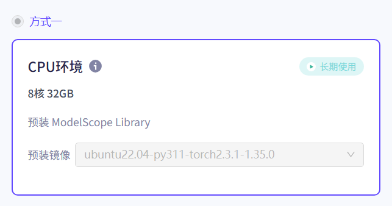
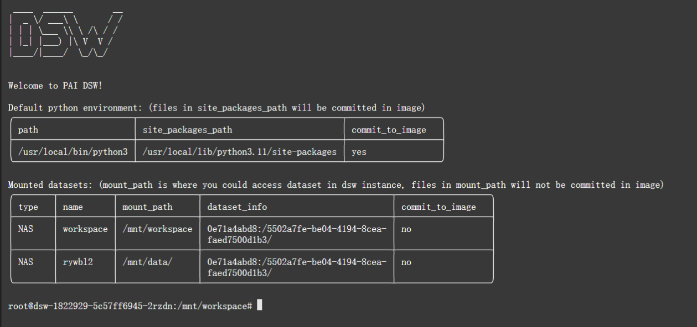

# 使用魔搭社区提供的8核 32GB的服务器实现自动化小说转视频功能

1. 使用的资源  预装 ModelScope Librar 8核 32GB 阿里云杭州区域镜像

----

然而，就在金龙那足以撕裂钢铁的利爪即将触及她眉心的前一瞬，顾清寒蓦然睁开了双眼。

那双原本古井无波的眼神之中，倒映着漫天金光，再无一丝一毫的生死之怖，唯有纯粹到了极点、也凌厉到了极点的剑意。

她骤然发力，纤细的手腕猛地一抖，没有半点迟疑。手中那柄由夜风与天地大势凝聚而成的无形之剑，下意识地刺出。

没有璀璨夺目的剑芒，也没有惊天动地的声威。

大音希声，无相无形！

这一剑刺出，分明是空无一物的一击，却在递出的刹那，于虚空中划出一道肉眼无法捕捉、却令人灵魂战栗的恐怖涟漪。连肆虐的狂风都在这无声的锋芒前被迫分流。这股凌厉无声的剑意，带着斩破一切虚妄的决绝，迎着那张开血盆大口的金色帝龙，逆流而上，悍然递入！

一边是极尽霸道、摧城填海的帝王杀招； 一边是融于天地、寂灭万物的无形一剑。

皇宫内苑中的两人，宿命之战中的最强的底牌，终于在这一刻毫无保留地轰击在了一处。

女帝那挟风雷之势、快若惊鸿的帝龙，与顾清寒那融于天地的无形剑气交汇的刹那，时间仿佛停滞了一瞬。紧接着，一轮刺目的白光以两人为圆心，如超新星爆发般轰然荡开。

天崩地裂！整个皇家广场在震耳欲聋的轰鸣中被瞬间掀翻，数以万计的青石板如纸片般被卷入半空，残存的宫墙石柱如同脆弱的朽木般寸寸崩碎。狂暴的冲击波携带着乱石穿空而去，漫天烟尘冲天而起，遮蔽了明月与星辰，令整座皇城都在这一击的余波下瑟瑟发抖，天地为之失色。

而在那滚滚烟尘的最深处，只剩下无尽的毁灭气流，在疯狂绞杀。

下一秒，只听一声穿云裂石的高亢龙吟破开重重尘雾！

那条璀璨的金色帝龙虚影狂啸着冲上九天，携带着摧枯拉朽、扫荡八荒的无敌气焰，将漫天烟尘瞬间撕裂。金光普照之下，皇城的上空仿佛下起了一场金色的火雨。放眼望去，在那毁灭性的狂暴气流碾压下，顾清寒那单薄的身影似乎已被彻底吞噬，再也寻不到半点气息。

龙威盖世，霸绝天下。从任何角度来看，这都是属于女帝沈惊鸿那无可争议的绝对胜利。

她赢了。 至少，在世人眼中是这样。

但事实，却远非双眼所见那般。

就在金龙腾空、万物臣服的那一刹那，九天之上依旧回荡着霸道的龙啸，可立于九天玄殿之上的沈惊鸿，那不可一世的身形却微微一僵，眼底燃烧的金焰稍显一滞。

大音希声，大象无形。

顾清寒那一剑，根本没有去与“帝龙出海”的狂暴真气正面硬撼。那一缕融于天地、顺应夜风的无形剑意，就像是一道穿透了所有表象与虚妄的幽灵。它犹如庖丁解牛般，顺着真气流转间最薄弱的缝隙，无声无息地绕过了女帝沈惊鸿那看似坚不可摧的帝王气场，直抵她那致命的罩门。

没有惊天动地的碰撞，也没有金铁交击的脆响。

就在沈惊鸿将毕生功力推向巅峰、金龙离体斩杀敌手的极限瞬间，也是她周身防御最为薄弱的空响。顾清寒那一道寂灭万物的无形剑气，已然悄无声息地跨越了空间的距离，以一种违背常理、却又暗合天道的轨迹，精准无比地刺向了《八荒帝龙诀》那隐藏至深、连沈惊鸿自己都极少在意的罩门之中！