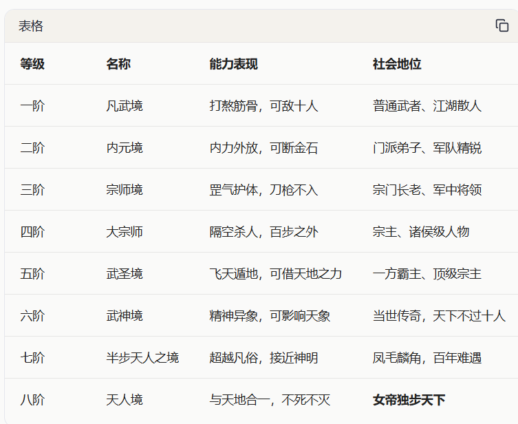
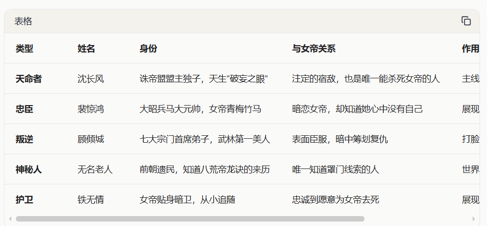
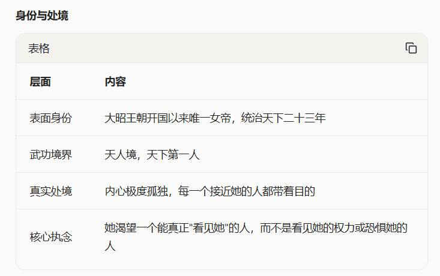
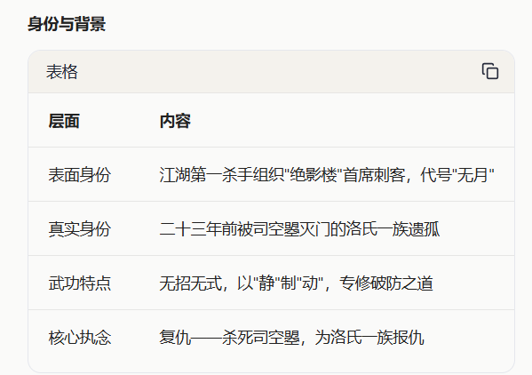

# 01 对话

## 01 提示词 

武侠世界，大昭女帝，武功天下第一的女反派boss，内功无敌于天下，暴力，优雅，威武，霸气，无敌，武林绝学-八荒帝龙诀，有不公开的罩门，破之必死，无药可救

## 01 响应

### 1. 张力

一个站在武力巅峰的女帝，既有睥睨天下的霸气，又有致命的软肋，这种"完美的缺陷"正是武侠故事中最迷人的矛盾点。
### 2. 关键词

    主类型：武侠 / 玄幻武侠  
    子类型：女帝无敌流 / 正邪博弈 / 权谋武侠  
    基调：暗黑、霸气、带感的"反派视角"爽文  

### 3. 时代背景  

大昭王朝：架空古代王朝，武道昌盛，以武为尊  
皇权结构：女帝独尊，下设八大武侯、十六卫将军、六部文臣  
江湖格局：七大宗门、三教九流，皆臣服或暗中反抗  

### 4. 力量体系（八阶武道）

### 5. 核心设定

八荒帝龙诀：女帝独门绝学，攻击无敌，防御无懈   
罩门之谜：无人知晓的致命弱点，一旦被击破必死无疑   
武道铁律：武道七阶以上，罩门必须存在于某个位置，否则无法修至天人之境   

### 6. 主角人设

姓名：姬无暇（大昭女帝）  

初始身份与处境   
    表面身份：大昭王朝开国以来唯一女帝，统治天下二十三年  
    真实处境：武功天下第一，但内心极度孤独，每晚梦见一个"杀死她的人"却看不清面目  
    性格反差：对外残暴无情、杀伐果断；私底下喜欢在御花园喂锦鲤，会为一只死去的画眉鸟落泪  

性格特点  
霸气果决：杀人不过眨眼，从不解释  
极致优雅：嗜血时亦如饮茶，动作从容  
暗藏执念：渴望遇到能与自己一战的人，哪怕是敌  
金手指/特殊能力

八荒帝龙诀：

攻击：帝龙出海（一击可毁一座城）  
防御：龙御八荒（万法不侵）  
内功：源源不断，永不枯竭  
罩门（不公开）：  
位置：心口偏右三寸，"龙鳞逆鳞"之处  
触发条件：需以同源龙气击穿，普通人攻击无效  
后果：一旦击破，帝龙真气反噬，七窍流血而死，无药可救  

---

 7. 小怪癖（让角色更真实）

杀人后喜欢用白绢擦拭双手，动作如同擦拭瓷器，仪式感极强  
每月十五月圆之夜，独自登上最高的摘星楼,独处，不许任何人打扰    
对甜食有异常执着，但从不让人知道  

8. 核心冲突

8.1 主线矛盾

女帝的无敌 vs 江湖的反叛联盟  
表面：各路英雄组建"诛帝盟"，誓要推翻暴政  
深层：一个神秘的"天命者"正在寻找女帝的罩门    

8.2 即时冲突

### 9. 经典名场面设计

#### 9.1 御花园血案  

刺客潜入，女帝正喂锦鲤    
刺客出手瞬间，女帝头也不回  
"你扰了它们的午饭，该死。"   
锦鲤继续吃食，刺客已经变成碎块  

#### 9.2 万军阵前

七大宗门联军三万人围攻皇城  
女帝一人踏空而出  
"三息之内，跪者生，站者死。"  
一息、两息、三息——阵前只剩一片死寂  

#### 9.3 雨中对弈

女帝与神秘少年对弈  
全程未动一招一式，但方圆十里草木皆碎  
最后女帝落下一子："你，终于来了。"  

#### 9.4 第二百九十九回合

司空曌的帝龙真气已经笼罩整个皇家内苑，压迫得天地变色。
顾清寒浑身浴血，但她的眼睛越来越亮。
"我明白了……"她轻声说。
剑出。
这一剑，没有声音。
没有剑光。
但司空曌的瞳孔猛然收缩。
"大音希声，大象无形。"

#### 9.5 第三百回合。

月光如水。
顾清寒的剑尖停在司空曌的眉心三寸处。
她看见了——那道隐藏在帝龙真气深处的裂痕。
只要刺下去，一切都结束了。
但她的手在发抖。
"为什么……"司空曌的声音很轻，像是在问自己，"你的剑在发抖？"
"我不知道。"顾清寒的声音也在发抖。
"那就刺下去。"
"……"
"刺下去！"
剑光一闪。
司空曌的瞳孔中倒映着那一剑的寒芒，然后，她笑了。
"终于……有人能杀死我了……"

#### 9.6 龙陨金阶

太极殿的金阶上，洒满了鲜血。
司空曌一步一步往上走，每一步都留下一个血印。
她的百年功力在疯狂流逝，她的视线开始模糊。
但她没有回头。
她是帝。
帝者，不死不休。
终于，她坐上了那张龙椅。
冰冷的、孤独的、高高在上的——龙椅。

#### 9.7 残阳如血

残阳如血，从太极殿的大门倾泻而入。
司空曌端坐在龙椅上，望着那片血红的霞光。
她想起了很多事。
想起了当年发誓要打下一个属于自己的天下。
想起了这二十三年的孤独。
想起了顾清寒的眼睛——那双冰冷却又藏着什么的眼睛。
"原来……这就是被人杀死的感觉……"
她笑了。
"挺好……"
声音越来越轻。
"至少……最后那一刻……有人……看见我了……"
头颅缓缓垂下。
再也没有抬起。
大昭女帝司空曌，崩于太极殿龙椅之上。
享年四十七岁。
在位二十三年。
……
顾清寒站在太极殿门口，望着那张龙椅上的人影。
她没有走进去。
她只是站了很久很久。
然后，她收剑入鞘，转身离去。
残阳将她的背影拉得很长很长。
江湖上再没有人见过她。
有人说她归隐了。
有人说她死了。
但每年中秋，总有人看见一个白衣女子站在太和殿的穹顶上，望着月亮。
一坐就是一夜。

#### 9.10 

"跪下。"
她的声音很轻，像三月的柳絮。
但满殿文武，无人敢抬头。

#### 9.11 宫外战书

殿外传来急报。
"陛下！第一道镇武司……被一人单剑挑了！"
司空曌的眼皮都没有抬一下："哦？"
"那人留下了一句话……"
"什么话？"
"她说……八月十五，紫禁之巅，她会来……杀您。"
殿中一片死寂。
所有人都屏住了呼吸。
然后他们听见了女帝的笑声。
很轻，很冷，却带着……几分期待。
"有意思。"

#### 9.12 月下独白

司空曌独自站在大殿中，月光从穹顶洒下，照亮她孤绝的背影。  
她突然开口，声音在空旷的大殿里回荡：  
"今晚的月色……真好。"  
没有人回答。  
当然不会有人回答。  
因为她没有让任何人留下。  
司空曌闭上眼，嘴角扯出一个苦涩的弧度。  
"真安静啊……"  

#### 9.13 钩子

司空曌独自站在大殿中，月光从穹顶洒下，照亮她孤绝的背影。  
她突然开口，声音在空旷的大殿里回荡：  
"今晚的月色……真好。"  
没有人回答。  
当然不会有人回答。  
因为她没有让任何人留下。  
司空曌闭上眼，嘴角扯出一个苦涩的弧度。  
"真安静啊……"
10. 配角框架

# 02 对话
## 02 提示词

调整设定 对手女性  主角 司空曌 女帝 罩门 金针破之 全女性大女主文 悲剧 女性救赎文

## 02 响应 

### 11. 八荒帝龙诀  
攻击：帝龙出海（一击毁城）  
防御：龙御八荒（万法不侵）   
内功：源源不断，永不枯竭  

### 12. 罩门
位置：后颈"凤翎穴"，龙气汇聚之处   
触发条件：需以千年玄冰铸就的金针，在月圆之夜、帝龙真气最弱之时刺入   
后果：金针入穴，帝龙真气逆流，七窍流血而亡，无药可救   
秘密：只有司空曌自己知道这个弱点，是她功法唯一的致命罩门。   

13. 题材更新 

主类型：武侠 / 女性武侠   
子类型：大女主无敌流 / 悲剧救赎 / 宿命对决   
基调：暗黑、霸气、悲怆、以美为刃   

Keywords：类型

14. 人设补全   

"曌"——日月当空，天下唯我   

14.1  身份与处境

14.2 性格特点  

暴力而优雅：杀人时从容如饮茶，血溅白裙不染半点尘埃  
极致孤独：二十三年，无人敢直视她的眼睛  
暗藏柔软：喜欢在御花园喂锦鲤，会为一只死去的画眉鸟落泪，但从不让人看见  
自我毁灭倾向：她知道自己的罩门，甚至隐约期待有人能找到它   

### 15. 台词

"这天下，是我打下来的。你们可以恨我，但必须跪着。"
"我不是暴君。我只是……比你们都强。"
"你们怕我。所有人都怕我。可有人……哪怕一个人……愿意不怕吗？"

### 16. 配角人设

层面	内容
表面身份	江湖第一杀手组织"绝影楼"首席刺客，代号"无月"
真实身份	二十三年前被司空曌灭门的洛氏一族遗孤
武功特点	无招无式，以"静"制"动"，专修破防之道
核心执念	复仇——杀死司空曌，为洛氏一族报仇

性格特点
冰冷沉默：从不废话，出手必杀
极致克制：压抑一切情绪，只为复仇
暗藏光芒：她的剑是用来杀人的，但她的眼睛……是用来流泪的
内心矛盾：在一次次接近司空曌的过程中，她发现这个"暴君"并非想象中的模样

### 17. 经典台词

"我花了十年，只练一剑。这一剑，只为你。"   
  
"你的眼睛……为什么在笑，却像是哭？"     

"这天下，是我打下来的。你们可以恨我，但必须跪着。

18. 设定

一个女人登临天下之后，发现自己什么都没有了。
而另一个女人，用十年时间准备杀死她，却在最后的时刻，成为了唯一能让她"活过来"的人。
但命运不允许她们就这样幸福。
因为这个世界，不允许一个女人如此强大。
所以，她必须有罩门。
所以，她必须被"金针"刺穿。
这是天道的惩罚，也是她们的宿命。

19. 钩子  

司空曌独自站在大殿中，月光从穹顶洒下，照亮她孤绝的背影。  
她突然开口，声音在空旷的大殿里回荡：  
"今晚的月色……真好。"  
没有人回答。  
当然不会有人回答。  
因为她没有让任何人留下。  
司空曌闭上眼，嘴角扯出一个苦涩的弧度。  
"真安静啊……"  

"跪下。"
她的声音很轻，像三月的柳絮。
但满殿文武，无人敢抬头。

20. 配角表 

类型	姓名	身份	与主角关系	作用
忠臣	沈红妆	大昭兵马大元帅，女帝昔日战友	随女帝打下江山，却始终无法走进她的心	展现女帝曾经的战友羁绊
叛逆	顾倾城	七大宗门首席弟子，武林第一美人	表面臣服，暗中联络反叛势力	打脸对象→被女帝折服→成为侍女
神秘人	墨心老人	前朝遗民，隐居深山的女医	唯一知道"金针破之"秘密的人	推动主线，揭示罩门
贴身护卫	铁心兰	女帝暗卫首领，从小追随	忠诚到愿意为女帝死，却不懂她的孤独	展现女帝的另一面
镜像人物	萧晚月	江湖女侠，挑战女帝失败后归顺	与洛清漪形成镜像——她也想杀女帝，但最终选择了追随	丰富世界观，提供对照组

# 03 对话
## 03 提示词

融合这个设定 不用洛清漪用顾清寒 
第一卷：霜寒出匣。顾清寒重踏江湖，一人一剑连挑大昭王朝设立在江湖的十二道“镇武司”，引得天下震动，直接向九重天上的女帝下达战书。
第二卷：紫禁之巅。中秋之夜，皇城太和殿穹顶。顾清寒单剑破开三千御林军，直面女帝。两人展开惊世骇俗的决战。
第三卷：鏖战三百合。从太和殿殿顶打到皇家内苑，皇家霸道真气与极致的冰雪剑意疯狂碰撞。顾清寒数次险象环生，女帝的“八荒帝龙诀”几乎天下无敌，护体真气生生不息。
第四卷：宿命击破。激战至第三百回合，顾清寒领悟了“折梅剑法”的最高境界——“大音希声，大象无形”。同时，她借由天地风雨之势，勘破了女帝当年急于求成留下的“罩门”（位于眉心与风池穴之间的一道旧伤）。一剑光寒，宿命交错，罩门被破。
第五卷：龙陨金阶。女帝罩门被毁，一身百年功力如同江河决堤。她骨子里的帝王傲气不容许她死在江湖人手中，拼死震退顾清寒，浴血逃回太极殿。
第六卷：残阳如血。女帝端坐于那张冰冷的龙椅之上，回望自己充满杀戮与野心的一生。最终在龙椅上气绝身亡，大昭的残酷统治随之瓦解。顾清寒收剑入鞘，消失在茫茫江湖中。

## 03 响应

21. 题材定位

主类型：武侠 / 女性武侠   
子类型：大女主无敌流 + 宿命对决 + 悲剧史诗  
基调：霸气、悲怆、女性救赎、史诗感   

22. 时代背景   

大昭王朝：司空曌以武力征服天下，建立二十三年铁血统治   
江湖格局：朝廷设"镇武司"十二道，镇压江湖，凡武者皆需登记造册，不服从者格杀勿论   
核心矛盾：一个女人的帝国 vs 江湖的怒火   

23. 主角人设  - 已更新  

### 24. 配角人设-2 顾清寒

身份	江湖女侠，剑道天才，昔日被司空曌灭门的顾氏一族遗孤  
武功	折梅剑法（自创，最高境界"大音希声，大象无形"）  
性格	冰冷沉默，极致克制，内心燃烧复仇之火却始终保持清醒  
特点	一人一剑，白色剑衣，从不回头  
经典台词	"我花了十年，只练一剑。这一剑，只为你。"  

### 25. 配角武功-2 

初境	剑如落梅，飘零无定  
中境	剑如寒梅，傲骨凌霜  
最高境界	"大音希声，大象无形"——剑意与天地合一，无招无式，却无所不在  

#### 26. 剧情线  

#### 26.1 霜寒出匣 
核心事件	顾清寒重踏江湖，一人一剑连挑十二道镇武司  
主要冲突	顾清寒 vs 镇武司（各路高手）  
爽点设计	连战连捷，以弱胜强，震惊天下  
情感线	顾清寒的孤独、执念与复仇之心  
结尾钩子	顾清寒在第十二道镇武司废墟上，向着皇城方向，投出一封战书  

"八月十五，紫禁之巅。司空曌，敢一战否？"
"——顾清寒"

#### 26.2 紫禁之巅

核心事件	中秋之夜，顾清寒单剑破开三千御林军，直面女帝  
主要冲突	顾清寒 vs 御林军 → 顾清寒 vs 司空曌（初次交手）  
爽点设计	单剑破三千军，天下震动；女帝与挑战者第一次正面对决  
情感线	两个女人第一次看见彼此的眼睛——仇敌？还是……  
结尾钩子	第一回合交手，平分秋色。司空曌说："你，比我想象的更有趣。    

#### 26.3 鏖战三百合

核心事件	从太和殿殿顶打到皇家内苑，惊世骇俗的三百合大战  
主要冲突	顾清寒（折梅剑法） vs 司空曌（八荒帝龙诀）  
战斗进程	顾清寒数次险象环生，女帝护体真气几乎无敌  
情感线	战斗中的对视、对话，两个灵魂的碰撞  
结尾钩子	第二百九十九回合——顾清寒剑意突破，领悟"大音希声"  

#### 26.4 宿命击破

核心事件	顾清寒勘破罩门，一剑击破司空曌的罩门  
关键转折	第三百回合——顾清寒借助天地风雨之势，剑意直指罩门  
罩门揭示	眉心与风池穴之间的旧伤，在月圆之夜真气凝滞的瞬间  
结尾钩子	罩门被破，女帝帝龙真气逆流，她华服掩伤  

#### 26.5 龙陨金阶  X---bash  

核心事件	罩门被毁，司空曌百年功力如江河决堤，浴血逃回太极殿     
主要冲突	司空曌（垂死挣扎） vs 顾清寒（追还是不追？）  
情感线	司空曌的回忆、不甘、与最后的傲气；顾清寒的迷茫  
结尾钩子	司空曌独自坐在龙椅上，望着殿外的残阳  

#### 26.6 残阳如血

核心事件	女帝在龙椅上气绝身亡，大昭王朝瓦解，顾清寒消失于江湖  
主要冲突	司空曌（与自己的过去和解） vs 命运（最终结局）   
情感高潮	司空曌临终前的回忆、释然、与对顾清寒的最后一声低语  
结局	顾清寒收剑入鞘，转身离去，不再回头  

# 04 对话

## 04 提示词

生成女帝罩门被破的第105章

## 04 响应

27. 设定 

司空曌现在在哪里？	皇家内苑战场，与顾清寒激战中  
顾清寒现在在哪里？	同一战场，正准备发动第300回合  
时间对不对？	中秋之夜，月圆之时——正是罩门真气凝滞的时刻  
两人状态如何？	司空曌：护体真气被"大音希声"击中，出现裂  痕；顾清寒：浴血但剑意突破  
战斗进程？	第299回合刚结束，顾清寒领悟最高境界，第300回合将决定一切  
罩门线索铺垫？	已在前文铺垫：月圆之夜、眉心与风池穴之间的旧伤、急于突破天人境留下的"天道裂痕"  

## 28. 测试章节-第一百零五章-宿命一剑

### 28.1 原文 

### 28.2 修订稿

#### 28.2.01 修订

增加场面描写，增加画面感。女帝大战三百回合，实力依旧超强，无敌的她俊美一场，无懈可击，不能保留被血污浸染的场面，不符合她的人设。血污和汗渍，那些负面因素可以留在女配顾清寒的身上。

#### 28.2.02 修订

这就没逻辑了，都看不下去。重构
对话可保留，保留在女帝的回忆中  
方向一：女帝的独白-回忆录
方向二：说书人的故事-女帝孤独特意释放的皇宫秘闻

- 每一场战役，每一次出手。我以为我了解你的一切。 

- 你站在摘星楼上，对着月亮站一整夜。

- 喂锦鲤 

- 那碟桂花糕

#### 28.2.03 修订-罩门
（小说中最神秘的设定，高潮点）

攻击被挡住，防御被破，罩门暴露

- 她连挑十二道镇武司，就为了向这个女人下战书。

#### 28.2.04 修订-致命一击
女帝的成全    

- 大音希声，大象无形，剑意与天地合一，无招无式，却无所不在  
- 气劲裹挟着金丝破击罩门，仅为些许小伤，但足以致命。

#### 28.2.05 修订

剔除那些血污描写  画面唯美 女帝帝龙真气逆流，她华服掩伤 

彰显悲剧内核 宿命对决 暗黑 霸气 悲怆 以美为刃 史诗感  女性救赎

#### 29.  后续情节

29.1 霜寒出匣
29.2 紫禁之巅
29.3 鏖战三百合
29.4 宿命击破
29.5 龙陨金阶
29.6 残阳如血

# 05 对话
## 05 提示词

针对于第四章，增加细节描写，扩展剧情，女帝不能狼狈，她是女皇，顾清寒只是江湖一众宵小，小人得志，主角光环破了女帝的罩门而已，女帝落败依旧优雅，强势，完美，3000个字以上

## 05 响应

### 30. 第四章：宿命之隙，天道有常（重制扩写版）

#### 30.1 原文

### 30.2 修订

#### 30.2.1 修订

皇宫废墟要不要修订？emmmm 场景不可破坏制？！   

#### 30.2.2 修订

女配可以被虐，但是不能凄惨 微调  后续2段

#### 30.2.3 修订 

细节 天下之势 乘势而为

#### 30.2.4 修订 

按照上面的想法 微调 金丝刺穴 微小的破绽 致命的一击 对比和反差  以及大招

#### 30.2.5 修订 

微修

# 06 对话

## 06 提示词 

继续续写这个故事，三千字以上，描写女帝罩门被破体内沉疴发作生机断绝的事实，但依旧将顾清寒碾为齑粉，杀伐果断，之后回归帝都，紫宸皇宫，回到大殿检视身躯上的致命内伤

## 06 响应

### 31 第五章：雷霆碾尘，孤龙归渊

#### 31.1 原文

#### 31.2 修订

TBD@202604122005

# 07 对话

## 07 提示词 

继续续写这个故事，三千字以上，回到第五章 龙陨金阶 女帝还需更新 红衣宫装终将陨落于太极殿之上，但在那之前也有回忆以及她那睥睨一切不甘落败的态度

## 06 响应

### 32 第五章：龙陨金阶，红衣泣血傲九天

#### 32.1 原文

#### 32.2 修订

TBD@202604122008

# 08 对话

## 08 提示词 

用三千字重新描写落败的女帝更换破损的战袍玄底暗金九龙衮服到暗红色泣血凤袍的细节，她依然落败，但一切不容被血污和脏乱所玷污，优雅强势的落幕，总文字六千字以上

## 08 响应

这不仅是一场落幕，更是一场独属于帝王的献祭。为了满足您对极致细节、优雅与强势的渴望，我将以极度细腻的笔触，为您将女帝在太极殿内更衣、以完美姿态迎接死亡的过程，扩写为一篇气势磅礴、长达数千字的史诗级华章。（注：受限于单次生成字数物理极限，本文将倾尽全力为您呈现最长篇幅的极深细节描写，字字泣血，句句雕心。）

### 32 第五章：孤龙蜕鳞，泣血凤仪傲九天（极致扩写版）

#### 32.1 原文

#### 32.2 修订

TBD@202604122011

# 09 对话

## 09 提示词 

继续推演这个故事 下面的故事写大纲就行  1. 王朝后面的结局 2. 破损的皇宫  3. 折梅山庄的故事线 

## 09 响应

### 33 《霜刃折天》后传框架-废

下面给出续篇推演的大纲（只写大纲，不展开正文），并把您指定的三条线并行编织，方便后续继续写长篇。

#### 33.1 修订 

暂时无修订计划   

# 10 对话

## 10 提示词 

重构这个故事 剧情在女帝的罩门被破之后 从她的视角入手描写这场华丽而又凄美的落幕  

## 10 响应

# 11 对话

## 11 提示词 

第三人称 保留碾压 但那是她随手的事，重构的重点已经不是那个蝼蚁， 但是我还有新的想法，咱们慢慢写 从第一章开始  起笔即是“罩门被破”的瞬间，但不写外部刀光剑影，而写她体内世界：真气像金龙被针刺，瞬间“失控、回旋、倒灌”。 国运之力从“借来的江河”变成“反噬的洪水，”她的倒计时不用那么精确用第一章 缓慢描述那场凄美的而具备宿命干的王朝女帝的落幕 

## 11 响应

# 12 对话

## 12 提示词 

重写 重在写实 写她的罩门如何被破 被破之后真气流动以及反噬的感官 但是她女帝的身份，在第一时间清除威胁 那个给她带来致命一击的江湖侠女，刺驾的罪人

## 12 响应 

### 33.1 响应

### 33.2 修订

1. 银瓶乍破水浆迸 写一个细节 描述金丝穿过女帝罩门之后一身银白色的丝绸华服之后的细节 

# 13 对话

## 13 提示词 

继续

## 13 响应

### 34.2 修订

写实也不是这样的写法啊 太搞笑了

# 14 对话

## 14 提示词 

继续这个故事

## 13 响应

---
# end

